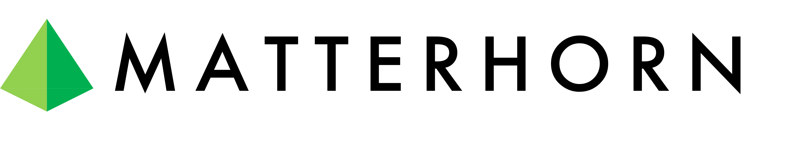
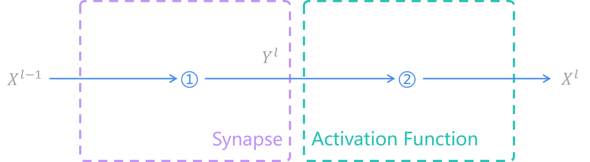
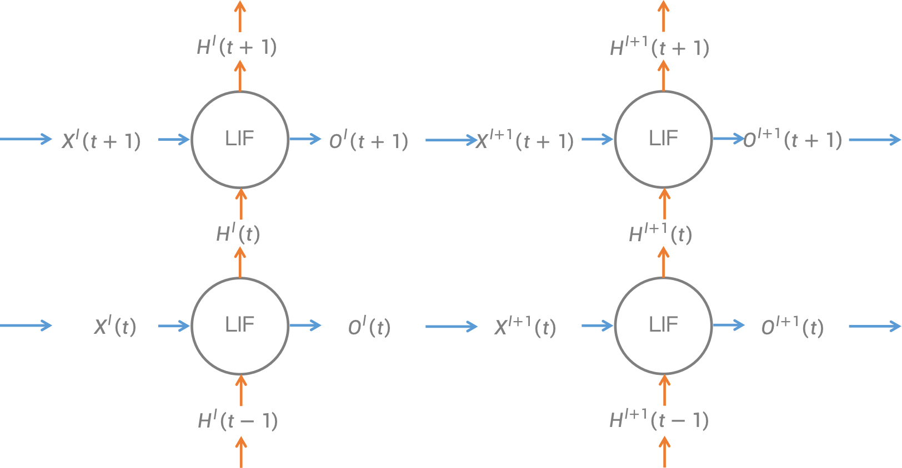
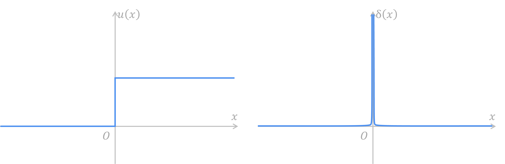
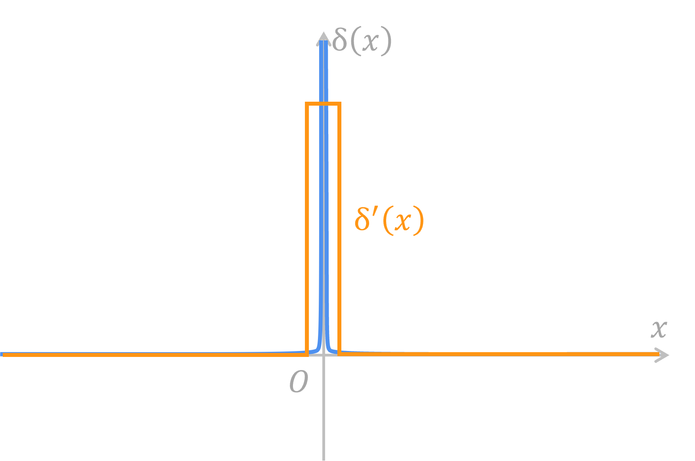
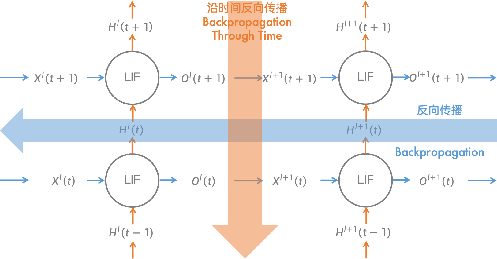
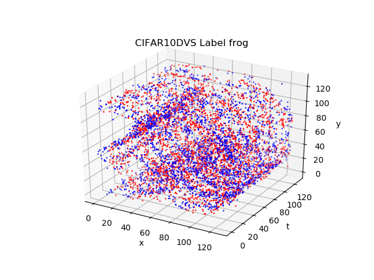
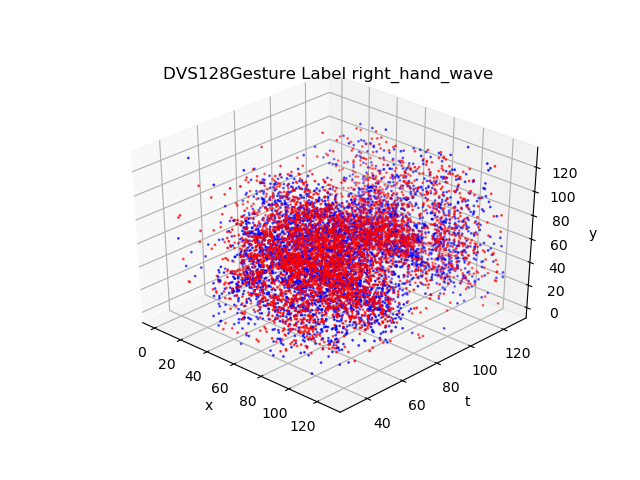
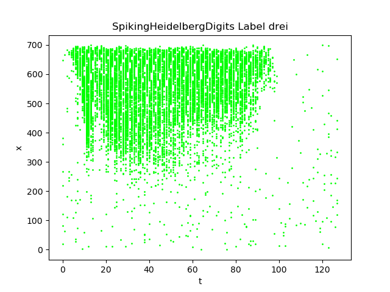

# Matterhorn

## 1 General Introduction



Matterhorn is a novel general SNN framework based on PyTorch.

## 2 Installation

### Environment

Python(>=3.7 and <= 3.9)

CUDA(>=11.3.0, with CUDNN)

PyTorch(>=1.10.0 and <=1.13.1)

TorchVision(>=0.11.0 and <= 0.13.1)

### Environment Installation

For Windows version you may have to install GCC as well as G++ through Visual C++ or MinGW.

```sh
git clone https://github.com/AmperiaWang/Matterhorn.git
cd Matterhorn
pip install -r requirements.txt
```

Don't forget to add `sudo` if you are not the root user.

### Install Matterhorn

```sh
git clone https://github.com/AmperiaWang/Matterhorn.git
cd Matterhorn
python3 setup.py install
```

Don't forget to add `sudo` if you are not the root user.

## 3 Module Explanation

### Neurons in SNN

As we're all known, the image below describes what an ANN looks like.



**Operation 1** is **synapse function**, which uses weights and bias to calculate those values from previous layer to current layer. Commonly used synapse functions are including full connection layer `nn.Linear`, convolution layer `nn.Conv2D`, etc.

We use an equation to describe the synapse function:

$$Y^{l}=synapse(X^{l-1})$$

Where $l$ here means the number of current layers.

**Operation 2** is **activation function**, which filters information from synapses and sends the filtered information to next layer. Commonly used activation functions are including `nn.ReLU`, `nn.Sigmoid`, etc.

We use an equation to describe the activation function:

$$X^{l}=activation(Y^{l})$$

In conclusion, each of layers in ANN has 2 functions. We can build our ANN model in PyTorch by the code below:

```python
import torch.nn as nn

model = nn.Sequential(
    nn.Linear(28 * 28, 10),
    nn.ReLU()
)
```

This is a 1-layer MLP. It can take an image with the size of 28x28 as input and classify it into 10 classes. In this example, two equations of ANN can be represented as below:

$$Y^{l}=W^{l}X^{l-1}+\vec{b}$$

$$X^{l}=ReLU(Y^{l})$$

In SNN, the synapse equation is the same as that in ANN. However, functions in soma are no longer like what is in ANN. In the soma of SNN, there exists a loop in time. The image below describes what an SNN looks like.


**Operation 1**, the **synapse function**, calculates spikes from previous layer $O^{l-1}(t)$ thus generates the input potential $X^{l}(t)$.

We use an equation to describe the synapse function:

$$X^{l}(t)=synapse(O^{l-1}(t))$$

By **operation 2**, the input potential, with the history potential, is calculated based on a 1-order differential equation, thus generating the soma potential $U^{l}(t)$. We name it **response function**.

We use an equation to describe the response function:

$$U^{l}(t)=response(H^{l}(t),X^{l}(t))$$

Each spiking neuron model has its unique response differential equation.

For example, in a LIF neuron:

$$\tau \frac{du}{dt}=-(u-u_{rest})+RI$$

Discretizing it into a difference equation, we can get:

$$U^{l}(t)=(1-\frac{1}{\tau})H^{l}(t)+\frac{1}{\tau}u_{rest}+X^{l}(t)$$

**Operation 3** uses Heaviside step function and threshold potential $u_{th}$ to decide whether to generate spikes $O^{l}(t)$. We name it **firing function**.

We use an equation to describe the firing function:

$$O^{l}(t)=spiking(U^{l}(t))$$

Generally, the firing function looks like this.

$$O^{l}(t)=Heaviside(U^{l}(t)-u_{th})$$

Where Heaviside step function returns 1 when input is greater than or equal to 0, returns 0 otherwise.

The aim of **operation 4** is to set refractory time on neurons by output spikes $O^{l}(t)$. We name it **reset function**.

We use an equation to describe reset function:

$$H^{l}(t)=reset(U^{l}(t-1),O^{l}(t-1))$$

Under most occasions we use equation below to reset potential:

$$H^{l}(t)=U^{l}(t-1)[1-O^{l}(t-1)]+u_{rest}O^{l}(t-1)$$

In brief, we use 4 equations to describe SNN neurons. This is what an SNN looks like. The shape of an SNN neuron is like a trumpet. Its synapses transform those spikes from last neuron and pass the input response to soma, in which there is a time loop awaits.

By unfolding SNN neurons on temporal dimension, we can get the spatial-temporal topology network of SNN.



Like building ANN in PyTorch, we can build our SNN model in Matterhorn by the code below:

```python
import torch
import matterhorn_pytorch.snn as snn

snn_model = snn.Temporal(
    snn.Spatial(
        snn.Linear(28 * 28, 10),
        snn.LIF()
    )
)
```

In the code, `Spatial` is one of Matterhorn's containers to represent sequential SNN layers on spatial dimension, and `Temporal` is another Matterhorn's container to repeat calculating potential and spikes on temporal dimension. By using `Spatial` and `Temporal`, an SNN spatial-temporal topology network is built and thus used for training and evaluating.

The built network takes an $n+1$ dimensional `torch.Tensor` as input spike train. It will take the first dimension as time steps, thus calculating through each time step. after that, it will generate a `torch.Tensor` as output spike train, just like what an ANN takes and generates in PyTorch. The only difference, which is also a key point, is that we should encode our information into spike train and decode the output spike train.

### Encoding and Decoding

A spike train is a set of Dirac impulse functions on the axis of time.

$$O(t)=\sum_{t_{i}}δ(t-t_{i})$$

In other words, there will only be 0s and 1s in discrete spike train. Therefore, we can use an $n+1$ dimensional tensor to represent our spike train. For example, if neurons are flattened into a 1-dimensional vector, we can use another dimension to represent time, thus let it be a 2-dimensional matrix to represent the spike train through space and time.

$$
\begin{matrix}
 & →s \\
↓t &
\begin{bmatrix}
0 & 1 & 1 & 0 & 1 & 0 & 0 & 1 \\
1 & 0 & 0 & 1 & 0 & 0 & 1 & 1 \\
1 & 1 & 1 & 1 & 1 & 1 & 0 & 1 \\
1 & 0 & 1 & 1 & 0 & 1 & 0 & 1 \\
\end{bmatrix}
\end{matrix}
$$

The matrix above shows what a spike train looks like. It has 4 rows, representing 4 time steps. Besides, it has 8 columns, representing 8 output neurons.

To transform our traditional binary information (images, sounds, etc.) into spike train, an encoder is needed. The most commonly used encoder for non-event data is Poisson encoder, which is a kind of rate coding encoder. It sees intensity of a pixel as probability to fire a spike.

You can use Poisson encoder in Matterhorn by the code below:

```python
import torch
import matterhorn_pytorch.snn as snn

encoder = snn.PoissonEncoder(
    time_steps = 32
)
```

Then, you can use it by the code below:

```python
spike_train = encoder(image)
```

An image with the shape of `[H, W, C]` would be encoded into a spike train with the shape of `[T, H, W, C]`. For example, a MNIST image which shape is `[28, 28]` would be encoded (`T=32`) into a spike train with the shape of `[32, 28, 28]`.

After encoding and processing, the network would generate an output spike train. To get the information, we need to decode. A commonly used decoding method is to count average spikes each output neuron has generated.

$$o_{i}=\frac{1}{T}\sum_{t=1}^{T}{O_{i}^{K}(t)}$$

You can use average decoder in Matterhorn by the code below:

```python
import torch
import matterhorn_pytorch.snn as snn

decoder = snn.AvgSpikeDecoder()
```

It will take first dimension as temporal dimension, and generate statistical results as output. The output can be transported into ANN for further processes.

Matterhorn provides a convenient container `matterhorn_pytorch.snn.Sequential` to connect all your SNN and ANN models.

```python
import torch
import matterhorn_pytorch.snn as snn

model = snn.Sequential(
    snn.PoissonEncoder(
        time_steps = time_steps,
    ),
    snn.Flatten(),
    snn.Linear(28 * 28, 10, bias = False),
    snn.LIF(tau_m = tau, trainable = True),
    snn.AvgSpikeDecoder()
)
```

By now, you have experienced what an SNN looks like and how to build it by Matterhorn. For further experience, you can refer to [examples/2_layer_mlp.py](./examples/2_layer_mlp.py).

```sh
cd Matterhorn
python3 examples/2_layer_mlp.py
```

In most cases, neurons of SNNs can be divided into 1 synapse operation and 3 soma operations. However, there are always some special cases. SRM0 neuron model is one of them, whose response is calculated in each synapse. We can use 5 operations to represent SRM0 neurons, 2 for synapses and 3 for soma:

**Operation 1**: **synapse response function**

$$R_{j}^{l}(t)=(1-\frac{1}{\tau_{m}})R_{j}^{l}(t-1)+O_{j}^{l}(t)$$

**Operation 2**: **synapse function**

$$X_{i}^{l}(t)=\sum_{j}{w_{ij}R_{j}^{l}(t)}$$

**Operation 3**: **response function**

$$U_{i}^{l}(t)=X_{i}^{l}(t)H_{i}^{l}(t)$$

**Operation 4**: **firing function**

$$O_{i}^{l}(t)=Heaviside(U_{i}^{l}(t))$$

**Operation 5**: **reset function**

$$H_{i}^{l}(t)=1-O_{i}^{l}(t-1)$$

With 5 operations resembled we can build a SRM0 neuron. For further experience, you can refer to [examples/2_layer_mlp_with_SRM0.py](./examples/2_layer_mlp_with_SRM0.py).

```sh
cd Matterhorn
python3 examples/2_layer_mlp_with_SRM0.py
```

### Why Should We Need Surrogate Gradient

In spiking neurons, we usually use Heaviside step function $u(t)$ to decide whether to generate a spike:

$$O^{l}(t)=u(U^{l}(t)-u_{th})$$



However, Heaviside step function has a derivative that can make everyone headache. Its derivative is Dirac impulse function $\delta (t)$. Dirac impulse function is infinity when x equals to 0, and 0 otherwise. If it is directly used for backpropagation, the gradient must be all damned.

Therefore, some functions must be there to replace Dirac impulse function to join the backpropagation. We call those functions surrogate gradients.

One of the most common surrogate gradients is rectangular function. It is a positive constant when absolute value of x is small enough, and 0 otherwise.



Also, functions suitable for surrogate gradient include the derivative of sigmoidal function, Gaussian function, etc.

You can inspect all provided surrogate gradient functions in `matterhorn_pytorch.snn.surrogate`.

### Learning: BPTT Vs. STDP

Training SNNs could be as easy as training ANNs after gradient problem of Heaviside step function is solved. After we unfold SNNs into a spatial-temporal network, backpropagation through time (BPTT) could be used in SNNs. On spatial dimension, gradients can be propagated through firing function and synapse function, thus neurons of previous layer would receive the gradient; On temporal dimension, the gradient of the next time step can be propagated through firing function and response function, thus soma of previous time would receive the gradient.



Besides BPTT, there is another simple way to train locally in each neuron without supervision, which we call spike-timing-dependent plasticity (STDP). STDP uses precise time differences between input and output spikes to calculate the weight increment.

STDP follows equation below:

$$Δw_{ij}=\sum_{t_{j}}{\sum_{t_{i}}W(t_{i}-t_{j})}$$

where the weight function $W(x)$ is:

$$
W(x)=
\begin{aligned}
A_{+}e^{-\frac{x}{τ_{+}}},x>0 \\\\
0,x=0 \\\\
-A_{-}e^{\frac{x}{τ_{-}}},x<0
\end{aligned}
$$


By setting parameters $A_{+}$, $τ_{+}$, $A_{-}$ and $τ_{-}$, we can easily train SNNs unsupervised. For further experience, you can refer to [examples/2_layer_mlp_with_stdp.py](./examples/2_layer_mlp_with_stdp.py).

```sh
cd Matterhorn
python3 examples/2_layer_mlp_with_stdp.py
```

**Note:** Please make sure you have installed `matterhorn_cpp_extensions` (or `matterhorn_cuda_extensions` if you have CUDA), otherwise it will be extremely slow.

```sh
cd matterhorn_cpp_extensions
python3 setup.py install
```

if you have CUDA, you can install CUDA version:

```sh
cd matterhorn_cuda_extensions
python3 setup.py install
```

### Neuromorphic Datasets

Matterhorn provides several neuromorphic datasets for training spiking neural networks.

#### NMNIST

We know MNIST. MNIST dataset is for training image classification, consisting of a set of 28x28 pixel grayscale images of handwritten digits (0-9). NMNIST is like MNIST, which is different is that it distorts images and record them into events. The shape of events in NMNIST Dataset is Tx2x34x34.


You can use NMNIST dataset in Matterhorn by the code below:

```python
from matterhorn_pytorch.data import NMNIST

time_steps = 128

train_dataset = NMNIST(
    root = "your/data/path",
    train = True,
    download = True,
    time_steps = time_steps
)
test_dataset = NMNIST(
    root = "your/data/path",
    train = False,
    download = True,
    time_steps = time_steps
)
```

#### CIFAR10-DVS

CIFAR10-DVS dataset records distorted CIFAR-10 image by a DVS camera. The shape of events in CIFAR10-DVS Dataset is Tx2x128x128.



You can use CIFAR10-DVS Dataset in Matterhorn by the code below:

```python
from matterhorn_pytorch.data import CIFAR10DVS

time_steps = 128

train_dataset = CIFAR10DVS(
    root = "your/data/path",
    train = True,
    download = True,
    time_steps = time_steps
)
test_dataset = CIFAR10DVS(
    root = "your/data/path",
    train = False,
    download = True,
    time_steps = time_steps
)
```

#### DVS128 Gesture

DVS128 Gesture dataset records gestures from 29 different people under 3 different illuminating conditions by DVS camera. The shape of events in DVS128 Gesture dataset is Tx2x128x128.



You can use DVS128 Gesture dataset in Matterhorn by the code below:

```python
from matterhorn_pytorch.data import DVS128Gesture

time_steps = 128

train_dataset = DVS128Gesture(
    root = "your/data/path",
    train = True,
    download = True,
    time_steps = time_steps
)
test_dataset = DVS128Gesture(
    root = "your/data/path",
    train = False,
    download = True,
    time_steps = time_steps
)
```

**Warning:** You may have to set parameter `sampling` to save the disk space in your device.

```python
train_dataset = DVS128Gesture(
    root = "your/data/path",
    train = True,
    download = True,
    sampling = 600,
    time_steps = time_steps
)
```

Recommended sampling ratio is more than 100 (which means choose one from `sampling` events).

#### Spiking Heidelberg Digits (SHD)

SHD dataset records vocal number from 1 to 10 in both English and German and turns them into events. The shape of events in SHD dataset is Tx700.



You can use SHD dataset in Matterhorn by the code below:

```python
from matterhorn_pytorch.data import SpikingHeidelbergDigits

time_steps = 128

train_dataset = SpikingHeidelbergDigits(
    root = "your/data/path",
    train = True,
    download = True,
    time_steps = time_steps
)
test_dataset = SpikingHeidelbergDigits(
    root = "your/data/path",
    train = False,
    download = True,
    time_steps = time_steps
)
```

## 4 Neuromorphic Hardware Support

Will come out soon, but not today.

## References

[1] Wei Fang, Yanqi Chen, Jianhao Ding, Zhaofei Yu, Huihui Zhou, Timothée Masquelier, Yonghong Tian, et al. Spikingjelly. [https://github.com/fangwei123456/spikingjelly](https://github.com/fangwei123456/spikingjelly).

```
@misc{SpikingJelly,
	title = {SpikingJelly},
	author = {Fang, Wei and Chen, Yanqi and Ding, Jianhao and Chen, Ding and Yu, Zhaofei and Zhou, Huihui and Timothée Masquelier and Tian, Yonghong and other contributors},
	year = {2020},
	howpublished = {\url{https://github.com/fangwei123456/spikingjelly}},
	note = {Accessed: 2023-08-01},
}
```
