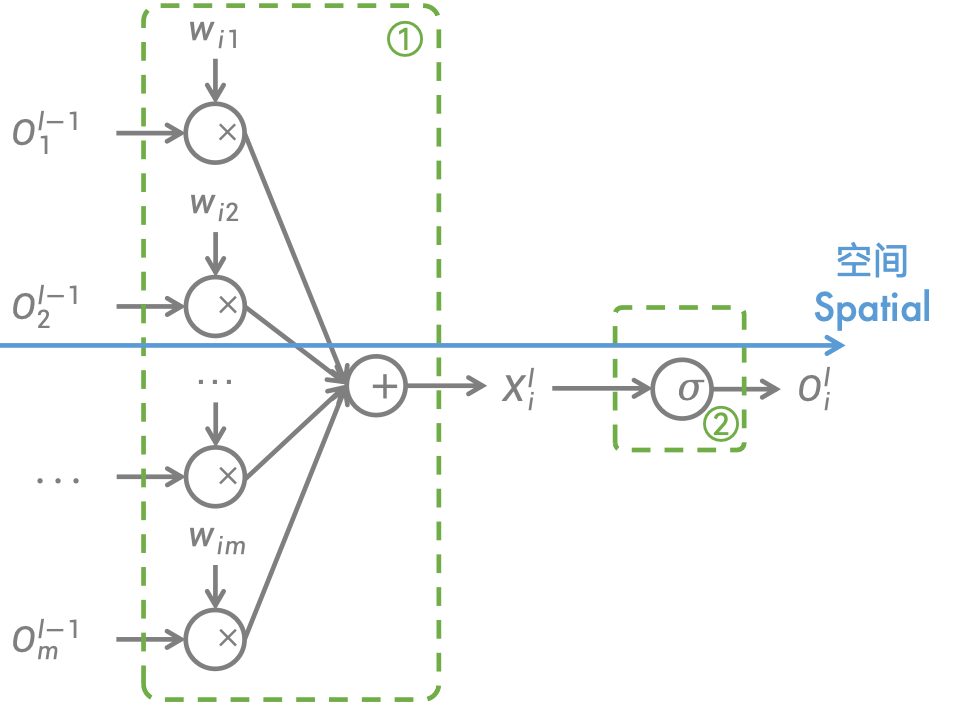
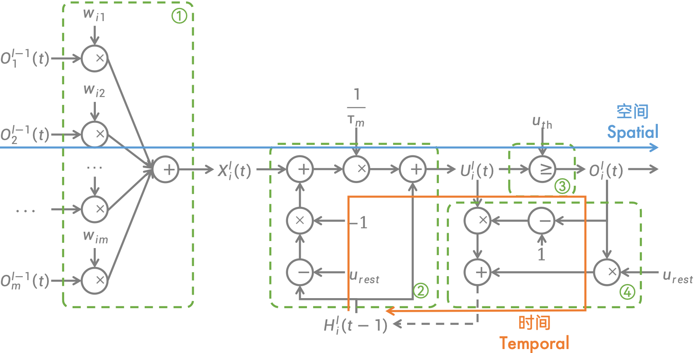

# Matterhorn （中文文档）

[English](./README.md)

[中文](./README_zh_cn.md)

## 1 基本介绍


Matterhorn 是基于 PyTorch 的，全新的通用 SNN 框架。

## 2 Matterhorn 的安装

以下是简略版本的安装，如果您是新手，详细的安装过程可以参考[ Matterhorn 的下载与使用教程](./docs/zh_cn/1_install.md)。

### 环境要求

Python （版本 >=3.7，<=3.9）

CUDA （版本 >=11.3.0， CUDNN 也需要装，如果电脑没有 NVIDIA 显卡不用安装）

PyTorch （版本 >=1.10.0 ， <=1.13.1）

TorchVision （版本 >=0.11.0 ， <= 0.13.1）

### 依赖安装

对于 Windows 用户来说，您需要安装额外的 GCC 和 G++ 编译器以正常安装 C++ 扩展，请安装 Visual Studio （仅安装生成工具），并执行[所下载的 MinGW 安装软件](./mingw-get-setup.exe)以安装环境。

随后执行：

```sh
git clone https://github.com/xjtuiair-cag/Matterhorn.git
cd Matterhorn
pip install -r requirements.txt
```

如果您是 Linux 的非 root 用户，而您的 Python 是全用户版本，请务必要加上 `sudo` 前缀。

### 安装 Matterhorn

```sh
git clone https://github.com/xjtuiair-cag/Matterhorn.git
cd Matterhorn
python3 setup.py develop
```

同上，如果您是 Linux 的非 root 用户，而您的 Python 是全用户版本，请务必要加上 `sudo` 前缀。

## 3 模块解释

### 术语

ANNs - 人工神经网络

SNNs - 脉冲神经网络

### SNNs 中的神经元

正如我们所知，下面的图像描述了 ANNs 的结构。



**函数1** 是 **突触函数** ，它使用权重和偏置来计算从上一层到当前层的值。常用的突触函数包括全连接层 `nn.Linear` ，卷积层 `nn.Conv2D` 等。

使用一个方程来描述突触函数：

$$Y^{l}=synapse(X^{l-1})$$

这里的 $l$ 表示当前层的编号。

**函数2** 是 **激活函数** ，它从突触中过滤信息并将过滤后的信息传递到下一层。常用的激活函数包括 `nn.ReLU` ， `nn.Sigmoid` 等。

使用一个方程来描述激活函数：

$$X^{l}=activation(Y^{l})$$

总之， ANNs 中的每一层都有两个功能。可以通过以下代码在 PyTorch 中构建 ANNs 模型：

```python
import torch.nn as nn

model = nn.Sequential(
    nn.Linear(28 * 28, 10),
    nn.ReLU()
)
```

这是一个单层的 MLP 。它可以将大小为 28x28 的图像作为输入，并将其分类为 10 个类别。在这个例子中， ANNs 的两个方程可以表示为：

$$Y^{l}=W^{l}X^{l-1}+\vec{b}$$

$$X^{l}=ReLU(Y^{l})$$

SNNs 中的突触方程与 ANNs 中的相同。然而， SNNs 的胞体函数却和 ANNs 不同。 SNNs 的胞体存在一个时间循环。下面的图像描述了 SNNs 的结构。



**函数1** 是 **突触函数** ，它计算来自前一层的脉冲 $O^{l-1}(t)$ ，从而生成输入电位 $X^{l}(t)$ 。

使用一个方程来描述突触函数：

$$X^{l}(t)=synapse(O^{l-1}(t))$$

**函数2** 中，输入电位与历史电位经过一个一阶微分方程生成胞体电位 $U^{l}(t)$ 。将其称为 **响应函数** 。

使用一个方程来描述响应函数：

$$U^{l}(t)=response(H^{l}(t-1),X^{l}(t))$$

每个脉冲神经元模型都有其独特的一阶响应微分方程。

例如， LIF 神经元的一阶响应微分方程为：

$$\tau \frac{du}{dt}=-(u-u_{rest})+RI$$

将其离散化为一阶差分方程，可以得到：

$$U^{l}(t)-H^{l}(t-1)=\frac{1}{\tau}[-[H^{l}(t-1)-u_{rest}]+X^{l}(t)]$$

**函数3** 使用 Heaviside 阶跃函数和阈电位 $u_{th}$ 决定是否生成脉冲 $O^{l}(t)$ 。将其称为 **脉冲函数** 。

使用一个方程来描述脉冲函数：

$$O^{l}(t)=spiking(U^{l}(t))$$

通常，脉冲函数看起来像这样。

$$O^{l}(t)=Heaviside(U^{l}(t)-u_{th})$$

其中， Heaviside 阶跃函数在输入大于或等于 0 时返回 1 ，在其他情况下返回 0 。

**函数4** 的目的是通过输出脉冲 $O^{l}(t)$ 在神经元上设置不应期时间。将其称为 **重置函数** 。

使用一个方程来描述重置函数：

$$H^{l}(t)=reset(U^{l}(t),O^{l}(t))$$

在大多数情况下，使用下面的方程来重置电位（硬重置）：

$$H^{l}(t)=U^{l}(t)[1-O^{l}(t)]+u_{rest}O^{l}(t)$$

简而言之，可以使用 4 个方程来描述脉冲神经元。这就是 SNNs 的样子。在脉冲神经元中，数据的流向类似小号。其同时接受来自突触和上一时刻神经元的电位作为输入，并产生脉冲输出，同时将这一时刻神经元的电位送往下一时刻。

通过在时间维度上展开脉冲神经元，可以得到 SNNs 的时空拓扑网络。


与在 PyTorch 中构建 ANNs 一样，在 Matterhorn 中，可以通过以下代码构建 SNNs ：

```python
import torch
import matterhorn_pytorch.snn as snn

snn_model = snn.Temporal(
    snn.Spatial(
        snn.Linear(28 * 28, 10),
        snn.LIF()
    )
)
```

在以上代码中， `Spatial` 是 Matterhorn 的其中一个容器，用于表示在空间维度上依次排列的 SNN 层，而 `Temporal` 是 Matterhorn 的另一个容器，用于在时间维度上重复计算电位和脉冲。通过使用 `Spatial` 和 `Temporal` 两个容器，可以构建一个时空拓扑网络，从而进行 SNNs 的训练。

构建的网络接受 $n+1$ 维的 `torch.Tensor` 作为输入脉冲序列。第一个维度默认为时间步，它会循环每个时间步去进行计算。之后，它将生成一个 `torch.Tensor` 作为输出脉冲序列。对它的计算就像对 PyTorch 中 ANN 模型的计算一样。这其中最重要的是对脉冲进行编解码。

### 编码和解码

脉冲序列是时间轴上的 Dirac 冲激响应函数的集合。

$$O(t)=\sum_{t_{i}}δ(t-t_{i})$$

换句话说，离散脉冲序列中只会有 0 和 1 。因此，可以使用一个 $n+1$ 维张量来表示脉冲序列。如下所示，如果将神经元展平为一维向量，可以使用另一个维度来表示时间，从而使其成为一个二维矩阵来表示通过空间和时间的脉冲序列。

$$
\begin{matrix}
 & →s \\
↓t &
\begin{bmatrix}
0 & 1 & 1 & 0 & 1 & 0 & 0 & 1 \\
1 & 0 & 0 & 1 & 0 & 0 & 1 & 1 \\
1 & 1 & 1 & 1 & 1 & 1 & 0 & 1 \\
1 & 0 & 1 & 1 & 0 & 1 & 0 & 1 \\
\end{bmatrix}
\end{matrix}
$$

以上矩阵就是一个脉冲序列。它有 4 行（第一个维度大小为 4），代表 4 个时间步。此外，它有 8 列（第二个维度大小为 8），代表 8 个输出神经元。

要将传统的二进制信息（图像、声音等）转换为脉冲序列，需要一个编码器。非事件数据的最常用编码器是泊松编码器，它是一种速率编码器。它将像素的强度视为产生脉冲的概率。

您可以在 Matterhorn 中通过以下代码构造一个泊松编码器：

```python
import torch
import matterhorn_pytorch.snn as snn

encoder = snn.PoissonEncoder(
    time_steps = 32
)
```

然后，您可以使用以下代码使用它：

```python
spike_train = encoder(image)
```

形状为 `[H, W, C]` 的图像将被编码为形状为 `[T, H, W, C]` 的脉冲序列。例如，形状为 `[28, 28]` 的MNIST图像将被编码（`T=32`）为形状为 `[32, 28, 28]` 的脉冲序列。

经过编码和处理后，网络将生成一个输出脉冲序列。从脉冲序列中获取信息需要进行解码。一种常用的解码方法是计算每个输出神经元的平均脉冲发射率。

$$o_{i}=\frac{1}{T}\sum_{t=1}^{T}{O_{i}^{K}(t)}$$

您可以在 Matterhorn 中通过以下代码构造一个平均脉冲发射率解码器：

```python
import torch
import matterhorn_pytorch.snn as snn

decoder = snn.AvgSpikeDecoder()
```

它将把第一个维度视为时间维度，并生成统计结果作为输出。输出可以传输到 ANNs 中进行进一步处理。

Matterhorn 提供了一个方便的容器 `matterhorn_pytorch.snn.Sequential` 来连接所有的 SNN 和 ANN 模型。它会自动判断如何适应所有模型的时间步变化，因此在代码中，您不用再考虑时间步。

```python
import torch
import matterhorn_pytorch.snn as snn

model = snn.Sequential(
    snn.PoissonEncoder(
        time_steps = time_steps,
    ),
    snn.Flatten(),
    snn.Linear(28 * 28, 10, bias = False),
    snn.LIF(tau_m = tau, trainable = True),
    snn.AvgSpikeDecoder()
)
```

到目前为止，您已经知道了 SNNs 的样子以及如何使用 Matterhorn 构建它。要进行更深入的体验，您可以参考 [examples/1_starting.py](./examples/1_starting.py) 。

```sh
cd Matterhorn
python3 examples/1_starting.py
```

在大多数情况下， SNNs 的神经元可以分为 1 个突触函数和 3 个胞体函数。然而，总会有一些特殊情况。 SRM0 神经元模型是其中之一，其响应在每个突触中计算。可以使用 5 个函数来表示 SRM0 神经元，其中 2 个是突触函数，3 个是胞体函数：

**函数1** ： **突触响应函数**

$$R_{j}^{l}(t)=(1-\frac{1}{\tau_{m}})R_{j}^{l}(t-1)+O_{j}^{l}(t)$$

**函数2** ： **突触函数**

$$X_{i}^{l}(t)=\sum_{j}{w_{ij}R_{j}^{l}(t)}$$

**函数3** ： **响应函数**

$$U_{i}^{l}(t)=X_{i}^{l}(t)H_{i}^{l}(t-1)$$

**函数4** ： **脉冲函数**

$$O_{i}^{l}(t)=Heaviside(U_{i}^{l}(t))$$

**函数5** ： **重置函数**

$$H_{i}^{l}(t)=1-O_{i}^{l}(t)$$

通过 5 个相似的函数，可以构建一个 SRM0 神经元。要进行更深入的体验，您可以参考 [examples/3_using_srm0_neuron.py](./examples/3_using_srm0_neuron.py) 。

```sh
cd Matterhorn
python3 examples/3_using_srm0_neuron.py
```

### 为什么需要替代梯度

在脉冲神经元中，通常使用 Heaviside 阶跃函数 $u(t)$ 来决定是否生成脉冲：

$$O^{l}(t)=u(U^{l}(t)-u_{th})$$


然而， Heaviside 阶跃函数具有一个烦人的导数，那就是 Dirac 冲激响应函数 $\delta (t)$ 。当 x 为 0 时， Dirac 冲激响应函数为正无穷，否则为 0 。如果它直接用于反向传播，势必会造成梯度爆炸或梯度消失。

因此，需要一些函数来替代 Dirac 冲激响应函数完成反向传播。称这些函数为替代梯度。

其中最常见的替代梯度之一是矩形函数。当 x 的绝对值足够小时，它是一个正的常数，否则为 0 。


此外，适用于替代梯度的函数还包括 Sigmoid 函数的导数、高斯函数等。

您可以在 `matterhorn_pytorch.snn.surrogate` 中看见所有提供的替代梯度函数。

### 学习：BPTT 和 STDP

训练 SNNs 可以和训练 ANNs 一样简单，一旦解决了 Heaviside 阶跃函数的梯度问题。将 SNNs 展开成时空网络后，就可以在 SNNs 中使用沿时间反向传播（BPTT）。在空间维度上，梯度会沿层传播；在时间维度上，梯度会沿时间步传播。


除 BPTT 之外，还有另一种在每个神经元中本地无监督训练的简单方法，称之为脉冲时序依赖可塑性（STDP）。 STDP 使用输入和输出脉冲之间的精确时间差异来计算权重增量。

遵循以下方程：
STDP 
$$Δw_{ij}=\sum_{t_{j}}{\sum_{t_{i}}W(t_{i}-t_{j})}$$

其中权重函数 $W(x)$ 为：

$$
W(x)=
\begin{aligned}
A_{+}e^{-\frac{x}{τ_{+}}},x>0 \\\\
0,x=0 \\\\
-A_{-}e^{\frac{x}{τ_{-}}},x<0
\end{aligned}
$$


通过设置参数 $A_{+}$ 、 $τ_{+}$ 、 $A_{-}$ 和 $τ_{-}$ ，可以轻松地进行无监督训练 SNNs 。有关更多体验，请参考 [examples/2_using_stdp.py](./examples/2_using_stdp.py) 。

```sh
cd Matterhorn
python3 examples/2_using_stdp.py
```

**注意：** 请确保已安装 `matterhorn_cpp_extensions` （或者如果有 CUDA ，则安装 `matterhorn_cuda_extensions`），否则速度将非常慢。

```sh
cd matterhorn_cpp_extensions
python3 setup.py develop
```

如果有 CUDA ，您可以安装 CUDA 版本：

```sh
cd matterhorn_cuda_extensions
python3 setup.py develop
```

### 神经形态数据集

Matterhorn 提供了一些神经形态数据集用来训练 SNNs 。您可以通过示例 [examples/4_convolution_and_event_datasets.py](./examples/4_convolution_and_event_datasets.py) 体验 Matterhorn 中预设神经形态数据集的用法。

```sh
cd Matterhorn
python3 examples/4_convolution_and_event_datasets.py
```

#### NMNIST

MNIST 我们耳熟能详。 MNIST 数据集用于训练图像分类，由一组 28x28 像素的手写数字（0-9）的灰度图像组成。 NMNIST 与 MNIST 类似，不同之处在于它将图像进行微小变形并将这一过程记录为事件。 NMNIST 数据集中事件的形状为 `[T, 2, 34, 34]` 。


您可以通过如下代码在 Matterhorn 中使用 NMNIST 数据集：

```python
from matterhorn_pytorch.data import NMNIST

time_steps = 128

train_dataset = NMNIST(
    root = "your/data/path",
    train = True,
    download = True,
    time_steps = time_steps
)
test_dataset = NMNIST(
    root = "your/data/path",
    train = False,
    download = True,
    time_steps = time_steps
)
```

#### CIFAR10-DVS

CIFAR10-DVS 数据集是通过对 CIFAR-10 数据集中的图像经过微小变形并将这一过程由事件相机记录为事件所得到的。 CIFAR10-DVS 数据集中事件的形状为 `[T, 2, 128, 128]` 。


您可以通过如下代码在 Matterhorn 中使用 CIFAR10-DVS 数据集：

```python
from matterhorn_pytorch.data import CIFAR10DVS

time_steps = 128

train_dataset = CIFAR10DVS(
    root = "your/data/path",
    train = True,
    download = True,
    time_steps = time_steps
)
test_dataset = CIFAR10DVS(
    root = "your/data/path",
    train = False,
    download = True,
    time_steps = time_steps
)
```

#### DVS128 Gesture

DVS128 Gesture 数据集通过事件相机记录了来自 29 个不同人在 3 种不同照明条件下的手势。 DVS128 Gesture 数据集中事件的形状为 `[T, 2, 128, 128]` 。


您可以通过如下代码在 Matterhorn 中使用 DVS128 Gesture 数据集：

```python
from matterhorn_pytorch.data import DVS128Gesture

time_steps = 128

train_dataset = DVS128Gesture(
    root = "your/data/path",
    train = True,
    download = True,
    time_steps = time_steps
)
test_dataset = DVS128Gesture(
    root = "your/data/path",
    train = False,
    download = True,
    time_steps = time_steps
)
```

**注意：** 您可能需要将参数 `sampling` 设置为在您的设备上节省磁盘空间。

```python
train_dataset = DVS128Gesture(
    root = "your/data/path",
    train = True,
    download = True,
    sampling = 600,
    time_steps = time_steps
)
```

建议设置为大于 100 （从每 `sampling` 个事件中选择一个）。

#### Spiking Heidelberg Digits（SHD）

SHD 数据集记录了从 1 到 10 的英语和德语口语数字，并将它们转换为事件。 SHD 数据集中事件的形状为 `[T, 700]` 。


您可以通过如下代码在 Matterhorn 中使用 SHD 数据集：

```python
from matterhorn_pytorch.data import SpikingHeidelbergDigits

time_steps = 128

train_dataset = SpikingHeidelbergDigits(
    root = "your/data/path",
    train = True,
    download = True,
    time_steps = time_steps
)
test_dataset = SpikingHeidelbergDigits(
    root = "your/data/path",
    train = False,
    download = True,
    time_steps = time_steps
)
```

## 4 神经形态硬件支持

在做了在做了，别问，问就是明天更新。

## 参考文献（特别感谢）

[1] Fang W, Chen Y, Ding J, et al. SpikingJelly: An open-source machine learning infrastructure platform for spike-based intelligence[J]. Science Advances, 2023, 9(40): eadi1480.

[2] Fang W, Yu Z, Chen Y, et al. Deep residual learning in spiking neural networks[J]. Advances in Neural Information Processing Systems, 2021, 34: 21056-21069.

[3] Yao M, Gao H, Zhao G, et al. Temporal-wise attention spiking neural networks for event streams classification[C]//Proceedings of the IEEE/CVF International Conference on Computer Vision. 2021: 10221-10230.