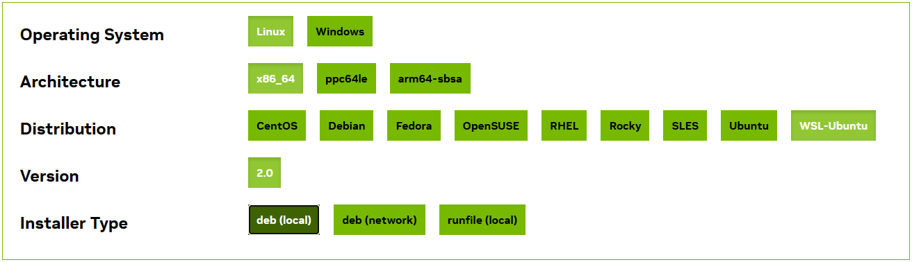

# Installation of Matterhorn

[English](../en_us/1_install.md)

[中文](../zh_cn/1_install.md)

## 1 Installing Python, CUDA, and PyTorch

### 1.1 Installing GIT and Python

**Please do not install Python of 3.10 and above, as they do not support PyTorch versions 1.x. If you have already installed, you can create a suitable Python virtual environment through Anaconda. It is recommended to use Python of versions from 3.7 to 3.9.**

#### For Windows Users

First, install Chocolatey (Windows package manager):

Right-click on the Windows icon, select "Command Prompt (Admin)" or "Terminal (Admin)" (if your terminal default is `cmd`), then input:

```sh
@"%SystemRoot%\System32\WindowsPowerShell\v1.0\powershell.exe" -NoProfile -InputFormat None -ExecutionPolicy Bypass -Command "iex ((New-Object System.Net.WebClient).DownloadString('https://chocolatey.org/install.ps1'))" && SET "PATH=%PATH%;%ALLUSERSPROFILE%\chocolatey\bin"
```

Or select "PowerShell (Admin)" or "Terminal (Admin)" (if your terminal default is `powershell`), then input:

```sh
Set-ExecutionPolicy Bypass -Scope Process -Force; iex ((New-Object System.Net.WebClient).DownloadString('https://chocolatey.org/install.ps1'))
```

Then follow the prompted steps to install. After installation, close the current command line and open a new one.

Then, input the following command in the command line:

```sh
choco install git
```

Once GIT installation is complete, go to [https://mirrors.tuna.tsinghua.edu.cn/anaconda/archive/Anaconda3-2020.11-Windows-x86_64.exe](https://mirrors.tuna.tsinghua.edu.cn/anaconda/archive/Anaconda3-2020.11-Windows-x86_64.exe) to download and install Anaconda (base environment is Python 3.8). **Note:** Be sure to add the conda environment to PATH (when "add ... to PATH" appears, please check it).

**Testing**

Then, input the following commands in the command line:

```sh
git --help
python --help
pip --help
```

Check if they are installed successfully. If there is no error, it means the installation was successful.

#### For MacOS Users

First, install Homebrew (MacOS package manager):

Open the "Terminal" application, and then input:

```sh
# Without GFW (if you don't know GFW, use this)
/bin/bash -c "$(curl -fsSL https://raw.githubusercontent.com/Homebrew/install/HEAD/install.sh)"
# With GFW (if errors occur, use this)
/bin/zsh -c "$(curl -fsSL https://gitee.com/cunkai/HomebrewCN/raw/master/Homebrew.sh)"
```

Follow the prompted steps to install. After installation, close the current command line and open a new one.

Then, input the following command in the command line:

```sh
brew install git
```

Once GIT installation is complete, go to [https://mirrors.tuna.tsinghua.edu.cn/anaconda/archive/Anaconda3-2020.11-MacOSX-x86_64.pkg](https://mirrors.tuna.tsinghua.edu.cn/anaconda/archive/Anaconda3-2020.11-MacOSX-x86_64.pkg) to download and install Anaconda (base environment is Python 3.8).

**Testing**

Then, input the following commands in the command line:

```sh
git --help
python --help
pip --help
```

Check if they are installed successfully. If there is no error, it means the installation was successful.

#### For Linux Users

First, update APT sources. Input the following command in the command line:

```sh
sudo apt update
```

Then, input the following command in the command line:

```sh
sudo apt install git python3-pip python-is-python3
```

Install GIT and PIP. **Note:** Ubuntu 20.04 comes with Python version 3.8, so there is no need to reinstall Anaconda; however, the built-in Python does not include PIP and needs to be installed manually.

Alternatively, you can go to [https://mirrors.tuna.tsinghua.edu.cn/anaconda/archive/Anaconda3-2020.11-Linux-x86_64.sh](https://mirrors.tuna.tsinghua.edu.cn/anaconda/archive/Anaconda3-2020.11-Linux-x86_64.sh) to download and install Anaconda (base environment is Python 3.8) through:

```sh
sudo path/to/Anaconda3-2020.11-Linux-x86_64.sh
```

**Testing**

Then, input the following commands in the command line:

```sh
git --help
python3 --help
pip3 --help
```

Check if they are installed successfully. If there is no error, it means the installation was successful.

### 1.2 Installing CUDA and CUDNN

If you do not have a CUDA-supported NVIDIA™ graphics card, you can skip this step. **CUDA versions 11.6 and above are all installable,** and it is recommended to install [CUDA 11.7.1](https://developer.nvidia.com/cuda-11-7-1-download-archive) version.

#### For Linux Users

Click on the link [https://developer.nvidia.com/cuda-11-7-1-download-archive](https://developer.nvidia.com/cuda-11-7-1-download-archive), and choose the following options for installation:

If you are a dual-boot or virtual machine user, please make the following selection:


If you are a WSL user, please make the following selection:



Then, relevant command lines will pop up at the bottom of the page:


Please copy and execute the commands in sequence for CUDA installation.

After CUDA installation, please proceed to [https://developer.nvidia.com/zh-cn/cudnn](https://developer.nvidia.com/zh-cn/cudnn) and download and install CUDNN suitable for CUDA 11.x according to the page instructions.

**Note:** Although CUDA and CUDNN are installed after completing the above steps, they will not be activated automatically when executed. At this point, we need to add self-startup code in `~/.bashrc`:

(1) Use `vim` (or text editor, etc.) to open `~/.bashrc`;

```sh
sudo apt install vim
sudo vim ~/.bashrc
```

(2) Then, the command line will display the content of `~/.bashrc`. Move the cursor to the end of the file, press the `I` key to start editing, and insert the following code at the end;

```sh
function switch_cuda {
   v=$1
   export PATH=/usr/local/cuda-$v/bin:$PATH
   export CUDADIR=/usr/local/cuda-$v
   export CUDA_HOME=/usr/local/cuda-$v
   export LD_LIBRARY_PATH=/usr/local/cuda-$v/lib64:$LD_LIBRARY_PATH
}
switch_cuda 11.7
```

(3) After insertion, press the `esc` key to enter command input mode, and input:

```sh
:wq
```

to save and exit;

(4) Close the command line or input:

```sh
source ~/.bashrc
```

to make CUDA effective in the command line.

**Testing**

After installation, input the following command in the command line:

```sh
nvcc --version
```

If there is no error, and the version number is observed to be 11.7.1, it means the installation was successful.

#### For Windows Users

Please refer to the tutorial [https://zhuanlan.zhihu.com/p/99880204](https://zhuanlan.zhihu.com/p/99880204) for installation. It is recommended to install CUDA 11.7.1.

**Testing**

After installation, input the following command in the command line:

```sh
nvcc --version
```

If there is no error, and the version number is observed to be 11.7.1, it means the installation was successful.

### 1.3 Installing PyTorch

Copy from [PyTorch Historical Versions](https://pytorch.org/get-started/previous-versions/) page, **do not install PyTorch versions above 2.0, as we cannot determine if there are compatibility issues.** It is recommended to install version 1.13.1.

#### For MacOS Users

```sh
pip install torch==1.13.1 torchvision==0.14.1 torchaudio==0.13.1
```

#### For Windows or Linux Users

```sh
# For ROCM 5.2
pip install torch==1.13.1+rocm5.2 torchvision==0.14.1+rocm5.2 torchaudio==0.13.1 --extra-index-url https://download.pytorch.org/whl/rocm5.2
# For CUDA 11.6
pip install torch==1.13.1+cu116 torchvision==0.14.1+cu116 torchaudio==0.13.1 --extra-index-url https://download.pytorch.org/whl/cu116
# For CUDA 11.7
pip install torch==1.13.1+cu117 torchvision==0.14.1+cu117 torchaudio==0.13.1 --extra-index-url https://download.pytorch.org/whl/cu117
# Otherwise
pip install torch==1.13.1+cpu torchvision==0.14.1+cpu torchaudio==0.13.1 --extra-index-url https://download.pytorch.org/whl/cpu
```

**Testing**

After installation, open the command line, input:

```sh
# Windows or MacOS
python
# Ubuntu 20.04
python3
```

When Python is started, input:

```python
import torch
```

If there are no errors, it means PyTorch has been successfully installed.

If you have installed the CUDA version of PyTorch, continue by inputting:

```python
torch.cuda.is_available()
```

If the command line returns:

```python
True
```

then it indicates that the CUDA extension of PyTorch is available and machine learning can be performed using the GPU.

## 2 Installing GCC and G++

Matterhorn relies on C++ and CUDA for accelerating neurons. If you want Matterhorn to run at full speed and get the best experience, please install GCC and G++.

If you input

```sh
gcc -v
g++ -v
```

in the command line without errors, you can skip this step.

### For Windows Users

Use the provided `mingw-get-setup.exe` in this repository, and refer to [this tutorial](https://blog.csdn.net/weixin_43448473/article/details/126942594) for installing GCC and G++.

### For MacOS Users

Refer to [this tutorial](https://segmentfault.com/a/1190000018045211) for installing Command Line Tools, which includes the GCC and G++ provided by Apple.

### For Linux Users

Install GCC and G++ via APT:

```sh
sudo apt install gcc g++
```

**Testing**

Open the command line, input:

```sh
gcc -v
g++ -v
```

If there are no errors, it means the installation was successful.

## 3 Installing Matterhorn

Clone the repository:

```sh
cd your/path
git clone https://github.com/xjtuiair-cag/Matterhorn.git
```

Then install:

```sh
cd Matterhorn
python setup.py develop
```

If an error occurs, please check if you are running in administrator mode (reopen terminal in administrator mode for Windows, add `sudo` before the command for Linux).

**Testing**

Open the command line, input:

```sh
python
```

When Python is started, input:

```python
import matterhorn_pytorch as mth
```

If there are no errors, it means Matterhorn has been successfully installed.