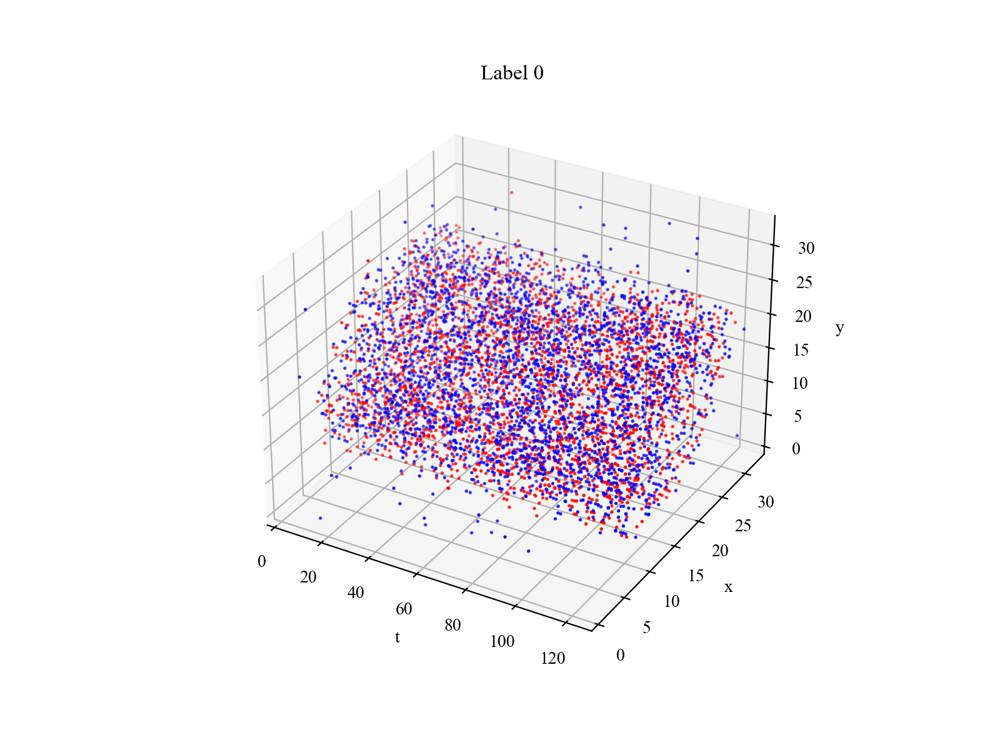

# `matterhorn_pytorch.data`

[Back to `matterhorn_pytorch`](../README.md)

[English](../../en_us/data/README.md)

[中文](../../zh_cn/data/README.md)

## Module Introduction

The module for neuromorphic datasets in Matterhorn, containing handling methods for various neuromorphic datasets.

## `matterhorn_pytorch.data.CIFAR10DVS` / `matterhorn_pytorch.data.aedat.CIFAR10DVS`

CIFAR10-DVS neuromorphic dataset.

```python
CIFAR10DVS(
    root: str,
    train: bool = True,
    transform: Optional[Callable] = None,
    target_transform: Optional[Callable] = None,
    download: bool = False,
    sampling: int = 1,
    count: bool = False,
    time_steps: int = 128,
    width: int = 128,
    height: int = 128,
    polarity: bool = True,
    clipped: Optional[Union[Iterable, int]] = None
)
```

### Constructor Arguments

`root (str)`: Location where all the dataset data is stored.

`train (bool)`: Whether it is the training set. If `True`, loads the training set data; if `False`, loads the test set data.

`transform (Callable | None)`: Transformation applied to the data in the dataset.

`target_transform (Callable | None)`: Transformation applied to the labels in the dataset.

`download (bool)`: Whether to attempt downloading the dataset resources if not available locally.

`sampling (int)`: Interval for sampling events. Default is `1`, meaning all events in the dataset are selected. This parameter is for preventing event density, thus saving computational costs.

`count (bool)`: Whether to output the event count for each point as pulse output. If `False`, the pulse sequence will only have `0` and `1`; otherwise, the output is the event count of that point.

`time_steps (int)`: Time steps `T` for the output tensor.

`width (int)`: Width `W` of the output tensor.

`height (int)`: Height `H` of the output tensor.

`polarity (bool)`: Whether the output tensor contains polarity. If `True`, the output tensor contains polarity, `P = 2`; otherwise, it does not, `P = 1`.

`clipped (Iterable | int | None)`: Whether to clip the original time to start and end times. It can take a tuple like `(start, end)`, representing the end timestamp as an integer, or `None` (no clipping).

### Example Usage

```python
import torch
import matterhorn_pytorch as mth


test_dataset = mth.data.CIFAR10DVS(
    root = './examples/data',
    train = False,
    download = True,
    time_steps = 128
)
demo_data, demo_label = test_dataset[0]
mth.util.plotter.event_plot_tyx(demo_data, titles = ["Label %s" % test_dataset.labels[demo_label]])
```


## `matterhorn_pytorch.data.DVS128Gesture` / `matterhorn_pytorch.data.aedat.DVS128Gesture`

DVS128 Gesture neuromorphic dataset.

**Note**: This dataset cannot be downloaded even if you set `download` to `True`. You should download all the data from [https://ibm.ent.box.com/s/3hiq58ww1pbbjrinh367ykfdf60xsfm8/folder/50167556794](https://ibm.ent.box.com/s/3hiq58ww1pbbjrinh367ykfdf60xsfm8/folder/50167556794) and place it into the `root/raw` folder.

```python
DVS128Gesture(
    root: str,
    train: bool = True,
    transform: Optional[Callable] = None,
    target_transform: Optional[Callable] = None,
    download: bool = False,
    sampling: int = 1,
    count: bool = False,
    time_steps: int = 128,
    width: int = 128,
    height: int = 128,
    polarity: bool = True,
    clipped: Optional[Union[Iterable, int]] = None
)
```

### Constructor Arguments

`root (str)`: Location where all the dataset data is stored.

`train (bool)`: Whether it is the training set. If `True`, loads the training set data; if `False`, loads the test set data.

`transform (Callable | None)`: Transformation applied to the data in the dataset.

`target_transform (Callable | None)`: Transformation applied to the labels in the dataset.

`download (bool)`: Whether to attempt downloading the dataset resources if not available locally.

`sampling (int)`: Interval for sampling events. Default is `1`, meaning all events in the dataset are selected. This parameter is for preventing event density, thus saving computational costs.

`count (bool)`: Whether to output the event count for each point as pulse output. If `False`, the pulse sequence will only have `0` and `1`; otherwise, the output is the event count of that point.

`time_steps (int)`: Time steps `T` for the output tensor.

`width (int)`: Width `W` of the output tensor.

`height (int)`: Height `H` of the output tensor.

`polarity (bool)`: Whether the output tensor contains polarity. If `True`, the output tensor contains polarity, `P = 2`; otherwise, it does not, `P = 1`.

`clipped (Iterable | int | None)`: Whether to clip the original time to start and end times. It can take a tuple like `(start, end)`, representing the end timestamp as an integer, or `None` (no clipping).

### Example Usage

```python
import torch
import matterhorn_pytorch as mth


test_dataset = mth.data.DVS128Gesture(
    root = './examples/data',
    train = False,
    download = True,
    time_steps = 128
)
demo_data, demo_label = test_dataset[0]
mth.util.plotter.event_plot_tyx(demo_data, titles = ["Label %s" % test_dataset.labels[demo_label]])
```


## `matterhorn_pytorch.data.SpikingHeidelbergDigits` / `matterhorn_pytorch.data.hdf5.SpikingHeidelbergDigits`

Spiking Heidelberg Digits (SHD) neuromorphic dataset.

```python
CIFAR10DVS(
    root: str,
    train: bool = True,
    transform: Optional[Callable] = None,
    target_transform: Optional[Callable] = None,
    download: bool = False,
    sampling: int = 1,
    count: bool = False,
    precision: float = 1e9,
    time_steps: int = 128,
    length: int = 700,
    clipped: Optional[Union[Iterable, float]] = None
)
```

### Constructor Arguments

`root (str)`: Location where all the dataset data is stored.

`train (bool)`: Whether it is the training set. If `True`, loads the training set data; if `False`, loads the test set data.

`transform (Callable | None)`: Transformation applied to the data in the dataset.

`target_transform (Callable | None)`: Transformation applied to the labels in the dataset.

`download (bool)`: Whether to attempt downloading the dataset resources if not available locally.

`sampling (int)`: Interval for sampling events. Default is `1`, meaning all events in the dataset are selected. This parameter is for preventing event density, thus saving computational costs.

`count (bool)`: Whether to output the event count for each point as pulse output. If `False`, the pulse sequence will only have `0` and `1`; otherwise, the output is the event count of that point.

`precision (float)`: Precision of the dataset. Keep the default value `1e9`.

`time_steps (int)`: Time steps `T` for the output tensor.

`length (int)`: Spatial length `L` of the output tensor.

`clipped (Iterable | int | None)`: Whether to clip the original time to start and end times. It can take a tuple like `(start, end)`, representing the end timestamp as an integer, or `None` (no clipping).

### Example Usage

```python
import torch
import matterhorn_pytorch as mth


test_dataset = mth.data.SpikingHeidelbergDigits(
    root = './examples/data',
    train = False,
    download = True,
    time_steps = 128
)
demo_data, demo_label = test_dataset[0]
mth.util.plotter.event_plot_tx(demo_data, titles = ["Label %s" % test_dataset.labels[demo_label]])
```


## `matterhorn_pytorch.data.NMNIST` / `matterhorn_pytorch.data.nmnist.NMNIST`

N-MNIST neuromorphic dataset.

```python
NMNIST(
    root: str,
    train: bool = True,
    transform: Optional[Callable] = None,
    target_transform: Optional[Callable] = None,
    download: bool = False,
    sampling: int = 1,
    count: bool = False,
    time_steps: int = 128,
    width: int = 34,
    height: int = 34,
    polarity: bool = True,
    clipped: Optional[Union[Iterable, int]] = None
)
```

### Constructor Arguments

`root (str)`: Location where all the dataset data is stored.

`train (bool)`: Whether it is the training set. If `True`, loads the training set data; if `False`, loads the test set data.

`transform (Callable | None)`: Transformation applied to the data in the dataset.

`target_transform (Callable | None)`: Transformation applied to the labels in the dataset.

`download (bool)`: Whether to attempt downloading the dataset resources if not available locally.

`sampling (int)`: Interval for sampling events. Default is `1`, meaning all events in the dataset are selected. This parameter is for preventing event density, thus saving computational costs.

`count (bool)`: Whether to output the event count for each point as pulse output. If `False`, the pulse sequence will only have `0` and `1`; otherwise, the output is the event count of that point.

`time_steps (int)`: Time steps `T` for the output tensor.

`width (int)`: Width `W` of the output tensor.

`height (int)`: Height `H` of the output tensor.

`polarity (bool)`: Whether the output tensor contains polarity. If `True`, the output tensor contains polarity, `P = 2`; otherwise, it does not, `P = 1`.

`clipped (Iterable | int | None)`: Whether to clip the original time to start and end times. It can take a tuple like `(start, end)`, representing the end timestamp as an integer, or `None` (no clipping).

### Example Usage

```python
import torch
import matterhorn_pytorch as mth


test_dataset = mth.data.NMNIST(
    root = './examples/data',
    train = False,
    download = True,
    time_steps = 128
)
demo_data, demo_label = test_dataset[0]
mth.util.plotter.event_plot_tyx(demo_data, titles = ["Label %s" % test_dataset.labels[demo_label]])
```

