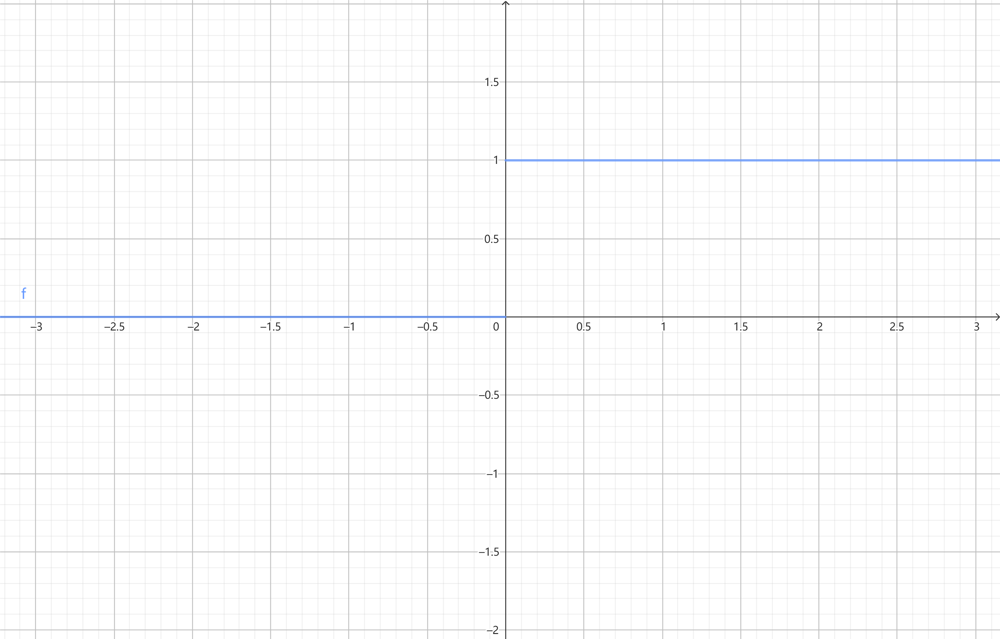
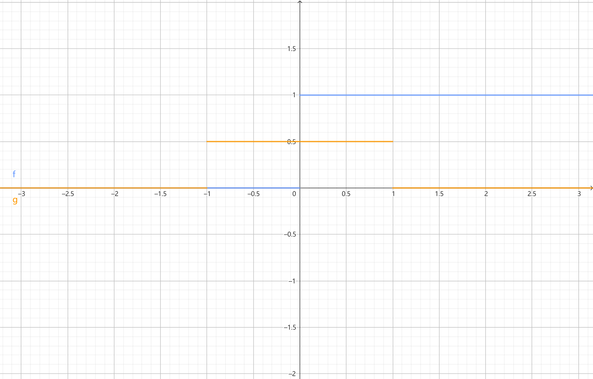
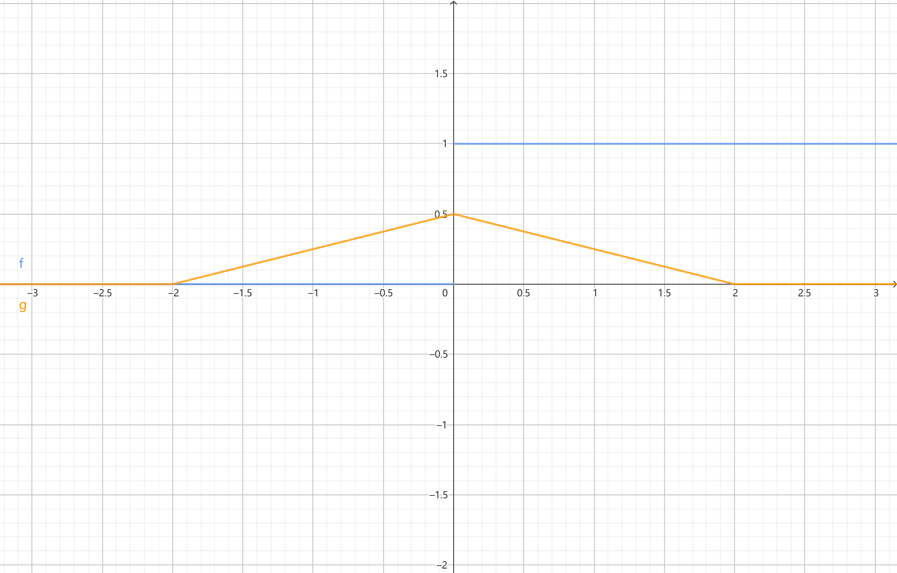
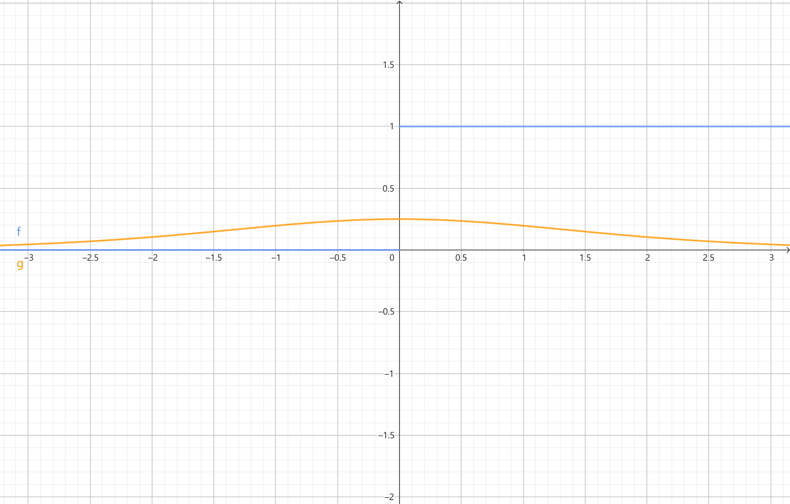

# `matterhorn_pytorch.snn.surrogate`

[Back to `matterhorn_pytorch.snn`](./README.md)

[English](../../en_us/snn/3_surrogate.md)

[中文](../../zh_cn/snn/3_surrogate.md)

## Module Introduction

Spiking neurons rely on the Heaviside step function to determine whether to generate spikes based on the current membrane potential and threshold potential. The formula is

$$u(x) := x \ge u_{th} ? 1 : 0$$



We use the `>=` operator to represent the Heaviside step function in spiking neurons. However, there is a problem: the derivative of the Heaviside step function, Dirac delta function

$$\delta (x) := x = u_{th} ? +\infty : 0$$

either equals positive infinity or zero. Directly using the Dirac delta function as the gradient will inevitably lead to gradient vanishing or exploding. Therefore, we need a function that can approximate the Dirac delta function as the gradient of the Heaviside step function to help complete the backpropagation of SNNs.

The surrogate gradient $h(x)$ should have the following properties:

(1) $\lim_{x \rightarrow \infty}{h(x)}=0$,

(2) $\int_{- \infty}^{+ \infty}{h(x)dx}=1$.

The module defines four surrogate gradients of the Heaviside step function, and you can find detailed definitions about them in reference [1].

The classes in this module are generally instantiated as the `spiking_function` parameter in the soma of spiking neurons (`matterhorn_pytorch.snn.soma`).

## `matterhorn_pytorch.snn.Rectangular()` / `matterhorn_pytorch.snn.surrogate.Rectangular()`

The simplest surrogate gradient. It treats the Heaviside step function as a piecewise linear function with a slope $k$. In this case, its gradient is a rectangular window. The formula is

$$h(x)=\frac{1}{a}(|x|\le\frac{a}{2})$$

Where the parameter $a$ is smaller, the narrower the rectangular window, and the higher the highest point $\frac{1}{a}$ of the rectangular window.



```py
Rectangular(
    a: float = 2.0
)
```

### Constructor Parameters

`a (float)`: Parameter $a$, determining the shape of the rectangular function.

### Example Usage

```python
import torch
import matterhorn_pytorch as mth


soma = mth.snn.LIF(
    spiking_function = mth.snn.Rectangular()
)
```

## `matterhorn_pytorch.snn.Polynomial()` / `matterhorn_pytorch.snn.surrogate.Polynomial()`

It uses a piecewise polynomial function to simulate the gradient of the Heaviside step function. The formula is

$$h(x)=(\frac{\sqrt{a}}{2}-\frac{a}{4}|x|)sgn(\frac{2}{\sqrt{a}}-|x|),|x|<\frac{2}{\sqrt{a}}$$

Where the parameter $a$ is larger, the narrower the triangular window, and the higher the highest point $\frac{\sqrt{a}}{2}$ of the triangular window.



```py
Polynomial(
    a: float = 1.0
)
```

### Constructor Parameters

`a (float)`: Parameter $a$, determining the shape of the triangular function.

### Example Usage

```python
import torch
import matterhorn_pytorch as mth


soma = mth.snn.LIF(
    spiking_function = mth.snn.Polynomial()
)
```

## `matterhorn_pytorch.snn.Sigmoid()` / `matterhorn_pytorch.snn.surrogate.Sigmoid()`

It treats the Heaviside step function as a very steep sigmoid function and uses the derivative of the sigmoid function to simulate the gradient of the Heaviside step function. The formula is

$$h(x)=\frac{1}{a}\frac{e^{\frac{x}{a}}}{(1+e^{\frac{x}{a}})^{2}}$$

Where the parameter $a$ is smaller, the tighter it is, and the higher the highest point $\frac{1}{4a}$.



```py
Sigmoid(
    a: float = 1.0
)
```

### Constructor Parameters

`a (float)`: Parameter $a$, determining the shape of the sigmoid derivative.

### Example Usage

```python
import torch
import matterhorn_pytorch as mth


soma = mth.snn.LIF(
    spiking_function = mth.snn.Sigmoid()
)
```

## `matterhorn_pytorch.snn.Gaussian()` / `matterhorn_pytorch.snn.surrogate.Gaussian()`

As a probability density function of the normal distribution, the Gaussian function satisfies the two requirements of being the gradient of the Heaviside step function. Therefore, the Gaussian function can be used as the surrogate gradient of the Heaviside step function. The formula is

$$h(x)=\frac{1}{\sqrt{2\pi a}}e^{\frac{-x^{2}}{2a}}$$

Where the parameter $a$ is smaller, the tighter it is, and the higher the highest point $\frac{1}{\sqrt{2\pi a}}$.


```py
Gaussian(
    a: float = 1.0
)
```

### Constructor Parameters

`a (float)`: Parameter $a$, determining the shape of the Gaussian function.

### Example Usage

```python
import torch
import matterhorn_pytorch as mth


soma = mth.snn.LIF(
    spiking_function = mth.snn.Gaussian()
)
```

## References

[1] Wu Y, Deng L, Li G, et al. Spatio-temporal backpropagation for training high-performance spiking neural networks[J]. Frontiers in neuroscience, 2018, 12: 331.