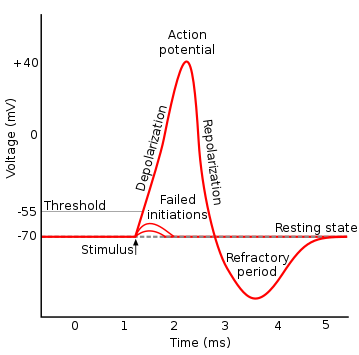

# `matterhorn_pytorch.snn.soma`

[Back to `matterhorn_pytorch.snn`](./README.md)

[English](../../en_us/snn/4_soma.md)

[中文](../../zh_cn/snn/4_soma.md)

## Module Introduction

### Spiking Neuron Models

The spiking neuron model originates from the biological neuron model: Hodgkin and Huxley conducted experiments on the squid's neuron in 1952 and obtained the Hodgkin-Huxley (HH) model. This model gradually evolved into the Leaky Integrate-and-Fire (LIF) model, from which various types of spiking neuron models have been derived.

However, these models have a similar characteristic: when the postsynaptic membrane receptors sense neurotransmitters, they generate excitatory or inhibitory signals, which eventually propagate to the soma along dendrites; excitatory signals accumulate in the soma; when the accumulated excitatory signal reaches a certain level, a neural impulse is generated in the neuron's soma, which then propagates along the axon to the synapse, releasing neurotransmitters. This process involves depolarization, hyperpolarization, and refractory period. The signal generated during this very short process is called a spike.



Since biological spikes are short in duration and have characteristics like "all or nothing", they can be represented by discrete values in computers: at a specific time step and a specific neuron, `1` represents a spike, and `0` represents no spike. Thus, a sequence of spikes existing in both time and space dimensions can be represented as a spike train.

Matterhorn's synapse module integrates spikes from the layer above and sends the postsynaptic potential (PSP) to the soma. The soma module accepts the postsynaptic potential from synapses, accumulates it, determines whether to generate spikes, and decides whether to enter the refractory period based on the spike generation.

## `matterhorn_pytorch.snn.soma.Soma`

```python
Soma(
    u_threshold: float = -0.055,
    u_rest: float = -0.07,
    spiking_function: torch.nn.Module = surrogate.Gaussian(),
    hard_reset: bool = True
)
```

### Constructor Parameters

`u_threshold (float)`: The threshold potential $u_{th}$.

`u_rest (float)`: The resting potential $u_{rest}$.

`spiking_function (torch.nn.Module)`: The surrogate function used for computing spikes, details can be found in [`matterhorn_pytorch.snn.firing`](./3_surrogate.md).

`hard_reset (bool)`: Whether to perform a hard reset.

### Overridable Methods

The computation process of the soma can be divided into 3 operations:

#### `f_response(self, h: torch.Tensor, x: torch.Tensor) -> torch.Tensor`: Response function

Calculate the current potential $U^{l}(t)$ based on the postsynaptic potential $X^{l}(t)$ and the historical potential $H^{l}(t - 1)$. The essential difference between different spiking neurons lies in the response function.

#### `f_firing(self, u: torch.Tensor) -> torch.Tensor`: Firing function

Typically, it uses the Heaviside step function to determine whether the current potential exceeds the threshold potential.

$$O^{l}(t)=(U^{l}(t) \ge u_{th})$$

Where $u_{th}$ is the threshold potential, and $\ge$ (`>=`) represents the operator for the Heaviside step function.

#### `f_reset(self, u: torch.Tensor, o: torch.Tensor) -> torch.Tensor`: Reset function

This function sets the refractory period. If there is no refractory period (only reset), it performs a single selection through the following function:

$$H^{l}(t)=U^{l}(t)(1-O^{l}(t))+u_{rest}O^{l}(t)$$

Where $u_{rest}$ is the resting potential. If there is a refractory period, a stored tensor is needed to record the length of the refractory period.

## `matterhorn_pytorch.snn.IF` / `matterhorn_pytorch.snn.soma.IF`

Integrate-and-Fire spiking neuron with the response function:

$$\frac{du}{dt}=IR$$

After discretization, the reaction function can be obtained:

$$U^{l}(t)=H^{l}(t-1)+X^{l}(t)$$

```python
IF(
    u_threshold: float = -0.055,
    u_rest: float = -0.07,
    spiking_function: torch.nn.Module = surrogate.Gaussian(),
    hard_reset: bool = True
)
```

### Constructor Parameters

`u_threshold (float)`: The threshold potential $u_{th}$.

`u_rest (float)`: The resting potential $u_{rest}$.

`spiking_function (torch.nn.Module)`: The surrogate function used for computing spikes, details can be found in [`matterhorn_pytorch.snn.firing`](./3_surrogate.md).

`hard_reset (bool)`: Whether to perform a hard reset.

### Example Usage

(1) Using default parameters:

```python
import torch
import matterhorn_pytorch as mth


soma = mth.snn.IF()
```

(2) Using custom parameters:

```python
import torch
import matterhorn_pytorch as mth


soma = mth.snn.IF(
    u_threshold = 1.0,
    u_rest = 0.0
)
```

(3) Using a custom spiking function:

```python
import torch
import matterhorn_pytorch as mth


soma = mth.snn.IF(
    spiking_function = mth.snn.Rectangular()
)
```

## `matterhorn_pytorch.snn.LIF` / `matterhorn_pytorch.snn.soma.LIF`

Leaky Integrate-and-Fire spiking neuron with the response function:

$$\tau_{m} \frac{du}{dt}=-(u-u_{rest})+IR$$

After discretization, the reaction function can be obtained:

$$U^{l}(t)=H^{l}(t-1)+\frac{1}{\tau_{m}}[-(H^{l}(t-1)-u_{rest})+X^{l}(t)]$$

```python
LIF(
    u_threshold: float = -0.055,
    u_rest: float = -0.07,
    tau_m: float = 2.0,
    spiking_function: torch.nn.Module = surrogate.Gaussian(),
    hard_reset: bool = True,
    trainable: bool = False,
    device: torch.device = None,
    dtype: torch.dtype = None
)
```

### Constructor Parameters

`u_threshold (float)`: The threshold potential $u_{th}$.

`u_rest (float)`: The resting potential $u_{rest}$.

`tau_m (float)`: Membrane time constant $\tau_{m}$.

`spiking_function (torch.nn.Module)`: The surrogate function used for computing spikes, details can be found in [`matterhorn_pytorch.snn.firing`](./3_surrogate.md).

`hard_reset (bool)`: Whether to perform a hard reset.

`trainable (bool)`: Whether the parameter $\tau_{m}$ can be trained.

`device (torch.device)`: Computational device to use.

`dtype (torch.dtype)`: Data type to use for computation.

### Example Usage

(1) Using default parameters:

```python
import torch
import matterhorn_pytorch as mth


soma = mth.snn.LIF()
```

(2) Using custom parameters:

```python
import torch
import matterhorn_pytorch as mth


soma = mth.snn.LIF(
    tau_m = 1.5,
    u_threshold = 1.0,
    u_rest = 0.0
)
```

(3) Using a custom spiking function:

```python
import torch
import matterhorn_pytorch as mth


soma = mth.snn.LIF(
    spiking_function = mth.snn.Rectangular()
)
```

## `matterhorn_pytorch.snn.QIF` / `matterhorn_pytorch.snn.soma.QIF`

Quadratic Integrate-and-Fire spiking neuron with the response function:

$$\tau_{m} \frac{du}{dt}=a_{0}(u-u_{rest})(u-u_{c})+RI$$

After discretization, the reaction function can be obtained:

$$U^{l}(t)=H^{l}(t-1)+\frac{1}{\tau_{m}}[a_{0}(H^{l}(t-1)-u_{rest})(H^{l}(t-1)-u_{c})+X^{l}(t)]$$

```python
QIF(
    u_threshold: float = -0.055,
    u_rest: float = -0.07,
    tau_m: float = 2.0,
    u_c: float = 1.0,
    a_0: float = 1.0,
    spiking_function: torch.nn.Module = surrogate.Gaussian(),
    hard_reset: bool = True,
    trainable: bool = False,
    device: torch.device = None,
    dtype: torch.dtype = None
)
```

### Constructor Parameters

`u_threshold (float)`: The threshold potential $u_{th}$.

`u_rest (float)`: The resting potential $u_{rest}$.

`tau_m (float)`: Membrane time constant $\tau_{m}$.

`u_c (float)`: Parameter $u_{c}$.

`a_0 (float)`: Parameter $a_{0}$.

`spiking_function (torch.nn.Module)`: The surrogate function used for computing spikes, details can be found in [`matterhorn_pytorch.snn.firing`](./3_surrogate.md).

`hard_reset (bool)`: Whether to perform a hard reset.

`trainable (bool)`: Whether the parameters $\tau_{m}$, $u_{c}$, and $a_{0}$ can be trained.

`device (torch.device)`: Computational device to use.

`dtype (torch.dtype)`: Data type to use for computation.

### Example Usage

(1) Using default parameters:

```python
import torch
import matterhorn_pytorch as mth


soma = mth.snn.QIF()
```

(2) Using custom parameters:

```python
import torch
import matterhorn_pytorch as mth


soma = mth.snn.QIF(
    tau_m = 1.5,
    u_threshold = 1.0,
    u_rest = 0.0,
    u_c = 0.99,
    a_0 = 1.01
)
```

(3) Using a custom spiking function:

```python
import torch
import matterhorn_pytorch as mth


soma = mth.snn.QIF(
    spiking_function = mth.snn.Rectangular()
)
```

## `matterhorn_pytorch.snn.ExpIF` / `matterhorn_pytorch.snn.soma.ExpIF`

Exponential Integrate-and-Fire spiking neuron with the response function:

$$\tau_{m} \frac{du}{dt}=-(u-u_{rest})+\Delta_{T}e^{\frac{u-u_{T}}{\Delta_{T}}}+RI$$

After discretization, the reaction function can be obtained:

$$U^{l}(t)=H^{l}(t-1)+\frac{1}{\tau_{m}}[-(H^{l}(t-1)-u_{rest})+\Delta_{T}e^{\frac{H^{l}(t-1)-u_{T}}{\Delta_{T}}}+X^{l}(t)]$$

```python
ExpIF(
    u_threshold: float = -0.055,
    u_rest: float = -0.07,
    tau_m: float = 2.0,
    u_t: float = 0.0,
    delta_t: float = 0.001,
    spiking_function: torch.nn.Module = surrogate.Gaussian(),
    hard_reset: bool = True,
    trainable: bool = False,
    device: torch.device = None,
    dtype: torch.dtype = None
)
```

### Constructor Parameters

`u_threshold (float)`: The threshold potential $u_{th}$.

`u_rest (float)`: The resting potential $u_{rest}$.

`tau_m (float)`: Membrane time constant $\tau_{m}$.

`u_t (float)`: Parameter $u_{T}$.

`delta_t (float)`: Parameter $\Delta_{T}$.

`spiking_function (torch.nn.Module)`: The surrogate function used for computing spikes, details can be found in [`matterhorn_pytorch.snn.firing`](./3_surrogate.md).

`hard_reset (bool)`: Whether to perform a hard reset.

`trainable (bool)`: Whether the parameters $\tau_{m}$, $u_{T}$, and $\Delta_{T}$ can be trained.

`device (torch.device)`: Computational device to use.

`dtype (torch.dtype)`: Data type to use for computation.

### Example Usage

(1) Using default parameters:

```python
import torch
import matterhorn_pytorch as mth


soma = mth.snn.ExpIF()
```

(2) Using custom parameters:

```python
import torch
import matterhorn_pytorch as mth


soma = mth.snn.ExpIF(
    tau_m = 1.5,
    u_threshold = 1.0,
    u_rest = 0.0,
    u_t = 0.05,
    delta_t = 0.01
)
```

(3) Using a custom spiking function:

```python
import torch
import matterhorn_pytorch as mth


soma = mth.snn.ExpIF(
    spiking_function = mth.snn.Rectangular()
)
```

## `matterhorn_pytorch.snn.Izhikevich` / `matterhorn_pytorch.snn.soma.Izhikevich`

Izhikevich spiking neuron with the response function:

$$\frac{du}{dt}=0.04u^{2}+5u+140-w+I$$

$$\frac{dw}{dt}=a(bu-w)$$

Where the level of potential is $mV$.

After discretization, the reaction function can be obtained:

$$W^{l}(t)=W^{l}(t-1)+a(bH^{l}(t-1)-W^{l}(t-1))$$

$$U^{l}(t)=H^{l}(t-1)+0.04(H^{l}(t-1))^{2}+5H^{l}(t-1)+140-W^{l}(t)+X^{l}(t)$$

```python
Izhikevich(
    u_threshold: float = -0.055,
    u_rest: float = -0.07,
    a: float = 1.0,
    b: float = 1.0,
    spiking_function: torch.nn.Module = surrogate.Gaussian(),
    hard_reset: bool = True,
    trainable: bool = False,
    device: torch.device = None,
    dtype: torch.dtype = None
)
```

### Constructor Parameters

`u_threshold (float)`: The threshold potential $u_{th}$.

`u_rest (float)`: The resting potential $u_{rest}$.

`a (float)`: Parameter $a$.

`b (float)`: Parameter $b$.

`spiking_function (torch.nn.Module)`: The surrogate function used for computing spikes, details can be found in [`matterhorn_pytorch.snn.firing`](./3_surrogate.md).

`hard_reset (bool)`: Whether to perform a hard reset.

`trainable (bool)`: Whether the parameters $a$ and $b$ can be trained.

`device (torch.device)`: Computational device to use.

`dtype (torch.dtype)`: Data type to use for computation.

### Example Usage

(1) Using default parameters:

```python
import torch
import matterhorn_pytorch as mth


soma = mth.snn.Izhikevich()
```

(2) Using custom parameters:

```python
import torch
import matterhorn_pytorch as mth


soma = mth.snn.Izhikevich(
    u_threshold = 1.0,
    u_rest = 0.0,
    a = 1.0,
    b = 5.0
)
```

(3) Using a custom spiking function:

```python
import torch
import matterhorn_pytorch as mth


soma = mth.snn.Izhikevich(
    spiking_function = mth.snn.Rectangular()
)
```

## `matterhorn_pytorch.snn.KLIF` / `matterhorn_pytorch.snn.soma.KLIF`

$k$-based leaky Integrate-and-Fire spiking neuron with continuous output. It is based on LIF spiking neuron, whereas add the processing between response function and firing function:

$$U^{l}(t)=ReLU[k(U^{l}(t)-u_{rest})]+u_{rest}$$

Refer to reference [1] for details.

```python
KLIF(
    u_threshold: float = 1.0,
    u_rest: float = 0.0,
    tau_m: float = 2.0,
    k: float = 0.2,
    spiking_function: Module = surrogate.Gaussian(),
    hard_reset: bool = True,
    trainable: bool = False,
    device: torch.device = None,
    dtype: torch.dtype = None
)
```

### Constructor Parameters

`u_threshold (float)`: The threshold potential $u_{th}$.

`u_rest (float)`: The resting potential $u_{rest}$.

`tau_m (float)`: Membrane time constant $\tau_{m}$.

`k (float)`: Parameter $k$.

`spiking_function (torch.nn.Module)`: The surrogate function used for computing spikes, details can be found in [`matterhorn_pytorch.snn.firing`](./3_surrogate.md).

`hard_reset (bool)`: Whether to perform a hard reset.

`trainable (bool)`: Whether the parameter $\tau_{m}$ and $k$ can be trained.

`device (torch.device)`: Computational device to use.

`dtype (torch.dtype)`: Data type to use for computation.

### Example Usage

(1) Using default parameters:

```python
import torch
import matterhorn_pytorch as mth


soma = mth.snn.KLIF()
```

(2) Using custom parameters:

```python
import torch
import matterhorn_pytorch as mth


soma = mth.snn.KLIF(
    k = 0.25
)
```

## `matterhorn_pytorch.snn.LIAF` / `matterhorn_pytorch.snn.soma.LIAF`

Leaky Integrate and Analog Fire spiking neuron. An extension of the LIF neuron with an activation function:

$$O_{A}^{l}(t)=ActFun(U^{l}(t)-u_{rest})$$

as the neuron's output. Refer to reference [2] for details.

```python
LIAF(
    u_threshold: float = -0.055,
    u_rest: float = -0.07,
    tau_m: float = 2.0,
    spiking_function: torch.nn.Module = surrogate.Gaussian(),
    activation_function: torch.nn.Module = nn.ReLU(),
    hard_reset: bool = True,
    trainable: bool = False,
    device: torch.device = None,
    dtype: torch.dtype = None
)
```

### Constructor Parameters

`u_threshold (float)`: The threshold potential $u_{th}$.

`u_rest (float)`: The resting potential $u_{rest}$.

`tau_m (float)`: Membrane time constant $\tau_{m}$.

`spiking_function (torch.nn.Module)`: The surrogate function used for computing spikes, details can be found in [`matterhorn_pytorch.snn.firing`](./3_surrogate.md).

`activation_function (torch.nn.Module)`: The activation function $f(U^{l}(t)-u_{th})$ used for output.

`hard_reset (bool)`: Whether to perform a hard reset.

`trainable (bool)`: Whether the parameter $\tau_{m}$ can be trained.

`device (torch.device)`: Computational device to use.

`dtype (torch.dtype)`: Data type to use for computation.

### Example Usage

(1) Using default parameters:

```python
import torch
import matterhorn_pytorch as mth


soma = mth.snn.LIAF()
```

(2) Using custom parameters:

```python
import torch
import matterhorn_pytorch as mth


soma = mth.snn.LIAF(
    tau_m = 1.5,
    u_threshold = 1.0,
    u_rest = 0.0
)
```

(3) Using a custom spiking or activation function:

```python
import torch
import matterhorn_pytorch as mth


soma = mth.snn.LIAF(
    spiking_function = mth.snn.Rectangular(),
    activation_function = torch.nn.LeakyReLU()
)
```

## References

[1] Jiang C, Zhang Y. KLIF: An optimized spiking neuron unit for tuning surrogate gradient slope and membrane potential[J]. arXiv preprint arXiv:2302.09238, 2023.

[2] Wu Z, Zhang H, Lin Y, et al. Liaf-net: Leaky integrate and analog fire network for lightweight and efficient spatiotemporal information processing[J]. IEEE Transactions on Neural Networks and Learning Systems, 2021, 33(11): 6249-6262.