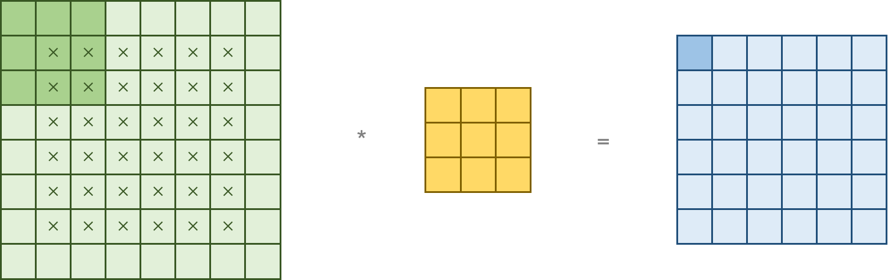
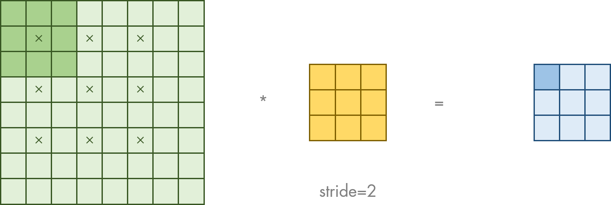
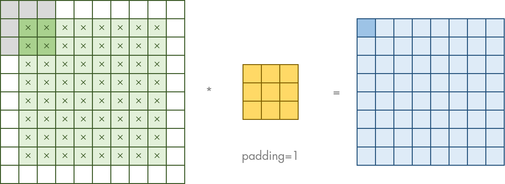
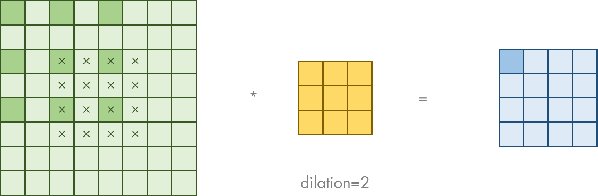

# `matterhorn_pytorch.snn.synapse`

[Back to `matterhorn_pytorch.snn`](./README.md)

[English](../../en_us/snn/5_synapse.md)

[中文](../../zh_cn/snn/5_synapse.md)

## Module Introduction

SNNs and ANNs are fundamentally similar in synaptic computation. The synapses of SNNs take spike trains as input signals, undergo certain processing, and output postsynaptic potentials (PSP).

## `matterhorn.snn.synapse.Synapse`

```python
Synapse(
    multi_time_step = False
)
```

### Constructor Parameters

`multi_time_step (bool)`: Whether to adjust to multi-time-step mode.

### Overridable Methods

#### `forward_single_time_step(self, o: torch.Tensor) -> torch.Tensor`

Synapse function within a single time step. Since synaptic computation is independent of time steps, the synaptic function in multi-time-step mode can be run in parallel by only overriding the synaptic function within a single time step.

#### `forward_multi_time_step(self, o: torch.Tensor) -> torch.Tensor`

If synaptic computation depends on time steps, please override this function and use variables to indicate the relationship between different time steps.

## `matterhorn_pytorch.snn.Linear` / `matterhorn_pytorch.snn.synapse.Linear`

Full connection operation of synapses. Can be represented as the formula below:

$$X^{l}(t)=W^{l}O^{l-1}(t)$$

Where $W^{l}$ is the weight matrix.

```python
Linear(
    in_features: int,
    out_features: int,
    bias: bool = True,
    multi_time_step: bool = False,
    device = None,
    dtype = None
)
```

### Constructor Parameters

`in_features (int)`: Input length `I`. The input shape is `[B, I]` (single-time-step mode) or `[T, B, I]` (multi-time-step mode).

`out_features (int)`: Output length `O`. The output shape is `[B, O]` (single-time-step mode) or `[T, B, O]` (multi-time-step mode).

`bias (bool)`: Whether to include bias. If `True`, it performs $W\vec{x}+\vec{b}$, otherwise $W\vec{x}$.

`multi_time_step (bool)`: Whether to adjust to multi-time-step mode.

`device (torch.device)`: Computational device to use.

`dtype`: Data type to use for computation.

### Example Usage

```python
import torch
import matterhorn_pytorch as mth


fc = mth.snn.Linear(784, 10) # [T, B, 784] -> [T, B, 10]
```

## `matterhorn_pytorch.snn.Conv1d` / `matterhorn_pytorch.snn.synapse.Conv1d`

One-dimensional convolution operation of synapses. Can be represented as the formula below:

$$X^{l}(t)=C^{l}*O^{l-1}(t)$$

Where $C^{l}$ is the convolution kernel.

```python
Conv1d(
    in_channels: int,
    out_channels: int,
    kernel_size: _size_1_t,
    stride: _size_1_t = 1,
    padding: Union[_size_1_t, str] = 0,
    dilation: _size_1_t = 1,
    groups: int = 1,
    bias: bool = True,
    padding_mode: str = "zeros",
    multi_time_step: bool = False,
    device = None,
    dtype = None
)
```

### Constructor Parameters

`in_channels (int)`: Input channel size `CI`. The input shape is `[B, CI, LI]` (single-time-step mode) or `[T, B, CI, LI]` (multi-time-step mode).

`out_channels (int)`: Output channel size `CO`. The input shape is `[B, CO, LO]` (single-time-step mode) or `[T, B, CO, LO]` (multi-time-step mode).

`kernel_size (_size_1_t)`: Shape of the convolution kernel.

`stride (_size_1_t)`: Stride. How many pixels to perform convolution after passing through the original image.

`padding (_size_1_t | str)`: Boundary size. How much blank space to fill at the edge.

`dilation (_size_1_t)`: During convolution, how many pixels to perform a multiplication and addition operation.

`groups (int)`: Number of groups for convolution operation.

`bias (bool)`: Whether to include bias.

`padding_mode (str)`: Padding mode.

`multi_time_step (bool)`: Whether to adjust to multi-time-step mode.

`device (torch.device)`: Computational device to use.

`dtype`: Data type to use for computation.

### Example Usage

```python
import torch
import matterhorn_pytorch as mth


conv = mth.snn.Conv1d(2, 8, 3, padding = 1) # [T, B, 2, L] -> [T, B, 8, L]
```

## `matterhorn_pytorch.snn.Conv2d` / `matterhorn_pytorch.snn.synapse.Conv2d`

Two-dimensional convolution operation of synapses. Can be represented as the formula below:

$$X^{l}(t)=C^{l}*O^{l-1}(t)$$

Where $C^{l}$ is the convolution kernel.



```python
Conv2d(
    in_channels: int,
    out_channels: int,
    kernel_size: _size_2_t,
    stride: _size_2_t = 1,
    padding: Union[_size_2_t, str] = 0,
    dilation: _size_2_t = 1,
    groups: int = 1,
    bias: bool = True,
    padding_mode: str = "zeros",
    multi_time_step: bool = False,
    device = None,
    dtype = None
)
```

### Constructor Parameters

`in_channels (int)`: Input channel size `CI`. The input shape is `[B, CI, HI, WI]` (single-time-step mode) or `[T, B, CI, HI, WI]` (multi-time-step mode).

`out_channels (int)`: Output channel size `CO`. The input shape is `[B, CO, HO, WO]` (single-time-step mode) or `[T, B, CO, HO, WO]` (multi-time-step mode).

`kernel_size (_size_2_t)`: Shape of the convolution kernel.

`stride (_size_2_t)`: Stride. How many pixels to perform convolution after passing through the original image.



`padding (_size_2_t)`: Boundary size. How much blank space to fill at the edge.



`dilation (_size_2_t)`: During convolution, how many pixels to perform a multiplication and addition operation.



`groups (int)`: Number of groups for convolution operation.

`bias (bool)`: Whether to include bias.

`padding_mode (str)`: Padding mode.

`multi_time_step (bool)`: Whether to adjust to multi-time-step mode.

`device (torch.device)`: Computational device to use.

`dtype`: Data type to use for computation.

### Example Usage

```python
import torch
import matterhorn_pytorch as mth


conv = mth.snn.Conv2d(2, 8, 3, padding = 1) # [T, B, 2, H, W] -> [T, B, 8, H, W]
```

## `matterhorn_pytorch.snn.Conv3d` / `matterhorn_pytorch.snn.synapse.Conv3d`

Three-dimensional convolution operation of synapses. Can be represented as the formula below:

$$X^{l}(t)=C^{l}*O^{l-1}(t)$$

Where $C^{l}$ is the convolution kernel.

```python
Conv3d(
    in_channels: int,
    out_channels: int,
    kernel_size: _size_3_t,
    stride: _size_3_t = 1,
    padding: Union[_size_3_t, str] = 0,
    dilation: _size_3_t = 1,
    groups: int = 1,
    bias: bool = True,
    padding_mode: str = "zeros",
    multi_time_step: bool = False,
    device = None,
    dtype = None
)
```

### Constructor Parameters

`in_channels (int)`: Input channel size `CI`. The input shape is `[B, CI, HI, WI, LI]` (single-time-step mode) or `[T, B, CI, HI, WI, LI]` (multi-time-step mode).

`out_channels (int)`: Output channel size `CO`. The input shape is `[B, CO, HO, WO, LO]` (single-time-step mode) or `[T, B, CO, HO, WO, LO]` (multi-time-step mode).

`kernel_size (_size_3_t)`: Shape of the convolution kernel.

`stride (_size_3_t)`: Stride. How many pixels to perform convolution after passing through the original image.

`padding (_size_3_t)`: Boundary size. How much blank space to fill at the edge.

`dilation (_size_3_t)`: During convolution, how many pixels to perform a multiplication and addition operation.

`groups (int)`: Number of groups for convolution operation.

`bias (bool)`: Whether to include bias.

`padding_mode (str)`: Padding mode.

`multi_time_step (bool)`: Whether to adjust to multi-time-step mode.

`device (torch.device)`: Computational device to use.

`dtype`: Data type to use for computation.

### Example Usage

```python
import torch
import matterhorn_pytorch as mth


conv = mth.snn.Conv3d(2, 8, 3, padding = 1) # [T, B, 2, H, W, L] -> [T, B, 8, H, W, L]
```

## `matterhorn_pytorch.snn.ConvTranspose1d` / `matterhorn_pytorch.snn.synapse.ConvTranspose1d`

One-dimensional transposed convolution (deconvolution) operation of synapses.

```python
ConvTranspose1d(
    in_channels: int,
    out_channels: int,
    kernel_size: _size_1_t,
    stride: _size_1_t = 1,
    padding: _size_1_t = 0,
    output_padding: _size_1_t = 0,
    groups: int = 1,
    bias: bool = True,
    dilation: _size_1_t = 1,
    padding_mode: str = "zeros",
    multi_time_step: bool = False,
    device = None,
    dtype = None
)
```

### Constructor Parameters

`in_channels (int)`: Input channel size `CI`. The input shape is `[B, CI, LI]` (single-time-step mode) or `[T, B, CI, LI]` (multi-time-step mode).

`out_channels (int)`: Output channel size `CO`. The input shape is `[B, CO, LO]` (single-time-step mode) or `[T, B, CO, LO]` (multi-time-step mode).

`kernel_size (_size_1_t)`: Shape of the convolution kernel.

`stride (_size_1_t)`: Stride. How many pixels to perform convolution after passing through the original image.

`padding (_size_1_t)`: Input boundary size. How much blank space to fill at the input edge.

`output_padding (_size_1_t)`: Output boundary size. How much blank space to fill at the output edge.

`groups (int)`: Number of groups for convolution operation.

`bias (bool)`: Whether to include bias.

`dilation (_size_1_t)`: During the original convolution, how many pixels to perform a multiplication and addition operation.

`padding_mode (str)`: Padding mode.

`multi_time_step (bool)`: Whether to adjust to multi-time-step mode.

`device (torch.device)`: Computational device to use.

`dtype`: Data type to use for computation.

### Example Usage

```python
import torch
import matterhorn_pytorch as mth


convt = mth.snn.ConvTranspose1d(2, 8, 3, padding = 1) # [T, B, 2, L] -> [T, B, 8, L]
```

## `matterhorn_pytorch.snn.ConvTranspose2d` / `matterhorn_pytorch.snn.synapse.ConvTranspose2d`

Two-dimensional transposed convolution (deconvolution) operation of synapses.

```python
ConvTranspose2d(
    in_channels: int,
    out_channels: int,
    kernel_size: _size_2_t,
    stride: _size_2_t = 1,
    padding: _size_2_t = 0,
    output_padding: _size_2_t = 0,
    groups: int = 1,
    bias: bool = True,
    dilation: _size_2_t = 1,
    padding_mode: str = "zeros",
    ulti_time_step: bool = False,
    device = None,
    dtype = None
)
```

### Constructor Parameters

`in_channels (int)`: Input channel size `CI`. The input shape is `[B, CI, HI, WI]` (single-time-step mode) or `[T, B, CI, HI, WI]` (multi-time-step mode).

`out_channels (int)`: Output channel size `CO`. The input shape is `[B, CO, HO, WO]` (single-time-step mode) or `[T, B, CO, HO, WO]` (multi-time-step mode).

`kernel_size (_size_2_t)`: Shape of the convolution kernel.

`stride (_size_2_t)`: Stride. How many pixels to perform convolution after passing through the original image.

`padding (_size_2_t)`: Input boundary size. How much blank space to fill at the input edge.

`output_padding (_size_2_t)`: Output boundary size. How much blank space to fill at the output edge.

`groups (int)`: Number of groups for convolution operation.

`bias (bool)`: Whether to include bias.

`dilation (_size_2_t)`: During the original convolution, how many pixels to perform a multiplication and addition operation.

`padding_mode (str)`: Padding mode.

`multi_time_step (bool)`: Whether to adjust to multi-time-step mode.

`device (torch.device)`: Computational device to use.

`dtype`: Data type to use for computation.

### Example Usage

```python
import torch
import matterhorn_pytorch as mth


convt = mth.snn.ConvTranspose2d(2, 8, 3, padding = 1) # [T, B, 2, H, W] -> [T, B, 8, H, W]
```

## `matterhorn_pytorch.snn.ConvTranspose3d` / `matterhorn_pytorch.snn.synapse.ConvTranspose3d`

```python
ConvTranspose3d(
    in_channels: int,
    out_channels: int,
    kernel_size: _size_3_t,
    stride: _size_3_t = 1,
    padding: _size_3_t = 0,
    output_padding: _size_3_t = 0,
    groups: int = 1,
    bias: bool = True,
    dilation: _size_3_t = 1,
    padding_mode: str = "zeros",
    multi_time_step: bool = False,
    device = None,
    dtype = None
)
```

Three-dimensional transposed convolution (deconvolution) operation of synapses.

### Constructor Parameters

`in_channels (int)`: Input channel size `CI`. The input shape is `[B, CI, HI, WI, LI]` (single-time-step mode) or `[T, B, CI, HI, WI, LI]` (multi-time-step mode).

`out_channels (int)`: Output channel size `CO`. The input shape is `[B, CO, HO, WO, LO]` (single-time-step mode) or `[T, B, CO, HO, WO, LO]` (multi-time-step mode).

`kernel_size (_size_3_t)`: Shape of the convolution kernel.

`stride (_size_3_t)`: Stride. How many pixels to perform convolution after passing through the original image.

`padding (_size_3_t)`: Input boundary size. How much blank space to fill at the input edge.

`output_padding (_size_3_t)`: Output boundary size. How much blank space to fill at the output edge.

`groups (int)`: Number of groups for convolution operation.

`bias (bool)`: Whether to include bias.

`dilation (_size_3_t)`: During the original convolution, how many pixels to perform a multiplication and addition operation.

`padding_mode (str)`: Padding mode.

`multi_time_step (bool)`: Whether to adjust to multi-time-step mode.

`device (torch.device)`: Computational device to use.

`dtype`: Data type to use for computation.

### Example Usage

```python
import torch
import matterhorn_pytorch as mth


convt = mth.snn.ConvTranspose3d(2, 8, 3, padding = 1) # [T, B, 2, H, W, L] -> [T, B, 8, H, W, L]
```

## `matterhorn_pytorch.snn.BatchNorm1d` / `matterhorn_pytorch.snn.synapse.BatchNorm1d`

One-dimensional batch normalization operation with the formula:

$$Y=\frac{X-E(X)}{\sqrt{D(X)+\varepsilon}}\times \gamma + \beta$$

Where $E(X)$ is the mean value of $X$ and $D(X)$ is the variance of $X$.

```python
BatchNorm1d(
    num_features: int,
    eps: float = 0.00001,
    momentum: float = 0.1,
    affine: bool = True,
    track_running_stats: bool = True,
    multi_time_step: bool = False,
    device = None,
    dtype = None
)
```

### Constructor Parameters

`num_features (int)`: Batch size.

`eps (float)`: Parameter $\varepsilon$.

`momentum (float)`: Momentum parameter.

`affine (bool)`: Whether to enable parameters $\gamma$ and $\beta$ for affine transformation.

`track_running_stats (bool)`: Whether to track the entire training process for batch normalization learning.

`multi_time_step (bool)`: Whether to adjust to multi-time-step mode.

`device (torch.device)`: Computational device to use.

`dtype`: Data type to use for computation.

### Example Usage

```python
import torch
import matterhorn_pytorch as mth


bn = mth.snn.BatchNorm1d(64)
```

## `matterhorn_pytorch.snn.BatchNorm2d` / `matterhorn_pytorch.snn.synapse.BatchNorm2d`

Two-dimensional batch normalization operation with the formula:

$$Y=\frac{X-E(X)}{\sqrt{D(X)+\varepsilon}}\times \gamma + \beta$$

Where $E(X)$ is the mean value of $X$ and $D(X)$ is the variance of $X$.

```python
BatchNorm2d(
    num_features: int,
    eps: float = 0.00001,
    momentum: float = 0.1,
    affine: bool = True,
    track_running_stats: bool = True,
    multi_time_step: bool = False,
    device = None,
    dtype = None
)
```

### Constructor Parameters

`num_features (int)`: Batch size.

`eps (float)`: Parameter $\varepsilon$.

`momentum (float)`: Momentum parameter.

`affine (bool)`: Whether to enable parameters $\gamma$ and $\beta$ for affine transformation.

`track_running_stats (bool)`: Whether to track the entire training process for batch normalization learning.

`multi_time_step (bool)`: Whether to adjust to multi-time-step mode.

`device (torch.device)`: Computational device to use.

`dtype`: Data type to use for computation.

### Example Usage

```python
import torch
import matterhorn_pytorch as mth


bn = mth.snn.BatchNorm2d(64)
```

## `matterhorn_pytorch.snn.BatchNorm3d` / `matterhorn_pytorch.snn.synapse.BatchNorm3d`

Three-dimensional batch normalization operation with the formula:

$$Y=\frac{X-E(X)}{\sqrt{D(X)+\varepsilon}}\times \gamma + \beta$$

Where $E(X)$ is the mean value of $X$ and $D(X)$ is the variance of $X$.

```python
BatchNorm3d(
    num_features: int,
    eps: float = 0.00001,
    momentum: float = 0.1,
    affine: bool = True,
    track_running_stats: bool = True,
    multi_time_step: bool = False,
    device = None,
    dtype = None
)
```

### Constructor Parameters

`num_features (int)`: Batch size.

`eps (float)`: Parameter $\varepsilon$.

`momentum (float)`: Momentum parameter.

`affine (bool)`: Whether to enable parameters $\gamma$ and $\beta$ for affine transformation.

`track_running_stats (bool)`: Whether to track the entire training process for batch normalization learning.

`multi_time_step (bool)`: Whether to adjust to multi-time-step mode.

`device (torch.device)`: Computational device to use.

`dtype`: Data type to use for computation.

### Example Usage

```python
import torch
import matterhorn_pytorch as mth


bn = mth.snn.BatchNorm3d(64)
```

## `matterhorn_pytorch.snn.LayerNorm` / `matterhorn_pytorch.snn.synapse.LayerNorm`

Layer normalization operation with the formula:

$$Y=\frac{X-E(X)}{\sqrt{D(X)+\varepsilon}}\times \gamma + \beta$$

Where $E(X)$ is the mean value of $X$ and $D(X)$ is the variance of $X$.

```python
LayerNorm(
    normalized_shape: _shape_t,
    eps: float = 0.00001,
    elementwise_affine: bool = True,
    multi_time_step: bool = False,
    device = None,
    dtype = None
)
```

### Constructor Parameters

`normalized_shape (_shape_t)`: Shape of the tensor part to be normalized. For example, for a tensor of size `[B, C, H, W]`, if normalization is needed on the last 2 dimensions, only `(H, W)` needs to be passed.

`eps (float)`: Parameter $\varepsilon$.

`elementwise_affine (bool)`: Whether to enable parameters $\gamma$ and $\beta$ for element-wise affine transformation.

`multi_time_step (bool)`: Whether to adjust to multi-time-step mode.

`device (torch.device)`: Computational device to use.

`dtype`: Data type to use for computation.

### Example Usage

```python
import torch
import matterhorn_pytorch as mth


ln = mth.snn.LayerNorm((28, 28))
```