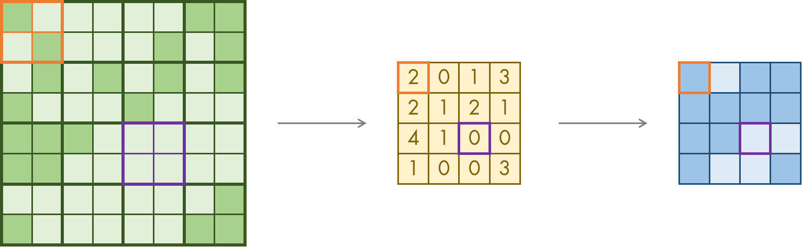

# `matterhorn_pytorch.snn.layer`

[Back to `matterhorn_pytorch.snn`](./README.md)

[English](../../en_us/snn/6_layer.md)

[中文](../../zh_cn/snn/6_layer.md)

## Module Introduction

This module defines some complete neural network layers or inter-layer operations, such as pooling, flattening, etc.

## `matterhorn_pytorch.snn.layer.Layer`

```python
Layer()
```

### Constructor Arguments

### Overridable Methods

#### `forward_step(self, o: torch.Tensor) -> torch.Tensor`

Synaptic function within a single time step. Since synaptic operations are independent of time steps, synaptic functions in multi-time-step mode can be run in parallel, and only need to override the synaptic function within a single time step.

#### `forward_steps(self, o: torch.Tensor) -> torch.Tensor`

If synaptic operations are related to time steps, please override this function and specify the association between different time steps using variables.

## `matterhorn_pytorch.snn.STDPLinear` / `matterhorn_pytorch.snn.layer.STDPLinear`

A fully connected layer employing the Spike Timing-Dependent Plasticity (STDP) learning mechanism. STDP, as a common spike-based learning mechanism, follows the weight update formula:

$$\Delta w_{ij}=\sum_{t_{j}}{\sum_{t_{i}}W(t_{i}-t_{j})}$$

Where the weight function $W(x)$ is defined as:

$$
W(x)=
\left \{
\begin{aligned}
A_{+}e^{-\frac{x}{\tau_{+}}},x>0 \\\\
0,x=0 \\\\
-A_{-}e^{\frac{x}{\tau_{-}}},x<0
\end{aligned}
\right .
$$

Where $t_{i}$ is the time step when the input spike of neuron with index $i$ is generated, and $t_{j}$ is the time step when the input spike of the synapse with index $j$ arrives.

```python
STDPLinear(
    soma: torch.nn.Module,
    in_features: int,
    out_features: int,
    a_pos: float = 0.015,
    tau_pos: float = 2.0,
    a_neg: float = 0.015,
    tau_neg: float = 2.0,
    device: torch.device = None,
    dtype: torch.dtype = None
)
```

### Constructor Arguments

`soma (torch.nn.Module)`: Type of soma used. Refer to the available soma types in the module [`matterhorn_pytorch.snn.soma`](./4_soma.md).

`in_features (int)`: Length of the input `I`. The shape of the input is `[B, I]` (single-time-step mode) or `[T, B, I]` (multi-time-step mode).

`out_features (int)`: Length of the output `O`. The shape of the output is `[B, O]` (single-time-step mode) or `[T, B, O]` (multi-time-step mode).

`a_pos (float)`: STDP parameter $A_{+}$.

`tau_pos (float)`: STDP parameter $\tau_{+}$.

`a_neg (float)`: STDP parameter $A_{-}$.

`tau_neg (float)`: STDP parameter $\tau_{-}$.

`device (torch.device)`: Computational device used.

`dtype (torch.dtype)`: Data type used for computation.

### Example Usage

```python
import torch
import matterhorn_pytorch as mth


l1 = mth.snn.STDPLinear(mth.snn.LIF(), 784, 10) # [T, B, 784] -> [T, B, 10]
```

## `matterhorn_pytorch.snn.MaxPool1d` / `matterhorn_pytorch.snn.layer.MaxPool1d`

One-dimensional max pooling layer. Define max pooling of spikes as: as long as any input generates a spike, the output generates a spike. It can be described by the following formula:

$$O_{i}^{l}(t)=(\sum_{j=1}^{m}{O_{j}^{l-1}(t)} \ge 1)$$

Where $i$ is the output index, $j$ is the input index that should be counted when the output index is $i$, and $m$ is the number of input indices to be counted.

```python
MaxPool1d(
    kernel_size: _size_any_t,
    stride: Optional[_size_any_t] = None,
    padding: _size_any_t = 0,
    dilation: _size_any_t = 1,
    return_indices: bool = False,
    ceil_mode: bool = False
)
```

### Constructor Arguments

`kernel_size (size_any_t)`: Size of the pooling kernel.

`stride (size_any_t | None)`: Number of pixels the pooling operation jumps over at once.

`padding (size_any_t)`: Length of padding at the boundaries.

`dilation (size_any_t)`: Number of pixels the pooling operation selects at once in one pooling operation.

`return_indices (bool)`: Whether to return the indices of the pooled values in the original image.

`ceil_mode (bool)`: Whether to ceil the value after pooling.

### Example Usage

```python
import torch
import matterhorn_pytorch as mth


pooling = mth.snn.MaxPool1d(2) # [T, B, L] -> [T, B, L // 2]
```

## `matterhorn_pytorch.snn.MaxPool2d` / `matterhorn_pytorch.snn.layer.MaxPool2d`

Two-dimensional max pooling layer. Define max pooling of spikes as: as long as any input generates a spike, the output generates a spike. It can be described by the following formula:

$$O_{i}^{l}(t)=(\sum_{j=1}^{m}{O_{j}^{l-1}(t)} \ge 1)$$

Where $i$ is the output index, $j$ is the input index that should be counted when the output index is $i$, and $m$ is the number of input indices to be counted. Max pooling of spikes is illustrated in the following figure.



```python
MaxPool2d(
    kernel_size: _size_any_t,
    stride: Optional[_size_any_t] = None,
    padding: _size_any_t = 0,
    dilation: _size_any_t = 1,
    return_indices: bool = False,
    ceil_mode: bool = False
)
```

### Constructor Arguments

`kernel_size (size_any_t)`: Size of the pooling kernel.

`stride (size_any_t | None)`: Number of pixels the pooling operation jumps over at once.

`padding (size_any_t)`: Length of padding at the boundaries.

`dilation (size_any_t)`: Number of pixels the pooling operation selects at once in one pooling operation.

`return_indices (bool)`: Whether to return the indices of the pooled values in the original image.

`ceil_mode (bool)`: Whether to ceil the value after pooling.

### Example Usage

```python
import torch
import matterhorn_pytorch as mth


pooling = mth.snn.MaxPool2d(2) # [T, B, H, W] -> [T, B, H // 2, W // 2]
```

## `matterhorn_pytorch.snn.MaxPool3d` / `matterhorn_pytorch.snn.layer.MaxPool3d`

Three-dimensional max pooling layer. Define max pooling of spikes as: as long as any input generates a spike, the output generates a spike. It can be described by the following formula:

$$O_{i}^{l}(t)=(\sum_{j=1}^{m}{O_{j}^{l-1}(t)} \ge 1)$$

Where $i$ is the output index, $j$ is the input index that should be counted when the output index is $i$, and $m$ is the number of input indices to be counted.

```python
MaxPool3d(
    kernel_size: _size_any_t,
    stride: Optional[_size_any_t] = None,
    padding: _size_any_t = 0,
    dilation: _size_any_t = 1,
    return_indices: bool = False,
    ceil_mode: bool = False
)
```

### Constructor Arguments

`kernel_size (size_any_t)`: Size of the pooling kernel.

`stride (size_any_t | None)`: Number of pixels the pooling operation jumps over at once.

`padding (size_any_t)`: Length of padding at the boundaries.

`dilation (size_any_t)`: Number of pixels the pooling operation selects at once in one pooling operation.

`return_indices (bool)`: Whether to return the indices of the pooled values in the original image.

`ceil_mode (bool)`: Whether to ceil the value after pooling.

### Example Usage

```python
import torch
import matterhorn_pytorch as mth


pooling = mth.snn.MaxPool3d(2) # [T, B, H, W, L] -> [T, B, H // 2, W // 2, L // 2]
```

## `matterhorn_pytorch.snn.AvgPool1d` / `matterhorn_pytorch.snn.layer.AvgPool1d`

One-dimensional average pooling layer. Define average pooling of spikes as: when half or more of the inputs generate spikes, the output generates spikes. It can be described by the following formula:

$$O_{i}^{l}(t)=(\sum_{j=1}^{m}{O_{j}^{l-1}(t)} \ge \lceil \frac{m}{2} \rceil)$$

Where $i$ is the output index, $j$ is the input index that should be counted when the output index is $i$, and $m$ is the number of input indices to be counted.

```python
AvgPool1d(
    kernel_size: _size_1_t,
    stride: Optional[_size_1_t] = None,
    padding: _size_1_t = 0,
    ceil_mode: bool = False,
    count_include_pad: bool = True
)
```

### Constructor Arguments

`kernel_size (size_1_t)`: Size of the pooling kernel.

`stride (size_1_t)`: Number of pixels the pooling operation jumps over at once.

`padding (size_1_t)`: Length of padding at the boundaries.

`ceil_mode (bool)`: Whether to ceil the value after pooling.

`count_include_pad (bool)`: Whether to include the boundary when pooling.

### Example Usage

```python
import torch
import matterhorn_pytorch as mth


pooling = mth.snn.AvgPool1d(2) # [T, B, L] -> [T, B, L // 2]
```

## `matterhorn_pytorch.snn.AvgPool2d` / `matterhorn_pytorch.snn.layer.AvgPool2d`

Two-dimensional average pooling layer. Define average pooling of spikes as: when half or more of the inputs generate spikes, the output generates spikes. It can be described by the following formula:

$$O_{i}^{l}(t)=(\sum_{j=1}^{m}{O_{j}^{l-1}(t)} \ge \lceil \frac{m}{2} \rceil)$$

Where $i$ is the output index, $j$ is the input index that should be counted when the output index is $i$, and $m$ is the number of input indices to be counted. Average pooling of spikes is illustrated in the following figure.


```python
AvgPool2d(
    kernel_size: _size_2_t,
    stride: Optional[_size_2_t] = None,
    padding: _size_2_t = 0,
    ceil_mode: bool = False,
    count_include_pad: bool = True,
    divisor_override: Optional[int] = None
)
```

### Constructor Arguments

`kernel_size (size_2_t)`: Size of the pooling kernel.

`stride (size_2_t | None)`: Number of pixels the pooling operation jumps over at once.

`padding (size_2_t)`: Length of padding at the boundaries.

`ceil_mode (bool)`: Whether to ceil the value after pooling.

`count_include_pad (bool)`: Whether to include the boundary when pooling.

`divisor_override (int | None)`: Whether to use a specific number to replace the sum as the divisor.

### Example Usage

```python
import torch
import matterhorn_pytorch as mth


pooling = mth.snn.AvgPool2d(2) # [T, B, H, W] -> [T, B, H // 2, W // 2]
```

## `matterhorn_pytorch.snn.AvgPool3d` / `matterhorn_pytorch.snn.layer.AvgPool3d`

Three-dimensional average pooling layer. Define average pooling of spikes as: when half or more of the inputs generate spikes, the output generates spikes. It can be described by the following formula:

$$O_{i}^{l}(t)=(\sum_{j=1}^{m}{O_{j}^{l-1}(t)} \ge \lceil \frac{m}{2} \rceil)$$

Where $i$ is the output index, $j$ is the input index that should be counted when the output index is $i$, and $m$ is the number of input indices to be counted.

```python
AvgPool3d(
    kernel_size: _size_3_t,
    stride: Optional[_size_3_t] = None,
    padding: _size_3_t = 0,
    ceil_mode: bool = False,
    count_include_pad: bool = True,
    divisor_override: Optional[int] = None
)
```

### Constructor Arguments

`kernel_size (size_3_t)`: Size of the pooling kernel.

`stride (size_3_t | None)`: Number of pixels the pooling operation jumps over at once.

`padding (size_3_t)`: Length of padding at the boundaries.

`ceil_mode (bool)`: Whether to ceil the value after pooling.

`count_include_pad (bool)`: Whether to include the boundary when pooling.

`divisor_override (int | None)`: Whether to use a specific number to replace the sum as the divisor.

### Example Usage

```python
import torch
import matterhorn_pytorch as mth


pooling = mth.snn.AvgPool3d(2) # [T, B, H, W, L] -> [T, B, H // 2, W // 2, L // 2]
```

## `matterhorn_pytorch.snn.Flatten` / `matterhorn_pytorch.snn.layer.Flatten`

Flattening layer, reshapes and flattens the tensor. Generally used to connect convolutional layers with output fully connected layers.

```python
Flatten(
    start_dim: int = 2,
    end_dim: int = -1
)
```

### Constructor Arguments

`start_dim (int)`: Dimension to start flattening (excluding the time dimension). Default is `1`, starting from spatial dimensions.

`end_dim (int)`: Dimension to end flattening (excluding the time dimension). Default is `-1`, flattening to the last dimension.

### Example Usage

```python
import torch
import matterhorn_pytorch as mth


lf = mth.snn.Flatten() # [T, B, H, W] -> [T, B, H * W]
```

## `matterhorn_pytorch.snn.Unflatten` / `matterhorn_pytorch.snn.layer.Unflatten`

Unflattening layer, re-folds the flattened tensor.

```python
Unflatten(
    dim: Union[int, str],
    unflattened_size: _size
)
```

### Constructor Arguments

`dim (int)`: Which dimension (excluding the time dimension) of data to fold.

`unflattened_size (size)`: Shape to fold this dimension into.

### Example Usage

```python
import torch
import matterhorn_pytorch as mth


lf = mth.snn.Unflatten(1, (1, 28, 28)) # [T, B, 784] -> [T, B, 1, 28, 28]
```

## `matterhorn_pytorch.snn.Dropout` / `matterhorn_pytorch.snn.layer.Dropout`

Dropout layer, which sets elements to `0` with a certain probability.

```python
Dropout(
    p: float = 0.5,
    inplace: bool = False
)
```

### Constructor Arguments

`p (float)`: The dropout probability.

`unflattened_size (size)`: Whether to modify the original tensor. If `True`, modifies the original tensor; otherwise, creates a new tensor.

### Example Usage

```python
import torch
import matterhorn_pytorch as mth


ld = mth.snn.Dropout(0.5)
```

## `matterhorn_pytorch.snn.Dropout1d` / `matterhorn_pytorch.snn.layer.Dropout1d`

One-dimensional dropout layer, which sets elements to `0` with a certain probability. Refer to `matterhorn_pytorch.snn.Dropout` for more information.

## `matterhorn_pytorch.snn.Dropout2d` / `matterhorn_pytorch.snn.layer.Dropout2d`

Two-dimensional dropout layer, which sets elements to `0` with a certain probability. Refer to `matterhorn_pytorch.snn.Dropout` for more information.

## `matterhorn_pytorch.snn.Dropout3d` / `matterhorn_pytorch.snn.layer.Dropout3d`

Three-dimensional dropout layer, which sets elements to `0` with a certain probability. Refer to `matterhorn_pytorch.snn.Dropout` for more information.