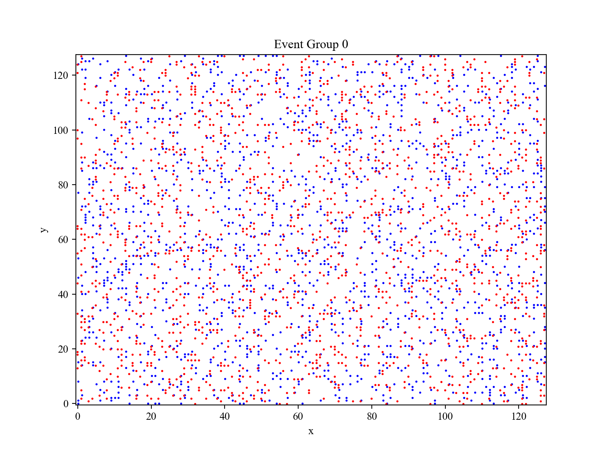
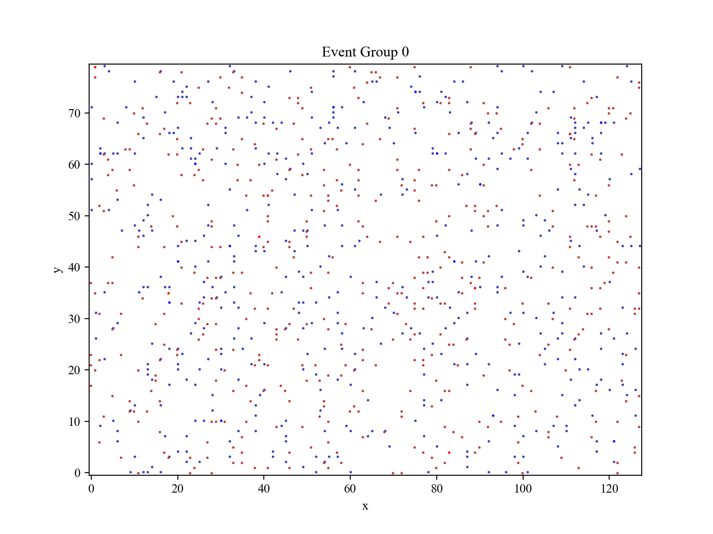
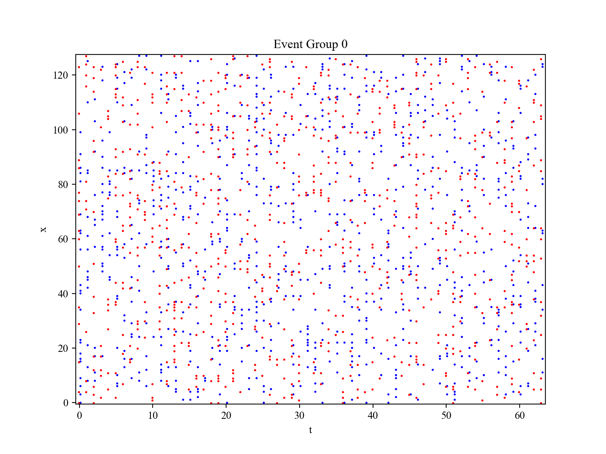
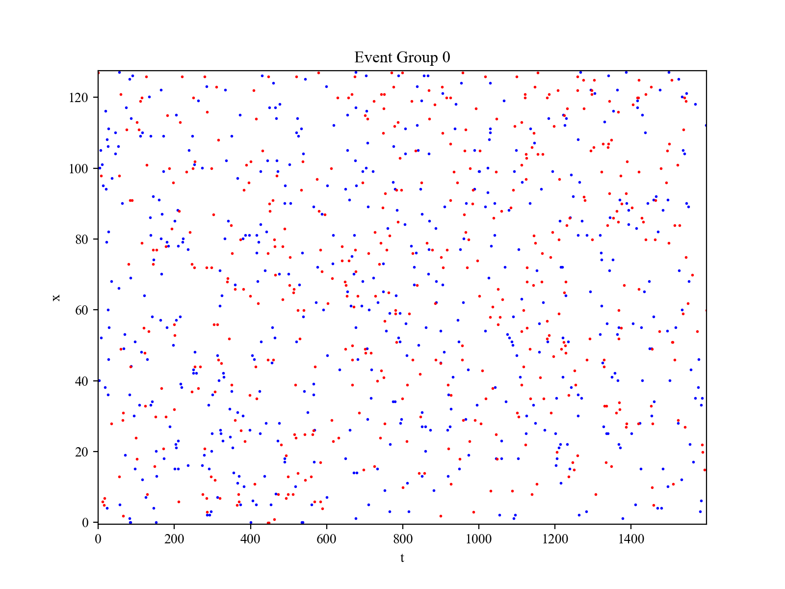
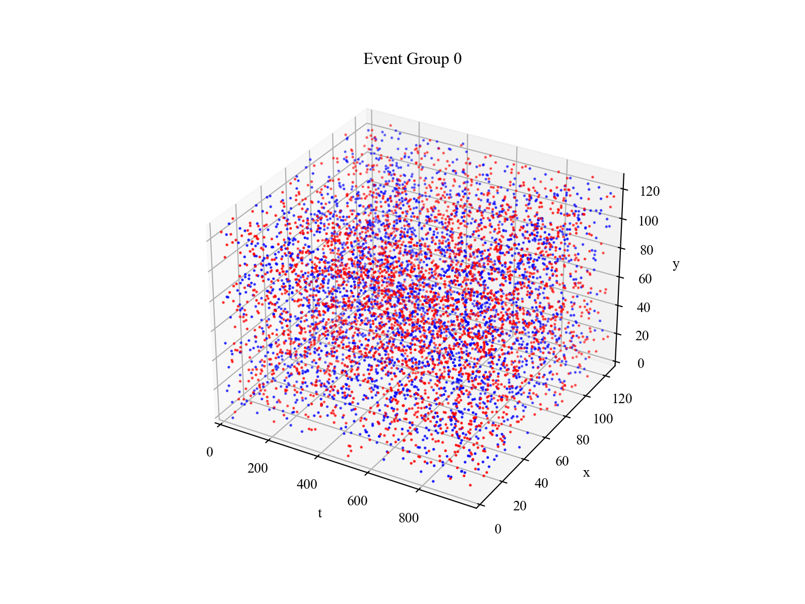
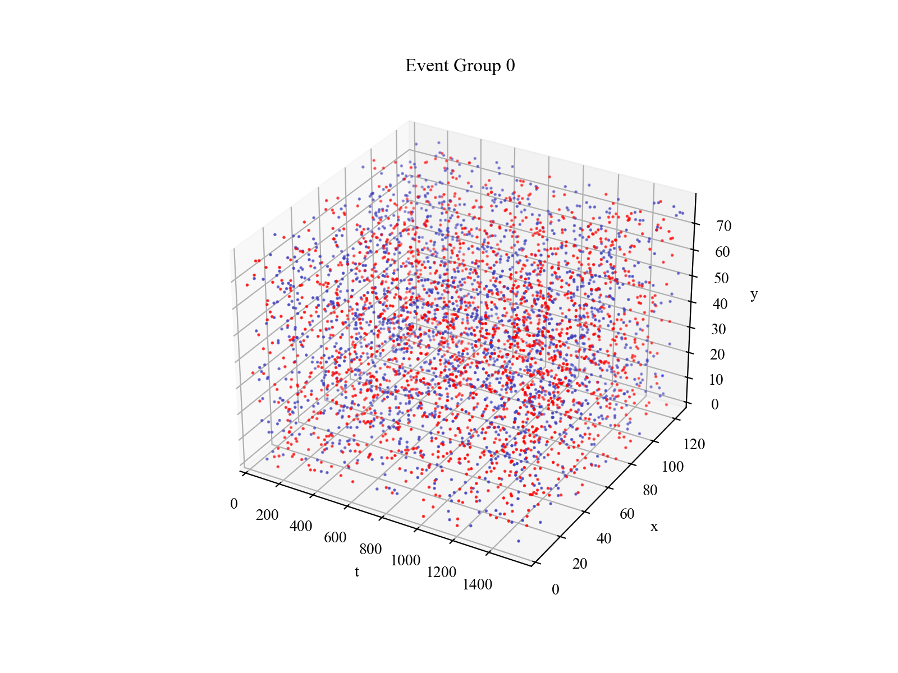

# `matterhorn_pytorch.util.plotter`

[回到 `matterhorn_pytorch.util`](./README.md)

[English](../../en_us/util/1_plotter.md)

[中文](../../zh_cn/util/1_plotter.md)

## 模块简介

该模块基于 `matplotlib` ，其功能为由事件序列或脉冲张量绘制图片。事件通常含有一个时间维度上的信息和多个空间维度上的信息。例如，事件相机所产生的事件通常含有 4 个维度 `[T, P, Y, X]` 的信息，其中时间维度 `T` 为产生事件的时间，空间维度 `Y` 和 `X` 为产生事件的像素点位置，极性 `P` 代表事件的类型，如在“光强变化超过阈值”这一条件所产生的事件中，极性为光强变化的方向（由弱变强或由强变弱）。

## `matterhorn_pytorch.util.plotter.event_plot_yx`

含有二维空间信息 `Y` 、 `X` ，不含时间信息的事件打印。

```python
event_plot_yx(
    data: Union[np.ndarray, torch.Tensor],
    shape: Iterable = None,
    polarity: bool = True,
    show: bool = True,
    save: str = None,
    titles: Iterable[str] = None,
    figsize: Tuple = (8, 6),
    is_seq: bool = False
) -> None:
```

### 参数

`data (np.ndarray | torch.Tensor)` ：需要打印的数据（可以是 2 、 3 、 4 维事件张量，也可以是 2 、 3 列事件序列）。

`shape (Iterable)` ：如果要打印的数据是事件序列，请指定其大小。假设事件序列的形状是 `[N, 3]` ，那么就要在此传入 3 列代表的数据各自的大小。

`polarity (bool)` ：如果传入的是张量，是否将第 1 个维度作为极性维度：如果为 `True` ，则传入的数据为形状为 `[C(P), H, W]` （3 维）或 `[B, C(P), H, W]` （4 维）的张量；如果为 `False` ，则传入的数据为形状为 `[H, W]` （2维）或 `[B, H, W]` （3维）的张量。如果传入的是事件，事件序列的第 1 列是否代表极性。

`show (bool)` ：是否展示图像，默认展示。

`save (str)` ：是否保存图像，若传入路径字符串，则在该路径下保存图像；否则不保存。

`titles (str*)` ：每张图都是什么标题。

`figSize (Tuple)` ：图像大小。

`is_seq (bool)` ：事件是否为序列。若为 `True` 则是事件序列，为 `False` 则是事件张量。

### 示例用法

（1）打印事件张量：

```python
import torch
import matterhorn_pytorch as mth


events = (torch.rand(2, 128, 128) > 0.9).float()
print(events.shape)
mth.util.plotter.event_plot_yx(events)
```



（2）打印事件序列：

```python
import torch
import matterhorn_pytorch as mth


events = torch.zeros(1000, 3, dtype = torch.long) # [P, H, W]
events[:, 0] = (torch.rand(1000) > 0.5).long() # P
events[:, 1] = torch.randint(80, (1000,)) # Y
events[:, 2] = torch.randint(128, (1000,)) # X
print(events.shape)
mth.util.plotter.event_plot_yx(events, (2, 80, 128), is_seq = True)
```



## `matterhorn_pytorch.util.plotter.event_plot_tx`

含有一维空间信息 `X` ，一维时间信息 `T` 的事件打印。

```python
event_plot_tx(
    data: Union[np.ndarray, torch.Tensor],
    shape: Iterable = None,
    polarity: bool = True,
    show: bool = True,
    save: str = None,
    titles: Iterable[str] = None,
    figsize: Tuple = (8, 6),
    is_seq: bool = False
) -> None:
```

### 参数

`data (np.ndarray | torch.Tensor)` ：需要打印的数据（可以是 2 、 3 、 4 维事件张量，也可以是 2 、 3 列事件序列）。

`shape (Iterable)` ：如果要打印的数据是事件序列，请指定其大小。假设事件序列的形状是 `[N, 3]` ，那么就要在此传入 3 列代表的数据各自的大小。

`polarity (bool)` ：如果传入的是张量，是否将第 2 个维度作为极性维度：如果为 `True` ，则传入的数据为形状为 `[T, C(P), L]` （3 维）或 `[T, B, C(P), L]` （4 维）的张量；如果为 `False` ，则传入的数据为形状为 `[T, L]` （2维）或 `[T, B, L]` （3维）的张量。如果传入的是事件，事件序列的第 0 列是否代表极性。

`show (bool)` ：是否展示图像，默认展示。

`save (str)` ：是否保存图像，若传入路径字符串，则在该路径下保存图像；否则不保存。

`titles (str*)` ：每张图都是什么标题。

`figSize (Tuple)` ：图像大小。

`is_seq (bool)` ：事件是否为序列。若为 `True` 则是事件序列，为 `False` 则是事件张量。

### 示例用法

（1）打印事件张量：

```python
import torch
import matterhorn_pytorch as mth


events = (torch.rand(64, 2, 128) > 0.9).float()
print(events.shape)
mth.util.plotter.event_plot_tx(events)
```



（2）打印事件序列：

```python
import torch
import matterhorn_pytorch as mth


events = torch.zeros(1000, 3, dtype = torch.long) # [T, P, L]
events[:, 0] = torch.randint(1600, (1000,)) # T
events[:, 1] = (torch.rand(1000) > 0.5).long() # P
events[:, 2] = torch.randint(128, (1000,)) # X
print(events.shape)
mth.util.plotter.event_plot_tx(events, (0, 2, 128), is_seq = True)
```



## `matterhorn_pytorch.util.plotter.event_plot_tyx`

含有二维空间信息 `Y` 、 `X` ，一维时间信息 `T` 的事件打印。

```python
event_plot_tyx(
    data: Union[np.ndarray, torch.Tensor],
    shape: Iterable = None,
    polarity: bool = True,
    show: bool = True,
    save: str = None,
    titles: Iterable[str] = None,
    figsize: Tuple = (8, 6),
    is_seq: bool = False
) -> None:
```

### 参数

`data (np.ndarray | torch.Tensor)` ：需要打印的数据（可以是 3 、 4 、 5 维事件张量，也可以是 3 、 4 列事件序列）。

`shape (Iterable)` ：如果要打印的数据是事件序列，请指定其大小。假设事件序列的形状是 `[N, 4]` ，那么就要在此传入 4 列代表的数据各自的大小。

`polarity (bool)` ：如果传入的是张量，是否将第 1 个维度作为极性维度：如果为 `True` ，则传入的数据为形状为 `[T, C(P), H, W]` （4 维）或 `[B, T, C(P), H, W]` （5 维）的张量；如果为 `False` ，则传入的数据为形状为 `[T, H, W]` （3维）或 `[B, T, H, W]` （4维）的张量。如果传入的是事件，事件序列的第 2 列是否代表极性。

`show (bool)` ：是否展示图像，默认展示。

`save (str)` ：是否保存图像，若传入路径字符串，则在该路径下保存图像；否则不保存。

`titles (str*)` ：每张图都是什么标题。

`figSize (Tuple)` ：图像大小。

`is_seq (bool)` ：事件是否为序列。若为 `True` 则是事件序列，为 `False` 则是事件张量

### 示例用法

（1）打印事件张量：

```python
import torch
import matterhorn_pytorch as mth


events = (torch.rand(1000, 2, 128, 128) > 0.9998).float()
print(events.shape)
mth.util.plotter.event_plot_tyx(events)
```



（2）打印事件序列：

```python
import torch
import matterhorn_pytorch as mth


events = torch.zeros(4000, 4, dtype = torch.long) # [T, P, H, W]
events[:, 0] = torch.randint(1600, (4000,)) # T
events[:, 1] = (torch.rand(4000) > 0.5).long() # P
events[:, 2] = torch.randint(80, (4000,)) # Y
events[:, 3] = torch.randint(128, (4000,)) # X
print(events.shape)
mth.util.plotter.event_plot_tyx(events, (0, 2, 80, 128), is_seq = True)
```

