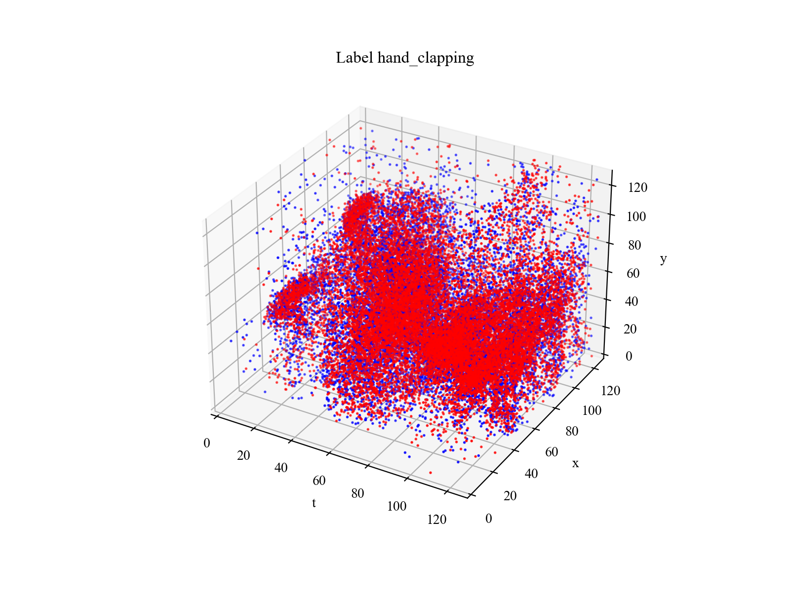
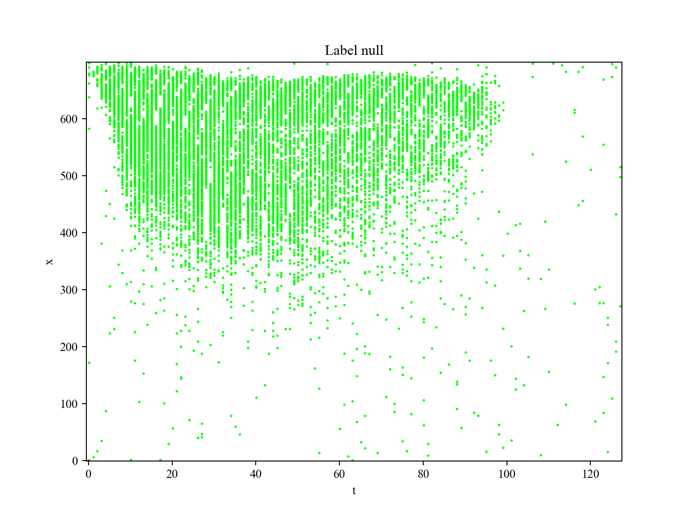

# `matterhorn_pytorch.data`

[回到 `matterhorn_pytorch`](../README.md)

[English](../../en_us/data/README.md)

[中文](../../zh_cn/data/README.md)

## 模块简介

Matterhorn 的神经形态数据集模块，其中含有对多种神经形态数据集的处理方式。

## `matterhorn_pytorch.data.CIFAR10DVS` / `matterhorn_pytorch.data.aedat.CIFAR10DVS`

CIFAR10-DVS 神经形态数据集。

```python
CIFAR10DVS(
    root: str,
    train: bool = True,
    transform: Optional[Callable] = None,
    target_transform: Optional[Callable] = None,
    download: bool = False,
    cached: bool = True,
    sampling: int = 1,
    count: bool = False,
    time_steps: int = 128,
    width: int = 128,
    height: int = 128,
    polarity: bool = True,
    clipped: Optional[Union[Iterable, int]] = None
)
```

### 构造函数参数

`root (str)` ：数据集中的所有数据存储的位置。

`train (bool)` ：是否是训练集。为 `True` 则加载训练集的数据，为 `False` 则加载测试集的数据。

`transform (Callable | None)` ：对数据集中数据的变换。

`target_transform (Callable | None)` ：对数据集中标签的变换。

`download (bool)` ：如果本地没有数据集的资源，是否尝试从网上下载。

`cached (bool)` ：是否占用本地空间建立缓存。缓存会消耗空间资源，但会减少后续训练和验证的时间成本。

`sampling (int)` ：每隔多少个事件取一个事件，默认为 `1` ，即选取数据集中全部的事件。该参数为了防止事件过密，从而节约计算成本。

`count (bool)` ：是否将每个点的事件个数作为脉冲输出。若为 `False` ，脉冲序列只会有 `0` 和 `1` ，否则输出的是该点的事件个数。

`time_steps (int)` ：输出张量的时间步长 `T` 。

`width (int)` ：输出张量的画幅宽度 `W` 。

`height (int)` ：输出张量的画幅高度 `H` 。

`polarity (bool)` ：输出的张量是否含有极性。若为 `True` ，则输出的张量含有极性， `P = 2` ，否则不含有极性， `P = 1` 。

`clipped (Iterable | int | None)` ：是否对原时间的起止时间作裁切。可以传入形如 `(start, end)` 的元组，代表截止时间戳的整数或 `None` （不裁切）。

### 示例用法

```python
import torch
import matterhorn_pytorch as mth


test_dataset = mth.data.CIFAR10DVS(
    root = './examples/data',
    train = False,
    download = True,
    time_steps = 128
)
demo_data, demo_label = test_dataset[0]
mth.util.plotter.event_plot_tyx(demo_data, titles = ["Label %s" % test_dataset.labels[demo_label]])
```


## `matterhorn_pytorch.data.DVS128Gesture` / `matterhorn_pytorch.data.aedat.DVS128Gesture`

DVS128 Gesture 神经形态数据集。

**注意** ：该数据集不可被下载，即使您将 `download` 设为 `True` 。 您应该在 [https://ibm.ent.box.com/s/3hiq58ww1pbbjrinh367ykfdf60xsfm8/folder/50167556794](https://ibm.ent.box.com/s/3hiq58ww1pbbjrinh367ykfdf60xsfm8/folder/50167556794) 将所有数据下载完毕后放入 `root/raw` 文件夹中。

```python
DVS128Gesture(
    root: str,
    train: bool = True,
    transform: Optional[Callable] = None,
    target_transform: Optional[Callable] = None,
    download: bool = False,
    cached: bool = True,
    sampling: int = 1,
    count: bool = False,
    time_steps: int = 128,
    width: int = 128,
    height: int = 128,
    polarity: bool = True,
    clipped: Optional[Union[Iterable, int]] = None
)
```

### 构造函数参数

`root (str)` ：数据集中的所有数据存储的位置。

`train (bool)` ：是否是训练集。为 `True` 则加载训练集的数据，为 `False` 则加载测试集的数据。

`transform (Callable | None)` ：对数据集中数据的变换。

`target_transform (Callable | None)` ：对数据集中标签的变换。

`download (bool)` ：如果本地没有数据集的资源，是否尝试从网上下载。

`cached (bool)` ：是否占用本地空间建立缓存。缓存会消耗空间资源，但会减少后续训练和验证的时间成本。

`sampling (int)` ：每隔多少个事件取一个事件，默认为 `1` ，即选取数据集中全部的事件。该参数为了防止事件过密，从而节约计算成本。

`count (bool)` ：是否将每个点的事件个数作为脉冲输出。若为 `False` ，脉冲序列只会有 `0` 和 `1` ，否则输出的是该点的事件个数。

`time_steps (int)` ：输出张量的时间步长 `T` 。

`width (int)` ：输出张量的画幅宽度 `W` 。

`height (int)` ：输出张量的画幅高度 `H` 。

`polarity (bool)` ：输出的张量是否含有极性。若为 `True` ，则输出的张量含有极性， `P = 2` ，否则不含有极性， `P = 1` 。

`clipped (Iterable | int | None)` ：是否对原时间的起止时间作裁切。可以传入形如 `(start, end)` 的元组，代表截止时间戳的整数或 `None` （不裁切）。

### 示例用法

```python
import torch
import matterhorn_pytorch as mth


test_dataset = mth.data.DVS128Gesture(
    root = './examples/data',
    train = False,
    download = True,
    time_steps = 128
)
demo_data, demo_label = test_dataset[0]
mth.util.plotter.event_plot_tyx(demo_data, titles = ["Label %s" % test_dataset.labels[demo_label]])
```



## `matterhorn_pytorch.data.SpikingHeidelbergDigits` / `matterhorn_pytorch.data.hdf5.SpikingHeidelbergDigits`

Spiking Heidelberg Digits （SHD）神经形态数据集。

```python
CIFAR10DVS(
    root: str,
    train: bool = True,
    transform: Optional[Callable] = None,
    target_transform: Optional[Callable] = None,
    download: bool = False,
    cached: bool = True,
    sampling: int = 1,
    count: bool = False,
    precision: float = 1e9,
    time_steps: int = 128,
    length: int = 700,
    clipped: Optional[Union[Iterable, float]] = None
)
```

### 构造函数参数

`root (str)` ：数据集中的所有数据存储的位置。

`train (bool)` ：是否是训练集。为 `True` 则加载训练集的数据，为 `False` 则加载测试集的数据。

`transform (Callable | None)` ：对数据集中数据的变换。

`target_transform (Callable | None)` ：对数据集中标签的变换。

`download (bool)` ：如果本地没有数据集的资源，是否尝试从网上下载。

`cached (bool)` ：是否占用本地空间建立缓存。缓存会消耗空间资源，但会减少后续训练和验证的时间成本。

`sampling (int)` ：每隔多少个事件取一个事件，默认为 `1` ，即选取数据集中全部的事件。该参数为了防止事件过密，从而节约计算成本。

`count (bool)` ：是否将每个点的事件个数作为脉冲输出。若为 `False` ，脉冲序列只会有 `0` 和 `1` ，否则输出的是该点的事件个数。

`precision (float)` ：数据集的精度。保持默认值 `1e9` 即可。

`time_steps (int)` ：输出张量的时间步长 `T` 。

`length (int)` ：输出张量的空间长度 `L` 。

`clipped (Iterable | int | None)` ：是否对原时间的起止时间作裁切。可以传入形如 `(start, end)` 的元组，代表截止时间戳的整数或 `None` （不裁切）。

### 示例用法

```python
import torch
import matterhorn_pytorch as mth


test_dataset = mth.data.SpikingHeidelbergDigits(
    root = './examples/data',
    train = False,
    download = True,
    time_steps = 128
)
demo_data, demo_label = test_dataset[0]
mth.util.plotter.event_plot_tx(demo_data, titles = ["Label %s" % test_dataset.labels[demo_label]])
```



## `matterhorn_pytorch.data.NMNIST` / `matterhorn_pytorch.data.nmnist.NMNIST`

N-MNIST 神经形态数据集。

```python
NMNIST(
    root: str,
    train: bool = True,
    transform: Optional[Callable] = None,
    target_transform: Optional[Callable] = None,
    download: bool = False,
    cached: bool = True,
    sampling: int = 1,
    count: bool = False,
    time_steps: int = 128,
    width: int = 34,
    height: int = 34,
    polarity: bool = True,
    clipped: Optional[Union[Iterable, int]] = None
)
```

### 构造函数参数

`root (str)` ：数据集中的所有数据存储的位置。

`train (bool)` ：是否是训练集。为 `True` 则加载训练集的数据，为 `False` 则加载测试集的数据。

`transform (Callable | None)` ：对数据集中数据的变换。

`target_transform (Callable | None)` ：对数据集中标签的变换。

`download (bool)` ：如果本地没有数据集的资源，是否尝试从网上下载。

`cached (bool)` ：是否占用本地空间建立缓存。缓存会消耗空间资源，但会减少后续训练和验证的时间成本。

`sampling (int)` ：每隔多少个事件取一个事件，默认为 `1` ，即选取数据集中全部的事件。该参数为了防止事件过密，从而节约计算成本。

`count (bool)` ：是否将每个点的事件个数作为脉冲输出。若为 `False` ，脉冲序列只会有 `0` 和 `1` ，否则输出的是该点的事件个数。

`time_steps (int)` ：输出张量的时间步长 `T` 。

`width (int)` ：输出张量的画幅宽度 `W` 。

`height (int)` ：输出张量的画幅高度 `H` 。

`polarity (bool)` ：输出的张量是否含有极性。若为 `True` ，则输出的张量含有极性， `P = 2` ，否则不含有极性， `P = 1` 。

`clipped (Iterable | int | None)` ：是否对原时间的起止时间作裁切。可以传入形如 `(start, end)` 的元组，代表截止时间戳的整数或 `None` （不裁切）。

### 示例用法

```python
import torch
import matterhorn_pytorch as mth


test_dataset = mth.data.NMNIST(
    root = './examples/data',
    train = False,
    download = True,
    time_steps = 128
)
demo_data, demo_label = test_dataset[0]
mth.util.plotter.event_plot_tyx(demo_data, titles = ["Label %s" % test_dataset.labels[demo_label]])
```

