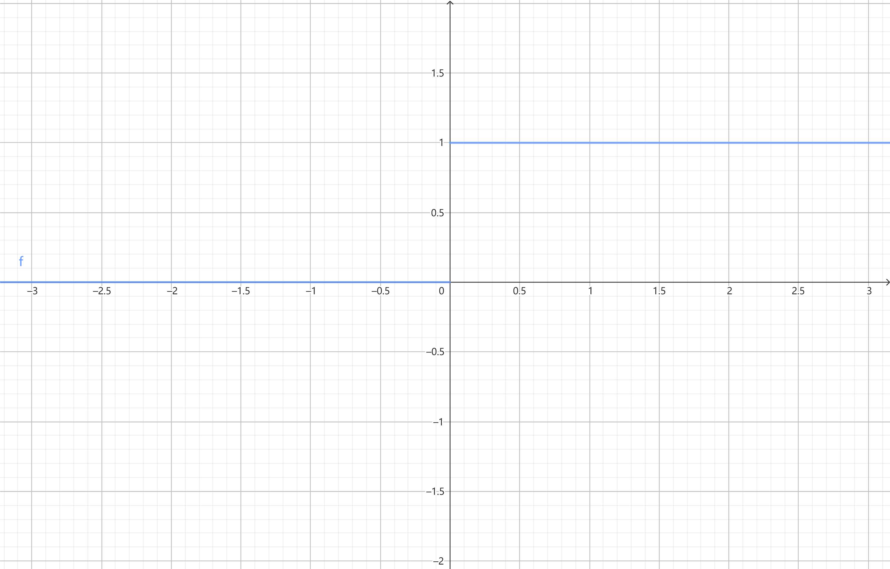
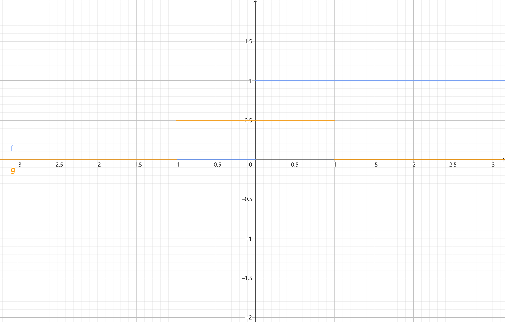
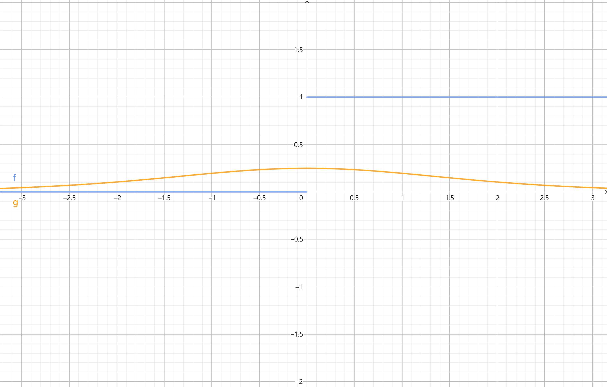

# `matterhorn_pytorch.snn.surrogate`

[回到 `matterhorn_pytorch.snn`](./README.md)

[English](../../en_us/snn/3_surrogate.md)

[中文](../../zh_cn/snn/3_surrogate.md)

## 模块简介

脉冲神经元依靠 Heaviside 阶跃函数，对当前电位和阈电位进行判断，最后决定是否产生脉冲。其公式为

$$u(x) := x \ge u_{th} ? 1 : 0$$



我们使用 `>=` 算子来表示脉冲神经元中的 Heaviside 阶跃函数。此时出现一个问题： Heaviside 阶跃函数的导数—— Dirac 冲激响应函数

$$\delta (x) := x = u_{th} ? +\infty : 0$$

要么为正无穷，要么为 0 。直接将 Dirac 冲激响应函数作为梯度的话，势必会造成梯度消失或梯度爆炸。因此，需要一个函数，能够替代 Dirac 冲激响应函数作为 Heaviside 阶跃函数的梯度近似，帮助完成 SNN 的反向传播。

替代梯度 $h(x)$ 应该具备的性质有：

（1） $\lim_{x \rightarrow \infty}{h(x)}=0$ ；

（2） $\int_{- \infty}^{+ \infty}{h(x)dx}=1$ 。

模块中定义了 4 个 Heaviside 阶跃函数的替代梯度，您可以在参考文献 [1] 中找到关于它们的详细定义。

该模块中的类一般实例化后作为 `matterhorn_pytorch.snn.soma` 中脉冲神经元胞体的 `spiking_function` 参数传入。

## `matterhorn_pytorch.snn.Rectangular()` / `matterhorn_pytorch.snn.surrogate.Rectangular()`

最简单的替代梯度。其将 Heaviside 阶跃函数视作一个中间具有斜率 $k$ 的三段函数。此时，其梯度为一个矩形窗。公式如下：

$$h(x)=\frac{1}{a}(|x|\le\frac{a}{2})$$

其中，参数 $a$ 越小，对应的矩形窗越窄，矩形窗的最高点 $\frac{1}{a}$ 也越高。



令 $\frac{1}{a}=1$ ，可得默认值 $a=1$ 。

```py
Rectangular(
    a: float = 1.0
)
```

### 构造函数参数

`a (float)` ：参数 $a$ ，决定矩形函数的形状。

### 示例用法

```python
import torch
import matterhorn_pytorch as mth


soma = mth.snn.LIF(
    spiking_function = mth.snn.Rectangular()
)
```

## `matterhorn_pytorch.snn.Polynomial()` / `matterhorn_pytorch.snn.surrogate.Polynomial()`

其使用一个折线偶函数模拟 Heaviside 阶跃函数的梯度。公式如下：

$$h(x)=(\frac{\sqrt{a}}{2}-\frac{a}{4}|x|)sgn(\frac{2}{\sqrt{a}}-|x|),|x|<\frac{2}{\sqrt{a}}$$

其中，参数 $a$ 越大，对应的三角形窗越窄，三角形窗的最高点 $\frac{\sqrt{a}}{2}$ 也越高。


令 $\frac{\sqrt{a}}{2}=1$ ，可得默认值 $a=2^{2}=4$ 。

```py
Polynomial(
    a: float = 4.0
)
```

### 构造函数参数

`a (float)` ：参数 $a$ ，决定三角函数的形状。

### 示例用法

```python
import torch
import matterhorn_pytorch as mth


soma = mth.snn.LIF(
    spiking_function = mth.snn.Polynomial()
)
```

## `matterhorn_pytorch.snn.Sigmoid()` / `matterhorn_pytorch.snn.surrogate.Sigmoid()`

其将 Heaviside 阶跃函数看作一个十分陡的 Sigmoid 函数，使用 Sigmoid 函数的导数模拟 Heaviside 阶跃函数的梯度。公式如下：

$$h(x)=\frac{1}{a}\frac{e^{\frac{x}{a}}}{(1+e^{\frac{x}{a}})^{2}}$$

其中，参数 $a$ 越小，其越紧凑，最高点 $\frac{1}{4a}$ 也越高。



令 $\frac{1}{4a}=1$ ，可得默认值 $a=\frac{1}{4}=0.25$ 。

```py
Sigmoid(
    a: float = 0.25
)
```

### 构造函数参数

`a (float)` ：参数 $a$ ，决定 Sigmoid 函数导数的形状。

### 示例用法

```python
import torch
import matterhorn_pytorch as mth


soma = mth.snn.LIF(
    spiking_function = mth.snn.Sigmoid()
)
```

## `matterhorn_pytorch.snn.Gaussian()` / `matterhorn_pytorch.snn.surrogate.Gaussian()`

作为正态分布的概率密度函数，高斯函数满足作为 Heaviside 阶跃函数梯度的两个要求。因此，可以将高斯函数作为 Heaviside 阶跃函数的替代梯度。公式如下：

$$h(x)=\frac{1}{\sqrt{2\pi a}}e^{\frac{-x^{2}}{2a}}$$

其中，参数 $a$ 越小，其越紧凑，最高点 $\frac{1}{\sqrt{2\pi a}}$ 也越高。


令 $\frac{1}{\sqrt{2\pi a}}=1$ ，可得默认值 $a=\frac{1}{2\pi}=0.16$ 。

```py
Gaussian(
    a: float = 1.0
)
```

### 构造函数参数

`a (float)` ：参数 $a$ ，决定高斯函数的形状。

### 示例用法

```python
import torch
import matterhorn_pytorch as mth


soma = mth.snn.LIF(
    spiking_function = mth.snn.Gaussian()
)
```

## 参考文献

[1] Wu Y, Deng L, Li G, et al. Spatio-temporal backpropagation for training high-performance spiking neural networks[J]. Frontiers in neuroscience, 2018, 12: 331.