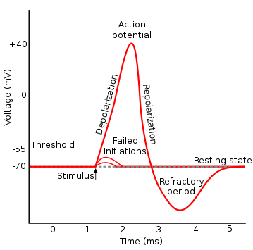

# `matterhorn_pytorch.snn.soma`

[回到 `matterhorn_pytorch.snn`](./README.md)

[English](../../en_us/snn/4_soma.md)

[中文](../../zh_cn/snn/4_soma.md)

## 模块简介

### 脉冲神经元模型

脉冲神经元模型来源于生物的神经元模型：霍奇金与赫胥黎于 1952 年在枪乌贼巨大神经元上进行了实验，并得到了霍奇金-赫胥黎模型（HH 模型）。该模型逐渐演变为 Leaky Intergrate-and-Fire （LIF）模型，并在此基础上，衍生出了各式各样的脉冲神经元模型。

然而，这些模型都有一个类似的特点：当突触后膜的受体感受到神经递质时，会产生兴奋或抑制，并最终沿着树突传导至胞体中；兴奋在胞体中累积；当兴奋积累至一定水平，就会在神经元的胞体中产生神经冲动，并将神经冲动沿轴突传导至突触处，释放神经递质。这一过程经历了去极化、超极化和不应期等过程。将这一极短过程中产生的信号称为脉冲。



由于生物脉冲产生时间短，具备“全或无”等特性，在计算机中，可以用离散的值来表示脉冲：在某一个时间步的某一个神经元处， `1` 代表有脉冲， `0` 代表无脉冲。如此，在时间和空间维度上存在的脉冲就可以表示为一串脉冲序列。

Matterhorn 的突触模块用于整合来自上一层的脉冲，并将突触后电位（PSP）送往胞体。而胞体模块则接受来自突触的突触后电位，并将其进行累计、判断是否发放脉冲，并根据脉冲的发放情况决定是否进入不应期。

## `matterhorn_pytorch.snn.soma.Soma`

```python
Soma(
    u_threshold: float = 1.0,
    u_rest: float = 0.0,
    spiking_function: torch.nn.Module = surrogate.Gaussian(),
    hard_reset: bool = True
)
```

### 构造函数参数

`u_threshold (float)` ：阈电位 $u_{th}$ 。

`u_rest (float)` ：静息电位 $u_{rest}$ 。

`spiking_function (torch.nn.Module)` ：计算脉冲时所使用的阶跃函数，详情参考 [`matterhorn_pytorch.snn.firing`](./3_surrogate.md) 。

`hard_reset (bool)` ：是否为硬重置。

### 可重载的方法

胞体的计算过程可以被分为 3 个操作：

#### `f_response(self, h: torch.Tensor, x: torch.Tensor) -> torch.Tensor` ：响应函数

通过突触后电位 $X^{l}(t)$ 和历史电位 $H^{l}(t - 1)$ 计算出当前电位 $U^{l}(t)$ 。不同的脉冲神经元，其本质上的不同是响应函数的不同。

#### `f_firing(self, u: torch.Tensor) -> torch.Tensor` ：脉冲函数

一般为通过 Heaviside 阶跃函数，判断当前电位是否超过了阈电位。

$$O^{l}(t)=(U^{l}(t) \ge u_{th})$$

其中 $u_{th}$ 为阈电位， $\ge$ （`>=`）为代表 Heaviside 阶跃函数的算子。

#### `f_reset(self, u: torch.Tensor, o: torch.Tensor) -> torch.Tensor` ：重置函数

为设置不应期的函数。如果不存在不应期（只重置），就通过以下函数进行一次选择：

$$H^{l}(t)=U^{l}(t)(1-O^{l}(t))+u_{rest}O^{l}(t)$$

其中 $u_{rest}$ 为静息电位。如果存在不应期，则需要一个存储的张量用于记录不应期长度。

## `matterhorn_pytorch.snn.IF` / `matterhorn_pytorch.snn.soma.IF`

Integrate-and-Fire 脉冲神经元，反应函数为：

$$\frac{du}{dt}=IR$$

离散化后可以得到反应函数：

$$U^{l}(t)=H^{l}(t-1)+X^{l}(t)$$

```python
IF(
    u_threshold: float = 1.0,
    u_rest: float = 0.0,
    spiking_function: torch.nn.Module = surrogate.Gaussian(),
    hard_reset: bool = True
)
```

### 构造函数参数

`u_threshold (float)` ：阈电位 $u_{th}$ 。

`u_rest (float)` ：静息电位 $u_{rest}$ 。

`spiking_function (torch.nn.Module)` ：计算脉冲时所使用的阶跃函数，详情参考 [`matterhorn_pytorch.snn.firing`](./3_surrogate.md) 。

`hard_reset (bool)` ：是否为硬重置。

### 示例用法

（1）使用默认参数：

```python
import torch
import matterhorn_pytorch as mth


soma = mth.snn.IF()
```

（2）使用自定义参数：

```python
import torch
import matterhorn_pytorch as mth


soma = mth.snn.IF(
    u_threshold = 1.0,
    u_rest = 0.0
)
```

（3）使用自定义脉冲函数：

```python
import torch
import matterhorn_pytorch as mth


soma = mth.snn.IF(
    spiking_function = mth.snn.Rectangular()
)
```

## `matterhorn_pytorch.snn.LIF` / `matterhorn_pytorch.snn.soma.LIF`

Leaky Integrate-and-Fire 脉冲神经元，反应函数为：

$$\tau_{m} \frac{du}{dt}=-(u-u_{rest})+IR$$

离散化后可以得到反应函数：

$$U^{l}(t)=H^{l}(t-1)+\frac{1}{\tau_{m}}[-(H^{l}(t-1)-u_{rest})+X^{l}(t)]$$

```python
LIF(
    u_threshold: float = 1.0,
    u_rest: float = 0.0,
    tau_m: float = 2.0,
    spiking_function: torch.nn.Module = surrogate.Gaussian(),
    hard_reset: bool = True,
    device: torch.device = None,
    dtype: torch.dtype = None
)
```

### 构造函数参数

`u_threshold (float)` ：阈电位 $u_{th}$ 。

`u_rest (float)` ：静息电位 $u_{rest}$ 。

`tau_m (float)` ：膜电位时间常数 $\tau_{m}$ 。

`spiking_function (torch.nn.Module)` ：计算脉冲时所使用的阶跃函数，详情参考 [`matterhorn_pytorch.snn.firing`](./3_surrogate.md) 。

`hard_reset (bool)` ：是否为硬重置。

`device (torch.device)` ：计算所使用的计算设备。

`dtype (torch.dtype)` ：计算所使用的数据类型。

### 示例用法

（1）使用默认参数：

```python
import torch
import matterhorn_pytorch as mth


soma = mth.snn.LIF()
```

（2）使用自定义参数：

```python
import torch
import matterhorn_pytorch as mth


soma = mth.snn.LIF(
    tau_m = 1.5,
    u_threshold = 1.0,
    u_rest = 0.0
)
```

（3）使用自定义脉冲函数：

```python
import torch
import matterhorn_pytorch as mth


soma = mth.snn.LIF(
    spiking_function = mth.snn.Rectangular()
)
```

## `matterhorn_pytorch.snn.QIF` / `matterhorn_pytorch.snn.soma.QIF`

Quadratic Integrate-and-Fire 脉冲神经元，反应函数为：

$$\tau_{m} \frac{du}{dt}=a_{0}(u-u_{rest})(u-u_{c})+RI$$

离散化后可以得到反应函数：

$$U^{l}(t)=H^{l}(t-1)+\frac{1}{\tau_{m}}[a_{0}(H^{l}(t-1)-u_{rest})(H^{l}(t-1)-u_{c})+X^{l}(t)]$$

```python
QIF(
    u_threshold: float = 1.0,
    u_rest: float = 0.0,
    tau_m: float = 2.0,
    u_c: float = 1.0,
    a_0: float = 1.0,
    spiking_function: torch.nn.Module = surrogate.Gaussian(),
    hard_reset: bool = True,
    device: torch.device = None,
    dtype: torch.dtype = None
)
```

### 构造函数参数

`u_threshold (float)` ：阈电位 $u_{th}$ 。

`u_rest (float)` ：静息电位 $u_{rest}$ 。

`tau_m (float)` ：膜电位时间常数 $\tau_{m}$ 。

`u_c (float)` ：参数 $u_{c}$ 。

`a_0 (float)` ：参数 $a_{0}$ 。

`spiking_function (torch.nn.Module)` ：计算脉冲时所使用的阶跃函数，详情参考 [`matterhorn_pytorch.snn.firing`](./3_surrogate.md) 。

`hard_reset (bool)` ：是否为硬重置。

`device (torch.device)` ：计算所使用的计算设备。

`dtype (torch.dtype)` ：计算所使用的数据类型。

### 示例用法

（1）使用默认参数：

```python
import torch
import matterhorn_pytorch as mth


soma = mth.snn.QIF()
```

（2）使用自定义参数：

```python
import torch
import matterhorn_pytorch as mth


soma = mth.snn.QIF(
    tau_m = 1.5,
    u_threshold = 1.0,
    u_rest = 0.0,
    u_c = 0.99,
    a_0 = 1.01
)
```

（3）使用自定义脉冲函数：

```python
import torch
import matterhorn_pytorch as mth


soma = mth.snn.QIF(
    spiking_function = mth.snn.Rectangular()
)
```

## `matterhorn_pytorch.snn.ExpIF` / `matterhorn_pytorch.snn.soma.ExpIF`

Exponential Integrate-and-Fire 脉冲神经元，反应函数为：

$$\tau_{m} \frac{du}{dt}=-(u-u_{rest})+\Delta_{T}e^{\frac{u-u_{T}}{\Delta_{T}}}+RI$$

离散化后可以得到反应函数：

$$U^{l}(t)=H^{l}(t-1)+\frac{1}{\tau_{m}}[-(H^{l}(t-1)-u_{rest})+\Delta_{T}e^{\frac{H^{l}(t-1)-u_{T}}{\Delta_{T}}}+X^{l}(t)]$$

```python
ExpIF(
    u_threshold: float = 1.0,
    u_rest: float = 0.0,
    tau_m: float = 2.0,
    u_t: float = 0.0,
    delta_t: float = 0.001,
    spiking_function: torch.nn.Module = surrogate.Gaussian(),
    hard_reset: bool = True,
    device: torch.device = None,
    dtype: torch.dtype = None
)
```

### 构造函数参数

`u_threshold (float)` ：阈电位 $u_{th}$ 。

`u_rest (float)` ：静息电位 $u_{rest}$ 。

`tau_m (float)` ：膜电位时间常数 $\tau_{m}$ 。

`u_t (float)` ：参数 $u_{T}$ 。

`delta_t (float)` ：参数 $\Delta_{T}$ 。

`spiking_function (torch.nn.Module)` ：计算脉冲时所使用的阶跃函数，详情参考 [`matterhorn_pytorch.snn.firing`](./3_surrogate.md) 。

`hard_reset (bool)` ：是否为硬重置。

`device (torch.device)` ：计算所使用的计算设备。

`dtype (torch.dtype)` ：计算所使用的数据类型。

### 示例用法

（1）使用默认参数：

```python
import torch
import matterhorn_pytorch as mth


soma = mth.snn.ExpIF()
```

（2）使用自定义参数：

```python
import torch
import matterhorn_pytorch as mth


soma = mth.snn.ExpIF(
    tau_m = 1.5,
    u_threshold = 1.0,
    u_rest = 0.0,
    u_t = 0.05,
    delta_t = 0.01
)
```

（3）使用自定义脉冲函数：

```python
import torch
import matterhorn_pytorch as mth


soma = mth.snn.ExpIF(
    spiking_function = mth.snn.Rectangular()
)
```

## `matterhorn_pytorch.snn.Izhikevich` / `matterhorn_pytorch.snn.soma.Izhikevich`

Izhikevich 脉冲神经元，反应函数为：

$$\frac{du}{dt}=0.04u^{2}+5u+140-w+I$$

$$\frac{dw}{dt}=a(bu-w)$$

其中电位的单位为 $mV$ 。

离散化后可以得到反应函数：

$$W^{l}(t)=W^{l}(t-1)+a(bH^{l}(t-1)-W^{l}(t-1))$$

$$U^{l}(t)=H^{l}(t-1)+0.04(H^{l}(t-1))^{2}+5H^{l}(t-1)+140-W^{l}(t)+X^{l}(t)$$

```python
Izhikevich(
    u_threshold: float = 1.0,
    u_rest: float = 0.0,
    a: float = 1.0,
    b: float = 1.0,
    spiking_function: torch.nn.Module = surrogate.Gaussian(),
    hard_reset: bool = True,
    device: torch.device = None,
    dtype: torch.dtype = None
)
```

### 构造函数参数

`u_threshold (float)` ：阈电位 $u_{th}$ 。

`u_rest (float)` ：静息电位 $u_{rest}$ 。

`a (float)` ：参数 $a$ 。

`b (float)` ：参数 $b$ 。

`spiking_function (torch.nn.Module)` ：计算脉冲时所使用的阶跃函数，详情参考 [`matterhorn_pytorch.snn.firing`](./3_surrogate.md) 。

`hard_reset (bool)` ：是否为硬重置。

`device (torch.device)` ：计算所使用的计算设备。

`dtype (torch.dtype)` ：计算所使用的数据类型。

### 示例用法

（1）使用默认参数：

```python
import torch
import matterhorn_pytorch as mth


soma = mth.snn.Izhikevich()
```

（2）使用自定义参数：

```python
import torch
import matterhorn_pytorch as mth


soma = mth.snn.Izhikevich(
    u_threshold = 1.0,
    u_rest = 0.0,
    a = 1.0,
    b = 5.0
)
```

（3）使用自定义脉冲函数：

```python
import torch
import matterhorn_pytorch as mth


soma = mth.snn.Izhikevich(
    spiking_function = mth.snn.Rectangular()
)
```

## `matterhorn_pytorch.snn.KLIF` / `matterhorn_pytorch.snn.soma.KLIF`

$k$-based leaky Integrate-and-Fire 脉冲神经元，输出为模拟值。其在 LIF 神经元的基础上，在反应函数和脉冲函数之间加入以下操作：

$$U^{l}(t)=ReLU[k(U^{l}(t)-u_{rest})]+u_{rest}$$

详情可参考文献 [1] 。

```python
KLIF(
    u_threshold: float = 1.0,
    u_rest: float = 0.0,
    tau_m: float = 2.0,
    k: float = 0.2,
    spiking_function: Module = surrogate.Gaussian(),
    hard_reset: bool = True,
    device: torch.device = None,
    dtype: torch.dtype = None
)
```

### 构造函数参数

`u_threshold (float)` ：阈电位 $u_{th}$ 。

`u_rest (float)` ：静息电位 $u_{rest}$ 。

`tau_m (float)` ：膜电位时间常数 $\tau_{m}$ 。

`k (float)` ：参数 $k$ 。

`spiking_function (torch.nn.Module)` ：计算脉冲时所使用的阶跃函数，详情参考 [`matterhorn_pytorch.snn.firing`](./3_surrogate.md) 。

`hard_reset (bool)` ：是否为硬重置。

`device (torch.device)` ：计算所使用的计算设备。

`dtype (torch.dtype)` ：计算所使用的数据类型。

### 示例用法

（1）使用默认参数：

```python
import torch
import matterhorn_pytorch as mth


soma = mth.snn.KLIF()
```

（2）使用自定义参数：

```python
import torch
import matterhorn_pytorch as mth


soma = mth.snn.KLIF(
    k = 0.25
)
```

## `matterhorn_pytorch.snn.LIAF` / `matterhorn_pytorch.snn.soma.LIAF`

Leaky Integrate and Analog Fire 脉冲神经元。在 LIF 神经元的基础上加入激活函数：

$$O_{A}^{l}(t)=ActFun(U^{l}(t)-u_{rest})$$

作为神经元的输出。详情可参考文献 [2] 。

```python
LIAF(
    u_threshold: float = 1.0,
    u_rest: float = 0.0,
    tau_m: float = 2.0,
    spiking_function: torch.nn.Module = surrogate.Gaussian(),
    activation_function: torch.nn.Module = nn.ReLU(),
    hard_reset: bool = True,
    device: torch.device = None,
    dtype: torch.dtype = None
)
```

### 构造函数参数

`u_threshold (float)` ：阈电位 $u_{th}$ 。

`u_rest (float)` ：静息电位 $u_{rest}$ 。

`tau_m (float)` ：膜电位时间常数 $\tau_{m}$ 。

`spiking_function (torch.nn.Module)` ：计算脉冲时所使用的阶跃函数，详情参考 [`matterhorn_pytorch.snn.firing`](./3_surrogate.md) 。

`activation_function (torch.nn.Module)` ：输出所使用的激活函数 $f(U^{l}(t)-u_{th})$ 。

`hard_reset (bool)` ：是否为硬重置。

`device (torch.device)` ：计算所使用的计算设备。

`dtype (torch.dtype)` ：计算所使用的数据类型。

### 示例用法

（1）使用默认参数：

```python
import torch
import matterhorn_pytorch as mth


soma = mth.snn.LIAF()
```

（2）使用自定义参数：

```python
import torch
import matterhorn_pytorch as mth


soma = mth.snn.LIAF(
    tau_m = 1.5,
    u_threshold = 1.0,
    u_rest = 0.0
)
```

（3）使用自定义脉冲函数或激活函数：

```python
import torch
import matterhorn_pytorch as mth


soma = mth.snn.LIAF(
    spiking_function = mth.snn.Rectangular(),
    activation_function = torch.nn.LeakyReLU()
)
```

## 参考文献

[1] Jiang C, Zhang Y. KLIF: An optimized spiking neuron unit for tuning surrogate gradient slope and membrane potential[J]. arXiv preprint arXiv:2302.09238, 2023.

[2] Wu Z, Zhang H, Lin Y, et al. Liaf-net: Leaky integrate and analog fire network for lightweight and efficient spatiotemporal information processing[J]. IEEE Transactions on Neural Networks and Learning Systems, 2021, 33(11): 6249-6262.