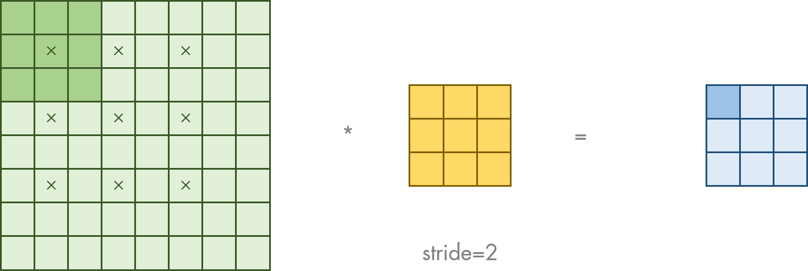
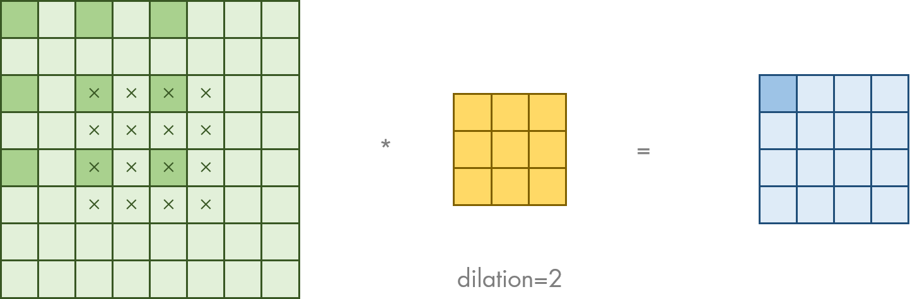

# `matterhorn_pytorch.snn.synapse`

[回到 `matterhorn_pytorch.snn`](./README.md)

[English](../../en_us/snn/5_synapse.md)

[中文](../../zh_cn/snn/5_synapse.md)

## 模块简介

SNNs 与 ANNs 在突触的计算上基本一致。 SNNs 的突触将脉冲序列作为输入信号，经过一定的处理，输出突触后电位（PSP）。

## `matterhorn.snn.synapse.Synapse`

```python
Synapse()
```

### 可重载的方法

#### `forward_step(self, o: torch.Tensor) -> torch.Tensor`

单个时间步内的突触函数。由于突触的运算和时间步无关，多时间步模式下的突触函数可以并行运行，仅需重载单个时间步内的突触函数。

#### `forward_steps(self, o: torch.Tensor) -> torch.Tensor`

若突触的运算与时间步有关，请重载这一函数，并用变量指明不同时间步之间的关联。

## `matterhorn_pytorch.snn.Linear` / `matterhorn_pytorch.snn.synapse.Linear`

突触的全连接操作。可用如下公式表示：

$$X^{l}(t)=W^{l}O^{l-1}(t)$$

其中 $W^{l}$ 为权重矩阵。

```python
Linear(
    in_features: int,
    out_features: int,
    bias: bool = True,
    device: torch.device = None,
    dtype: torch.dtype = None
)
```

### 构造函数参数

`in_features (int)` ：输入的长度 `I` 。输入的形状为 `[B, I]` （单时间步模式） 或 `[T, B, I]` （多时间步模式）。

`out_features (int)` ：输出的长度 `O` 。输出的形状为 `[B, O]` （单时间步模式） 或 `[T, B, O]` （多时间步模式）。

`bias (bool)` ：是否要加入偏置，为 `True` 则执行 $W\vec{x}+\vec{b}$ ，为 `False` 则执行 $W\vec{x}$ 。

`device (torch.device)` ：计算所使用的计算设备。

`dtype (torch.dtype)` ：计算所使用的数据类型。

### 示例用法

```python
import torch
import matterhorn_pytorch as mth


fc = mth.snn.Linear(784, 10) # [T, B, 784] -> [T, B, 10]
```

## `matterhorn_pytorch.snn.Conv1d` / `matterhorn_pytorch.snn.synapse.Conv1d`

突触的一维卷积操作。可用如下公式表示：

$$X^{l}(t)=C^{l}*O^{l-1}(t)$$

其中 $C^{l}$ 为卷积核。

```python
Conv1d(
    in_channels: int,
    out_channels: int,
    kernel_size: _size_1_t,
    stride: _size_1_t = 1,
    padding: Union[_size_1_t, str] = 0,
    dilation: _size_1_t = 1,
    groups: int = 1,
    bias: bool = True,
    padding_mode: str = "zeros",
    device: torch.device = None,
    dtype: torch.dtype = None
)
```

### 构造函数参数

`in_channels (int)` ：输入通道数 `CI` 。输入的形状为 `[B, CI, LI]` （单时间步模式） 或 `[T, B, CI, LI]` （多时间步模式）。

`out_channels (int)` ：输出通道数 `CO` 。输入的形状为 `[B, CO, LO]` （单时间步模式） 或 `[T, B, CO, LO]` （多时间步模式）。

`kernel_size (size_1_t)` ：卷积核的形状。

`stride (size_1_t)` ：步长。在原图经过多少个像素后进行卷积。

`padding (size_1_t | str)` ：边界大小。在边缘填充多少空白。

`dilation (size_1_t)` ：在卷积时，每隔多少像素进行一次乘加操作。

`groups (int)` ：分组进行卷积操作的组数。

`bias (bool)` ：是否要加入偏置。

`padding_mode (str)` ：边缘填充的方式。

`device (torch.device)` ：计算所使用的计算设备。

`dtype (torch.dtype)` ：计算所使用的数据类型。

### 示例用法

```python
import torch
import matterhorn_pytorch as mth


conv = mth.snn.Conv1d(2, 8, 3, padding = 1) # [T, B, 2, L] -> [T, B, 8, L]
```

## `matterhorn_pytorch.snn.Conv2d` / `matterhorn_pytorch.snn.synapse.Conv2d`

突触的二维卷积操作。可用如下公式表示：

$$X^{l}(t)=C^{l}*O^{l-1}(t)$$

其中 $C^{l}$ 为卷积核。


```python
Conv2d(
    in_channels: int,
    out_channels: int,
    kernel_size: _size_2_t,
    stride: _size_2_t = 1,
    padding: Union[_size_2_t, str] = 0,
    dilation: _size_2_t = 1,
    groups: int = 1,
    bias: bool = True,
    padding_mode: str = "zeros",
    device: torch.device = None,
    dtype: torch.dtype = None
)
```

### 构造函数参数

`in_channels (int)` ：输入通道数 `CI` 。输入的形状为 `[B, CI, HI, WI]` （单时间步模式） 或 `[T, B, CI, HI, WI]` （多时间步模式）。

`out_channels (int)` ：输出通道数 `CO` 。输入的形状为 `[B, CO, HO, WO]` （单时间步模式） 或 `[T, B, CO, HO, WO]` （多时间步模式）。

`kernel_size (size_2_t)` ：卷积核的形状。

`stride (size_2_t)` ：步长。在原图经过多少个像素后进行卷积。



`padding (size_2_t | str)` ：边界大小。在边缘填充多少空白。


`dilation (size_2_t)` ：在卷积时，每隔多少像素进行一次乘加操作。



`groups (int)` ：分组进行卷积操作的组数。

`bias (bool)` ：是否要加入偏置。

`padding_mode (str)` ：边缘填充的方式。

`device (torch.device)` ：计算所使用的计算设备。

`dtype (torch.dtype)` ：计算所使用的数据类型。

### 示例用法

```python
import torch
import matterhorn_pytorch as mth


conv = mth.snn.Conv2d(2, 8, 3, padding = 1) # [T, B, 2, H, W] -> [T, B, 8, H, W]
```

## `matterhorn_pytorch.snn.Conv3d` / `matterhorn_pytorch.snn.synapse.Conv3d`

突触的三维卷积操作。可用如下公式表示：

$$X^{l}(t)=C^{l}*O^{l-1}(t)$$

其中 $C^{l}$ 为卷积核。

```python
Conv3d(
    in_channels: int,
    out_channels: int,
    kernel_size: _size_3_t,
    stride: _size_3_t = 1,
    padding: Union[_size_3_t, str] = 0,
    dilation: _size_3_t = 1,
    groups: int = 1,
    bias: bool = True,
    padding_mode: str = "zeros",
    device: torch.device = None,
    dtype: torch.dtype = None
)
```

### 构造函数参数

`in_channels (int)` ：输入通道数 `CI` 。输入的形状为 `[B, CI, HI, WI, LI]` （单时间步模式） 或 `[T, B, CI, HI, WI, LI]` （多时间步模式）。

`out_channels (int)` ：输出通道数 `CO` 。输入的形状为 `[B, CO, HO, WO, LO]` （单时间步模式） 或 `[T, B, CO, HO, WO, LO]` （多时间步模式）。

`kernel_size (size_3_t)` ：卷积核的形状。

`stride (size_3_t)` ：步长。在原图经过多少个像素后进行卷积。

`padding (size_3_t | str)` ：边界大小。在边缘填充多少空白。

`dilation (size_3_t)` ：在卷积时，每隔多少像素进行一次乘加操作。

`groups (int)` ：分组进行卷积操作的组数。

`bias (bool)` ：是否要加入偏置。

`padding_mode (str)` ：边缘填充的方式。

`device (torch.device)` ：计算所使用的计算设备。

`dtype (torch.dtype)` ：计算所使用的数据类型。

### 示例用法

```python
import torch
import matterhorn_pytorch as mth


conv = mth.snn.Conv3d(2, 8, 3, padding = 1) # [T, B, 2, H, W, L] -> [T, B, 8, H, W, L]
```

## `matterhorn_pytorch.snn.ConvTranspose1d` / `matterhorn_pytorch.snn.synapse.ConvTranspose1d`

突触的一维转置卷积（逆卷积）操作。

```python
ConvTranspose1d(
    in_channels: int,
    out_channels: int,
    kernel_size: _size_1_t,
    stride: _size_1_t = 1,
    padding: _size_1_t = 0,
    output_padding: _size_1_t = 0,
    groups: int = 1,
    bias: bool = True,
    dilation: _size_1_t = 1,
    padding_mode: str = "zeros",
    device: torch.device = None,
    dtype: torch.dtype = None
)
```

### 构造函数参数

`in_channels (int)` ：输入通道数 `CI` 。输入的形状为 `[B, CI, LI]` （单时间步模式） 或 `[T, B, CI, LI]` （多时间步模式）。

`out_channels (int)` ：输出通道数 `CO` 。输入的形状为 `[B, CO, LO]` （单时间步模式） 或 `[T, B, CO, LO]` （多时间步模式）。

`kernel_size (size_1_t)` ：卷积核的形状。

`stride (size_1_t)` ：步长。在原图经过多少个像素后进行卷积。

`padding (size_1_t)` ：输入边界大小。在输入边缘填充多少空白。

`output_padding (size_1_t)` ：输出边界大小。在输出边缘填充多少空白。

`groups (int)` ：分组进行卷积操作的组数。

`bias (bool)` ：是否要加入偏置。

`dilation (size_1_t)` ：在原卷积时，每隔多少像素进行一次乘加操作。

`padding_mode (str)` ：边缘填充的方式。

`device (torch.device)` ：计算所使用的计算设备。

`dtype (torch.dtype)` ：计算所使用的数据类型。

### 示例用法

```python
import torch
import matterhorn_pytorch as mth


convt = mth.snn.ConvTranspose1d(2, 8, 3, padding = 1) # [T, B, 2, L] -> [T, B, 8, L]
```

## `matterhorn_pytorch.snn.ConvTranspose2d` / `matterhorn_pytorch.snn.synapse.ConvTranspose2d`

突触的二维转置卷积（逆卷积）操作。

```python
ConvTranspose2d(
    in_channels: int,
    out_channels: int,
    kernel_size: _size_2_t,
    stride: _size_2_t = 1,
    padding: _size_2_t = 0,
    output_padding: _size_2_t = 0,
    groups: int = 1,
    bias: bool = True,
    dilation: _size_2_t = 1,
    padding_mode: str = "zeros",
    ulti_time_step: bool = False,
    device: torch.device = None,
    dtype: torch.dtype = None
)
```

### 构造函数参数

`in_channels (int)` ：输入通道数 `CI` 。输入的形状为 `[B, CI, HI, WI]` （单时间步模式） 或 `[T, B, CI, HI, WI]` （多时间步模式）。

`out_channels (int)` ：输出通道数 `CO` 。输入的形状为 `[B, CO, HO, WO]` （单时间步模式） 或 `[T, B, CO, HO, WO]` （多时间步模式）。

`kernel_size (size_2_t)` ：卷积核的形状。

`stride (size_2_t)` ：步长。在原图经过多少个像素后进行卷积。

`padding (size_2_t)` ：输入边界大小。在输入边缘填充多少空白。

`output_padding (size_2_t)` ：输出边界大小。在输出边缘填充多少空白。

`groups (int)` ：分组进行卷积操作的组数。

`bias (bool)` ：是否要加入偏置。

`dilation (size_2_t)` ：在原卷积时，每隔多少像素进行一次乘加操作。

`padding_mode (str)` ：边缘填充的方式。

`device (torch.device)` ：计算所使用的计算设备。

`dtype (torch.dtype)` ：计算所使用的数据类型。

### 示例用法

```python
import torch
import matterhorn_pytorch as mth


convt = mth.snn.ConvTranspose2d(2, 8, 3, padding = 1) # [T, B, 2, H, W] -> [T, B, 8, H, W]
```

## `matterhorn_pytorch.snn.ConvTranspose3d` / `matterhorn_pytorch.snn.synapse.ConvTranspose3d`

突触的三维转置卷积（逆卷积）操作。

```python
ConvTranspose3d(
    in_channels: int,
    out_channels: int,
    kernel_size: _size_3_t,
    stride: _size_3_t = 1,
    padding: _size_3_t = 0,
    output_padding: _size_3_t = 0,
    groups: int = 1,
    bias: bool = True,
    dilation: _size_3_t = 1,
    padding_mode: str = "zeros",
    device: torch.device = None,
    dtype: torch.dtype = None
)
```

### 构造函数参数

`in_channels (int)` ：输入通道数 `CI` 。输入的形状为 `[B, CI, HI, WI, LI]` （单时间步模式） 或 `[T, B, CI, HI, WI, LI]` （多时间步模式）。

`out_channels (int)` ：输出通道数 `CO` 。输入的形状为 `[B, CO, HO, WO, LO]` （单时间步模式） 或 `[T, B, CO, HO, WO, LO]` （多时间步模式）。

`kernel_size (size_3_t)` ：卷积核的形状。

`stride (size_3_t)` ：步长。在原图经过多少个像素后进行卷积。

`padding (size_3_t)` ：输入边界大小。在输入边缘填充多少空白。

`output_padding (size_3_t)` ：输出边界大小。在输出边缘填充多少空白。

`groups (int)` ：分组进行卷积操作的组数。

`bias (bool)` ：是否要加入偏置。

`dilation (size_3_t)` ：在原卷积时，每隔多少像素进行一次乘加操作。

`padding_mode (str)` ：边缘填充的方式。

`device (torch.device)` ：计算所使用的计算设备。

`dtype (torch.dtype)` ：计算所使用的数据类型。

### 示例用法

```python
import torch
import matterhorn_pytorch as mth


convt = mth.snn.ConvTranspose3d(2, 8, 3, padding = 1) # [T, B, 2, H, W, L] -> [T, B, 8, H, W, L]
```

## `matterhorn_pytorch.snn.BatchNorm1d` / `matterhorn_pytorch.snn.synapse.BatchNorm1d`

一维批归一化操作。公式为：

$$Y=\frac{X-E(X)}{\sqrt{D(X)+\varepsilon}}\times \gamma + \beta$$

其中 $E(X)$ 为张量 $X$ 的均值， $D(X)$ 为张量 $X$ 的方差。

```python
BatchNorm1d(
    num_features: int,
    eps: float = 0.00001,
    momentum: float = 0.1,
    affine: bool = True,
    track_running_stats: bool = True,
    device: torch.device = None,
    dtype: torch.dtype = None
)
```

### 构造函数参数

`num_features (int)` ：批大小。

`eps (float)` ：参数 $\varepsilon$ 。

`momentum (float)` ：动量参数。

`affine (bool)` ：是否启用参数 $\gamma$ 和 $\beta$ ，进行仿射变换。

`track_running_stats (bool)` ：是否需要跟踪整个训练过程来进行批归一化的学习。

`device (torch.device)` ：计算所使用的计算设备。

`dtype (torch.dtype)` ：计算所使用的数据类型。

### 示例用法

```python
import torch
import matterhorn_pytorch as mth


bn = mth.snn.BatchNorm1d(64)
```

## `matterhorn_pytorch.snn.BatchNorm2d` / `matterhorn_pytorch.snn.synapse.BatchNorm2d`

二维批归一化操作。公式为：

$$Y=\frac{X-E(X)}{\sqrt{D(X)+\varepsilon}}\times \gamma + \beta$$

其中 $E(X)$ 为张量 $X$ 的均值， $D(X)$ 为张量 $X$ 的方差。

```python
BatchNorm2d(
    num_features: int,
    eps: float = 0.00001,
    momentum: float = 0.1,
    affine: bool = True,
    track_running_stats: bool = True,
    device: torch.device = None,
    dtype: torch.dtype = None
)
```

### 构造函数参数

`num_features (int)` ：批大小。

`eps (float)` ：参数 $\varepsilon$ 。

`momentum (float)` ：动量参数。

`affine (bool)` ：是否启用参数 $\gamma$ 和 $\beta$ ，进行仿射变换。

`track_running_stats (bool)` ：是否需要跟踪整个训练过程来进行批归一化的学习。

`device (torch.device)` ：计算所使用的计算设备。

`dtype (torch.dtype)` ：计算所使用的数据类型。

### 示例用法

```python
import torch
import matterhorn_pytorch as mth


bn = mth.snn.BatchNorm2d(64)
```

## `matterhorn_pytorch.snn.BatchNorm3d` / `matterhorn_pytorch.snn.synapse.BatchNorm3d`

三维批归一化操作。公式为：

$$Y=\frac{X-E(X)}{\sqrt{D(X)+\varepsilon}}\times \gamma + \beta$$

其中 $E(X)$ 为张量 $X$ 的均值， $D(X)$ 为张量 $X$ 的方差。

```python
BatchNorm3d(
    num_features: int,
    eps: float = 0.00001,
    momentum: float = 0.1,
    affine: bool = True,
    track_running_stats: bool = True,
    device: torch.device = None,
    dtype: torch.dtype = None
)
```

### 构造函数参数

`num_features (int)` ：批大小。

`eps (float)` ：参数 $\varepsilon$ 。

`momentum (float)` ：动量参数。

`affine (bool)` ：是否启用参数 $\gamma$ 和 $\beta$ ，进行仿射变换。

`track_running_stats (bool)` ：是否需要跟踪整个训练过程来进行批归一化的学习。

`device (torch.device)` ：计算所使用的计算设备。

`dtype (torch.dtype)` ：计算所使用的数据类型。

### 示例用法

```python
import torch
import matterhorn_pytorch as mth


bn = mth.snn.BatchNorm3d(64)
```

## `matterhorn_pytorch.snn.LayerNorm` / `matterhorn_pytorch.snn.synapse.LayerNorm`

层间归一化操作。公式为：

$$Y=\frac{X-E(X)}{\sqrt{D(X)+\varepsilon}}\times \gamma + \beta$$

其中 $E(X)$ 为张量 $X$ 的均值， $D(X)$ 为张量 $X$ 的方差。

```python
LayerNorm(
    normalized_shape: _shape_t,
    eps: float = 0.00001,
    elementwise_affine: bool = True,
    device: torch.device = None,
    dtype: torch.dtype = None
)
```

### 构造函数参数

`normalized_shape (shape_t)` ：需要归一化的部分张量形状。如一个大小为 `[B, C, H, W]` 的张量，需要在最后 2 维进行归一化，只需要传入 `(H, W)` 即可。

`eps (float)` ：参数 $\varepsilon$ 。

`elementwise_affine (bool)` ：是否启用参数 $\gamma$ 和 $\beta$ ，进行逐元素仿射变换。

`device (torch.device)` ：计算所使用的计算设备。

`dtype (torch.dtype)` ：计算所使用的数据类型。

### 示例用法

```python
import torch
import matterhorn_pytorch as mth


ln = mth.snn.LayerNorm((28, 28))
```