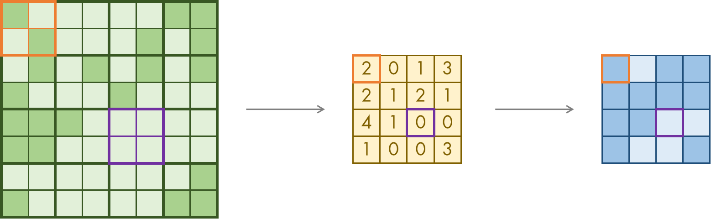
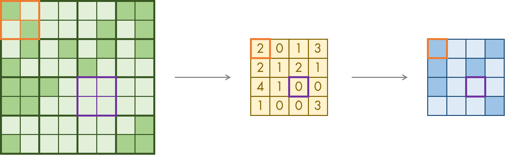

# `matterhorn_pytorch.snn.layer`

[回到 `matterhorn_pytorch.snn`](./README.md)

[English](../../en_us/snn/6_layer.md)

[中文](../../zh_cn/snn/6_layer.md)

## 模块简介

本模块定义了一些完整的神经网络层或层间操作，如池化、展开等。

## `matterhorn_pytorch.snn.layer.Layer`

```python
Layer(
    multi_time_step = False
)
```

### 构造函数参数

`multi_time_step (bool)` ：是否调整为多时间步模式。

### 可重载的方法

#### `forward_single_time_step(self, o: torch.Tensor) -> torch.Tensor`

单个时间步内的突触函数。由于突触的运算和时间步无关，多时间步模式下的突触函数可以并行运行，仅需重载单个时间步内的突触函数。

#### `forward_multi_time_steps(self, o: torch.Tensor) -> torch.Tensor`

若突触的运算与时间步有关，请重载这一函数，并用变量指明不同时间步之间的关联。

## `matterhorn_pytorch.snn.STDPLinear` / `matterhorn_pytorch.snn.layer.STDPLinear`

采用脉冲时序依赖可塑性（STDP）学习机制的全连接层。 STDP 作为常见的基于脉冲的学习机制，其权重更新遵循公式：

$$\Delta w_{ij}=\sum_{t_{j}}{\sum_{t_{i}}W(t_{i}-t_{j})}$$

其中权重函数 $W(x)$ 为：

$$
W(x)=
\left \{
\begin{aligned}
A_{+}e^{-\frac{x}{\tau_{+}}},x>0 \\\\
0,x=0 \\\\
-A_{-}e^{\frac{x}{\tau_{-}}},x<0
\end{aligned}
\right .
$$

， $t_{i}$ 为索引为 $i$ 的神经元输入脉冲产生的时间步， $t_{j}$ 为索引为 $j$ 的突触输入脉冲到达的时间步。

```python
STDPLinear(
    soma: torch.nn.Module,
    in_features: int,
    out_features: int,
    a_pos: float = 0.015,
    tau_pos: float = 2.0,
    a_neg: float = 0.015,
    tau_neg: float = 2.0,
    multi_time_step: bool = True,
    device: torch.device = None,
    dtype: torch.dtype = None
)
```

### 构造函数参数

`in_features (int)` ：输入的长度 `I` 。输入的形状为 `[B, I]` （单时间步模式） 或 `[T, B, I]` （多时间步模式）。

`out_features (int)` ：输出的长度 `O` 。输出的形状为 `[B, O]` （单时间步模式） 或 `[T, B, O]` （多时间步模式）。

`soma (torch.nn.Module)` ：采用哪种胞体。可选择的胞体类型可以参考模块 [`matterhorn_pytorch.snn.soma`](./4_soma.md) 。

`a_pos (float)` ： STDP 参数 $A_{+}$ 。

`tau_pos (float)` ： STDP 参数 $\tau_{+}$ 。

`a_neg (float)` ： STDP 参数 $A_{-}$ 。

`tau_neg (float)` ： STDP 参数 $\tau_{-}$ 。

`multi_time_step (bool)` ：是否调整为多个时间步模式。

`device (torch.device)` ：计算所使用的计算设备。

`dtype (torch.dtype)` ：计算所使用的数据类型。

### 示例用法

```python
import torch
import matterhorn_pytorch as mth


l1 = mth.snn.STDPLinear(mth.snn.LIF(), 784, 10) # [T, B, 784] -> [T, B, 10]
```

## `matterhorn_pytorch.snn.MaxPool1d` / `matterhorn_pytorch.snn.layer.MaxPool1d`

一维最大池化层。将对脉冲的最大池化定义为：只要有任意一个输入产生脉冲，则输出产生脉冲。可以用如下公式描述：

$$O_{i}^{l}(t)=(\sum_{j=1}^{m}{O_{j}^{l-1}(t)} \ge 1)$$

其中 $i$ 为输出索引， $j$ 为输出索引为 $i$ 时应被统计的输入索引， $m$ 为应被统计的输入索引个数。

```python
MaxPool1d(
    kernel_size: _size_any_t,
    stride: Optional[_size_any_t] = None,
    padding: _size_any_t = 0,
    dilation: _size_any_t = 1,
    return_indices: bool = False,
    ceil_mode: bool = False,
    multi_time_step: bool = False
)
```

### 构造函数参数

`kernel_size (size_any_t)` ：池化核的大小。

`stride (size_any_t | None)` ：一次池化操作跨越多少像素。

`padding (size_any_t)` ：边界填充的长度。

`dilation (size_any_t)` ：在一次池化操作中，一次选择操作跨越多少像素。

`return_indices (bool)` ：是否返回池化后的值在原图像中的索引。

`ceil_mode (bool)` ：池化后是否将值向上取整。

`multi_time_step (bool)` ：是否调整为多个时间步模式。

### 示例用法

```python
import torch
import matterhorn_pytorch as mth


pooling = mth.snn.MaxPool1d(2) # [T, B, L] -> [T, B, L // 2]
```

## `matterhorn_pytorch.snn.MaxPool2d` / `matterhorn_pytorch.snn.layer.MaxPool2d`

二维最大池化层。将对脉冲的最大池化定义为：只要有任意一个输入产生脉冲，则输出产生脉冲。可以用如下公式描述：

$$O_{i}^{l}(t)=(\sum_{j=1}^{m}{O_{j}^{l-1}(t)} \ge 1)$$

其中 $i$ 为输出索引， $j$ 为输出索引为 $i$ 时应被统计的输入索引， $m$ 为应被统计的输入索引个数。脉冲的最大池化如下图所示。



```python
MaxPool2d(
    kernel_size: _size_any_t,
    stride: Optional[_size_any_t] = None,
    padding: _size_any_t = 0,
    dilation: _size_any_t = 1,
    return_indices: bool = False,
    ceil_mode: bool = False,
    multi_time_step: bool = False
)
```

### 构造函数参数

`kernel_size (size_any_t)` ：池化核的大小。

`stride (size_any_t | None)` ：一次池化操作跨越多少像素。

`padding (size_any_t)` ：边界填充的长度。

`dilation (size_any_t)` ：在一次池化操作中，一次选择操作跨越多少像素。

`return_indices (bool)` ：是否返回池化后的值在原图像中的索引。

`ceil_mode (bool)` ：池化后是否将值向上取整。

`multi_time_step (bool)` ：是否调整为多个时间步模式。

### 示例用法

```python
import torch
import matterhorn_pytorch as mth


pooling = mth.snn.MaxPool2d(2) # [T, B, H, W] -> [T, B, H // 2, W // 2]
```

## `matterhorn_pytorch.snn.MaxPool3d` / `matterhorn_pytorch.snn.layer.MaxPool3d`

三维最大池化层。将对脉冲的最大池化定义为：只要有任意一个输入产生脉冲，则输出产生脉冲。可以用如下公式描述：

$$O_{i}^{l}(t)=(\sum_{j=1}^{m}{O_{j}^{l-1}(t)} \ge 1)$$

其中 $i$ 为输出索引， $j$ 为输出索引为 $i$ 时应被统计的输入索引， $m$ 为应被统计的输入索引个数。

```python
MaxPool3d(
    kernel_size: _size_any_t,
    stride: Optional[_size_any_t] = None,
    padding: _size_any_t = 0,
    dilation: _size_any_t = 1,
    return_indices: bool = False,
    ceil_mode: bool = False,
    multi_time_step: bool = False
)
```

### 构造函数参数

`kernel_size (size_any_t)` ：池化核的大小。

`stride (size_any_t | None)` ：一次池化操作跨越多少像素。

`padding (size_any_t)` ：边界填充的长度。

`dilation (size_any_t)` ：在一次池化操作中，一次选择操作跨越多少像素。

`return_indices (bool)` ：是否返回池化后的值在原图像中的索引。

`ceil_mode (bool)` ：池化后是否将值向上取整。

`multi_time_step (bool)` ：是否调整为多个时间步模式。

### 示例用法

```python
import torch
import matterhorn_pytorch as mth


pooling = mth.snn.MaxPool3d(2) # [T, B, H, W, L] -> [T, B, H // 2, W // 2, L // 2]
```

## `matterhorn_pytorch.snn.AvgPool1d` / `matterhorn_pytorch.snn.layer.AvgPool1d`

一维平均池化层。将对脉冲的平均池化定义为：当一半及以上的输入产生脉冲时，输出才产生脉冲。可以用如下公式描述：

$$O_{i}^{l}(t)=(\sum_{j=1}^{m}{O_{j}^{l-1}(t)} \ge \lceil \frac{m}{2} \rceil)$$

其中 $i$ 为输出索引， $j$ 为输出索引为 $i$ 时应被统计的输入索引， $m$ 为应被统计的输入索引个数。

```python
AvgPool1d(
    kernel_size: _size_1_t,
    stride: Optional[_size_1_t] = None,
    padding: _size_1_t = 0,
    ceil_mode: bool = False,
    count_include_pad: bool = True,
    multi_time_step: bool = False
)
```

### 构造函数参数

`kernel_size (size_1_t)` ：池化核的大小。

`stride (size_1_t)` ：一次池化操作跨越多少像素。

`padding (size_1_t)` ：边界填充的长度。

`ceil_mode (bool)` ：池化后是否将值向上取整。

`count_include_pad (bool)` ：池化的时候是否连边界一起计入。

`multi_time_step (bool)` ：是否调整为多个时间步模式。

### 示例用法

```python
import torch
import matterhorn_pytorch as mth


pooling = mth.snn.AvgPool1d(2) # [T, B, L] -> [T, B, L // 2]
```

## `matterhorn_pytorch.snn.AvgPool2d` / `matterhorn_pytorch.snn.layer.AvgPool2d`

二维平均池化层。将对脉冲的平均池化定义为：当一半及以上的输入产生脉冲时，输出才产生脉冲。可以用如下公式描述：

$$O_{i}^{l}(t)=(\sum_{j=1}^{m}{O_{j}^{l-1}(t)} \ge \lceil \frac{m}{2} \rceil)$$

其中 $i$ 为输出索引， $j$ 为输出索引为 $i$ 时应被统计的输入索引， $m$ 为应被统计的输入索引个数。脉冲的平均池化如下图所示。



```python
AvgPool2d(
    kernel_size: _size_2_t,
    stride: Optional[_size_2_t] = None,
    padding: _size_2_t = 0,
    ceil_mode: bool = False,
    count_include_pad: bool = True,
    divisor_override: Optional[int] = None,
    multi_time_step: bool = False
)
```

### 构造函数参数

`kernel_size (size_2_t)` ：池化核的大小。

`stride (size_2_t | None)` ：一次池化操作跨越多少像素。

`padding (size_2_t)` ：边界填充的长度。

`ceil_mode (bool)` ：池化后是否将值向上取整。

`count_include_pad (bool)` ：池化的时候是否连边界一起计入。

`divisor_override (int | None)` ：是否用某个数取代总和作为除数。

`multi_time_step (bool)` ：是否调整为多个时间步模式。

### 示例用法

```python
import torch
import matterhorn_pytorch as mth


pooling = mth.snn.AvgPool2d(2) # [T, B, H, W] -> [T, B, H // 2, W // 2]
```

## `matterhorn_pytorch.snn.AvgPool3d` / `matterhorn_pytorch.snn.layer.AvgPool3d`

三维平均池化层。将对脉冲的平均池化定义为：当一半及以上的输入产生脉冲时，输出才产生脉冲。可以用如下公式描述：

$$O_{i}^{l}(t)=(\sum_{j=1}^{m}{O_{j}^{l-1}(t)} \ge \lceil \frac{m}{2} \rceil)$$

其中 $i$ 为输出索引， $j$ 为输出索引为 $i$ 时应被统计的输入索引， $m$ 为应被统计的输入索引个数。

```python
AvgPool3d(
    kernel_size: _size_3_t,
    stride: Optional[_size_3_t] = None,
    padding: _size_3_t = 0,
    ceil_mode: bool = False,
    count_include_pad: bool = True,
    divisor_override: Optional[int] = None,
    multi_time_step: bool = False
)
```

### 构造函数参数

`kernel_size (size_3_t)` ：池化核的大小。

`stride (size_3_t | None)` ：一次池化操作跨越多少像素。

`padding (size_3_t)` ：边界填充的长度。

`ceil_mode (bool)` ：池化后是否将值向上取整。

`count_include_pad (bool)` ：池化的时候是否连边界一起计入。

`divisor_override (int | None)` ：是否用某个数取代总和作为除数。

`multi_time_step (bool)` ：是否调整为多个时间步模式。

### 示例用法

```python
import torch
import matterhorn_pytorch as mth


pooling = mth.snn.AvgPool3d(2) # [T, B, H, W, L] -> [T, B, H // 2, W // 2, L // 2]
```

## `matterhorn_pytorch.snn.Flatten` / `matterhorn_pytorch.snn.layer.Flatten`

展平层，将张量重排展开，一般用于连接卷积层与输出的全连接层。

```python
Flatten(
    start_dim: int = 2,
    end_dim: int = -1,
    multi_time_step: bool = False
)
```

### 构造函数参数

`start_dim (int)` ：展平开始的维度（不算时间维度）。默认为 `1` ，即跳过批维度，从空间维度开始展平。

`end_dim (int)` ：展平结束的维度（不算时间维度）。默认为 `-1` ，即展平到最后一个维度。

`multi_time_step (bool)` ：是否调整为多个时间步模式。

### 示例用法

```python
import torch
import matterhorn_pytorch as mth


lf = mth.snn.Flatten() # [T, B, H, W] -> [T, B, H * W]
```

## `matterhorn_pytorch.snn.Unflatten` / `matterhorn_pytorch.snn.layer.Unflatten`

反展平层，将展开的张量重新折叠。

```python
Unflatten(
    dim: Union[int, str],
    unflattened_size: _size,
    multi_time_step: bool = False
)
```

### 构造函数参数

`dim (int)` ：要折叠哪一个维度（不算时间维度）的数据。

`unflattened_size (size)` ：将这一个维度的数据折叠成什么形状。

`multi_time_step (bool)` ：是否调整为多个时间步模式。

### 示例用法

```python
import torch
import matterhorn_pytorch as mth


lf = mth.snn.Unflatten(1, (1, 28, 28)) # [T, B, 784] -> [T, B, 1, 28, 28]
```

## `matterhorn_pytorch.snn.Dropout` / `matterhorn_pytorch.snn.layer.Dropout`

遗忘层，以一定概率将元素置为 `0` 。

```python
Dropout(
    p: float = 0.5,
    inplace: bool = False,
    multi_time_step: bool = False
)
```

### 构造函数参数

`p (float)` ：遗忘概率。

`unflattened_size (size)` ：是否在原有张量上改动，若为 `True` 则直接改原张量，否则新建一个张量。

`multi_time_step (bool)` ：是否调整为多个时间步模式。

### 示例用法

```python
import torch
import matterhorn_pytorch as mth


ld = mth.snn.Dropout(0.5)
```

## `matterhorn_pytorch.snn.Dropout1d` / `matterhorn_pytorch.snn.layer.Dropout1d`

一维遗忘层，以一定概率将元素置为 `0` 。详情请参考 `matterhorn_pytorch.snn.Dropout` 。

## `matterhorn_pytorch.snn.Dropout2d` / `matterhorn_pytorch.snn.layer.Dropout2d`

二维遗忘层，以一定概率将元素置为 `0` 。详情请参考 `matterhorn_pytorch.snn.Dropout` 。

## `matterhorn_pytorch.snn.Dropout3d` / `matterhorn_pytorch.snn.layer.Dropout3d`

三维遗忘层，以一定概率将元素置为 `0` 。详情请参考 `matterhorn_pytorch.snn.Dropout` 。